# librdkFwupdateMgr — Visual Engineering Documentation

> **Document Version**: 1.0  
> **Date**: April 28, 2026  
> **Classification**: Internal Engineering — Pull Request Review  
> **Component**: `librdkFwupdateMgr` (shared library)  
> **Companion**: See [DESIGN_DOCUMENT.md](DESIGN_DOCUMENT.md) for full prose reference

---

## Color Legend

| Color | Meaning | Used For |
|-------|---------|----------|
| 🔵 Blue | Public API | Exported functions, client-visible interfaces |
| 🟢 Green | Success | Successful returns, normal completion paths |
| 🔴 Red | Error | Failures, error returns, exception paths |
| 🟡 Yellow | Validation | Input checks, parameter validation gates |
| 🟣 Purple | Logging | Log emission points, log module boundaries |
| ⬜ Gray | Internal Helpers | Private functions, internal state management |

---

## Table of Contents

1. [High-Level Architecture](#1-high-level-architecture)
2. [API Flowcharts](#2-api-flowcharts)
   - 2.1 [registerProcess()](#21-registerprocess)
   - 2.2 [checkForUpdate()](#22-checkforupdate)
   - 2.3 [downloadFirmware()](#23-downloadfirmware)
   - 2.4 [updateFirmware()](#24-updatefirmware)
   - 2.5 [unregisterProcess()](#25-unregisterprocess)
3. [Sequence Diagrams](#3-sequence-diagrams)
   - 3.1 [Complete Firmware Update Flow](#31-complete-firmware-update-flow)
   - 3.2 [Daemon Unavailable + Retry](#32-daemon-unavailable--retry)
   - 3.3 [Callback Registration & Delivery](#33-callback-registration--delivery)
   - 3.4 [Timeout Recovery](#34-timeout-recovery)
4. [Thread Safety Diagram](#4-thread-safety-diagram)
5. [Memory Ownership Diagram](#5-memory-ownership-diagram)
6. [Logging Pipeline Diagram](#6-logging-pipeline-diagram)

---

## 1. High-Level Architecture

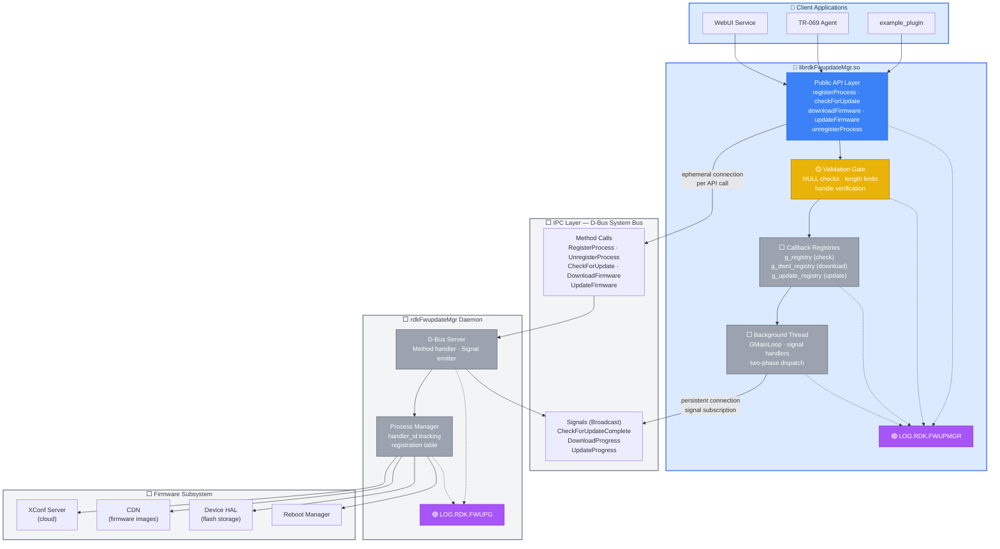

### Layer Responsibilities Summary

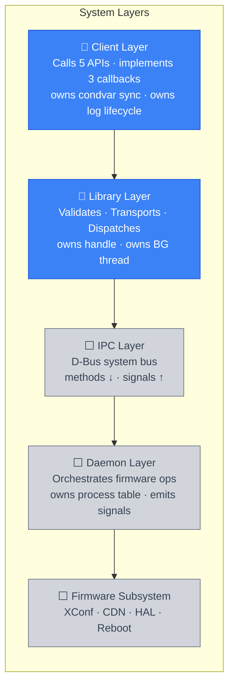

---

## 2. API Flowcharts

### 2.1 `registerProcess()`

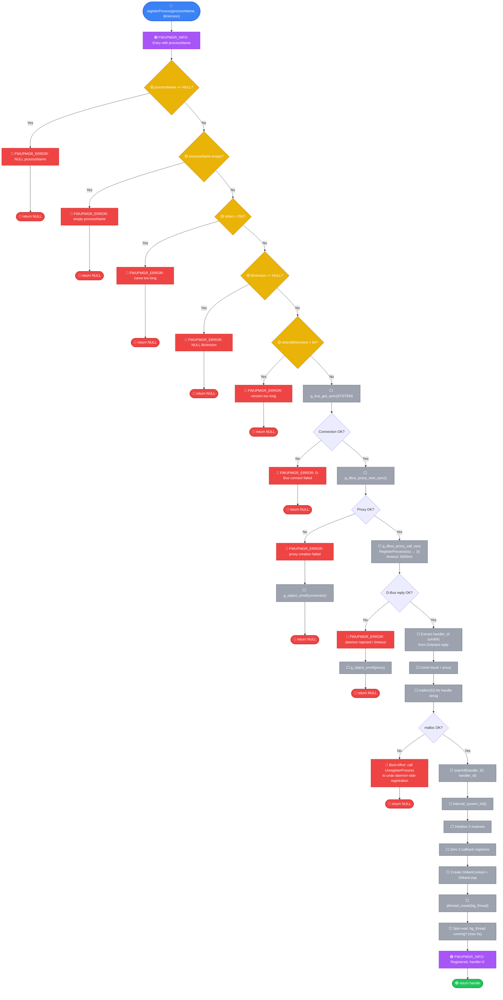

---

### 2.2 `checkForUpdate()`

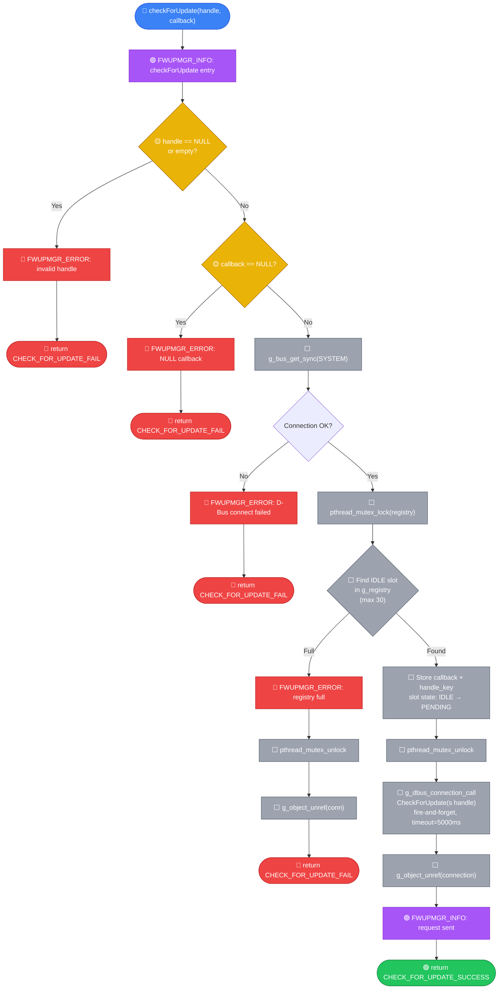

---

### 2.3 `downloadFirmware()`

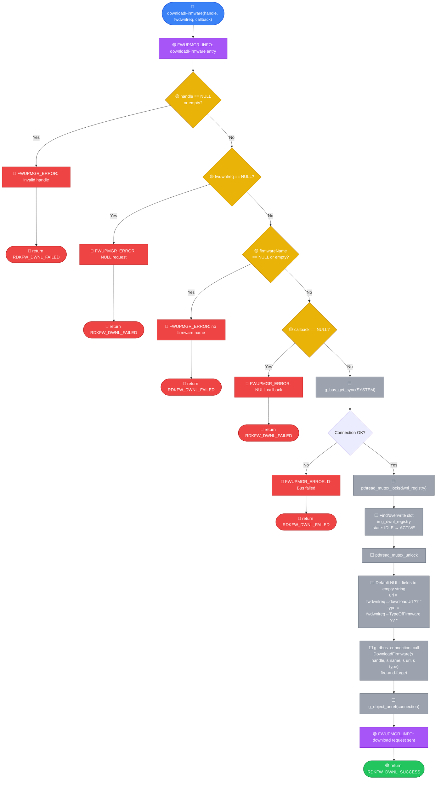

---

### 2.4 `updateFirmware()`

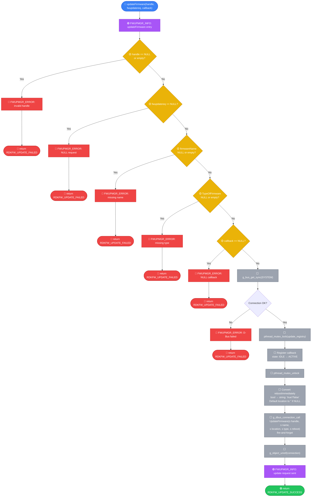

---

### 2.5 `unregisterProcess()`

```mermaid
flowchart TD
    START(["🔵 unregisterProcess(handle)"])
    START --> V1{"🟡 handle == NULL?"}

    V1 -- Yes --> LOG_NULL["🟣 FWUPMGR_INFO: NULL handle, no-op"]
    LOG_NULL --> RET_VOID1(["🟢 return (void)"])

    V1 -- No --> PARSE["⬜ strtoull(handle) → handler_id"]
    PARSE --> PARSE_OK{"🟡 Parse valid?<br/>strict endptr check"}

    PARSE_OK -- No --> ERR1["🔴 FWUPMGR_ERROR: invalid handle format"]
    ERR1 --> FREE_HANDLE_ERR["⬜ free(handle)"]
    FREE_HANDLE_ERR --> RET_VOID2(["🔴 return (void)"])

    PARSE_OK -- Yes --> LOG_DEINIT["🟣 FWUPMGR_INFO: deinit starting"]
    LOG_DEINIT --> DEINIT["⬜ internal_system_deinit()"]

    DEINIT --> QUIT["⬜ g_main_loop_quit()"]
    QUIT --> JOIN["⬜ pthread_join(bg_thread)"]
    JOIN --> UNREF_LOOP["⬜ g_main_loop_unref()<br/>g_main_context_unref()"]
    UNREF_LOOP --> FREE_DWNL["⬜ internal_dwnl_system_deinit()"]
    FREE_DWNL --> FREE_UPD["⬜ internal_update_system_deinit()"]
    FREE_UPD --> FREE_REG["⬜ Free check registry handle_keys"]
    FREE_REG --> DESTROY_MTX["⬜ pthread_mutex_destroy() × 4"]

    DESTROY_MTX --> PROXY["⬜ Create D-Bus proxy<br/>(best-effort)"]
    PROXY --> PROXY_OK{"Proxy OK?"}

    PROXY_OK -- No --> LOG_WARN["🟣 FWUPMGR_WARN: daemon unreachable"]
    LOG_WARN --> FREE_HANDLE2["⬜ free(handle)"]
    FREE_HANDLE2 --> RET_VOID3(["🟢 return (void)"])

    PROXY_OK -- Yes --> CALL["⬜ g_dbus_proxy_call_sync<br/>UnregisterProcess(t handler_id)"]
    CALL --> CALL_OK{"D-Bus OK?"}

    CALL_OK -- No --> LOG_WARN2["🟣 FWUPMGR_WARN: unregister call failed"]
    LOG_WARN2 --> UNREF_P2["⬜ g_object_unref(proxy)"]
    UNREF_P2 --> FREE_HANDLE3["⬜ free(handle)"]
    FREE_HANDLE3 --> RET_VOID4(["🟢 return (void)"])

    CALL_OK -- Yes --> UNREF_ALL["⬜ g_object_unref(result + proxy)"]
    UNREF_ALL --> LOG_OK["🟣 FWUPMGR_INFO: unregistered OK"]
    LOG_OK --> FREE_HANDLE4["⬜ free(handle)"]
    FREE_HANDLE4 --> RET_VOID5(["🟢 return (void)"])

    style START fill:#3b82f6,stroke:#1d4ed8,color:#fff
    style RET_VOID1 fill:#22c55e,stroke:#15803d,color:#fff
    style RET_VOID2 fill:#ef4444,stroke:#b91c1c,color:#fff
    style RET_VOID3 fill:#22c55e,stroke:#15803d,color:#fff
    style RET_VOID4 fill:#22c55e,stroke:#15803d,color:#fff
    style RET_VOID5 fill:#22c55e,stroke:#15803d,color:#fff
    style ERR1 fill:#ef4444,stroke:#b91c1c,color:#fff
    style V1 fill:#eab308,stroke:#a16207,color:#fff
    style PARSE_OK fill:#eab308,stroke:#a16207,color:#fff
    style LOG_NULL fill:#a855f7,stroke:#7e22ce,color:#fff
    style LOG_DEINIT fill:#a855f7,stroke:#7e22ce,color:#fff
    style LOG_WARN fill:#a855f7,stroke:#7e22ce,color:#fff
    style LOG_WARN2 fill:#a855f7,stroke:#7e22ce,color:#fff
    style LOG_OK fill:#a855f7,stroke:#7e22ce,color:#fff
    style PARSE fill:#9ca3af,stroke:#4b5563,color:#fff
    style DEINIT fill:#9ca3af,stroke:#4b5563,color:#fff
    style QUIT fill:#9ca3af,stroke:#4b5563,color:#fff
    style JOIN fill:#9ca3af,stroke:#4b5563,color:#fff
    style UNREF_LOOP fill:#9ca3af,stroke:#4b5563,color:#fff
    style FREE_DWNL fill:#9ca3af,stroke:#4b5563,color:#fff
    style FREE_UPD fill:#9ca3af,stroke:#4b5563,color:#fff
    style FREE_REG fill:#9ca3af,stroke:#4b5563,color:#fff
    style DESTROY_MTX fill:#9ca3af,stroke:#4b5563,color:#fff
    style PROXY fill:#9ca3af,stroke:#4b5563,color:#fff
    style CALL fill:#9ca3af,stroke:#4b5563,color:#fff
    style UNREF_ALL fill:#9ca3af,stroke:#4b5563,color:#fff
    style FREE_HANDLE_ERR fill:#9ca3af,stroke:#4b5563,color:#fff
    style FREE_HANDLE2 fill:#9ca3af,stroke:#4b5563,color:#fff
    style FREE_HANDLE3 fill:#9ca3af,stroke:#4b5563,color:#fff
    style FREE_HANDLE4 fill:#9ca3af,stroke:#4b5563,color:#fff
    style UNREF_P2 fill:#9ca3af,stroke:#4b5563,color:#fff
```

---

## 3. Sequence Diagrams

### 3.1 Complete Firmware Update Flow

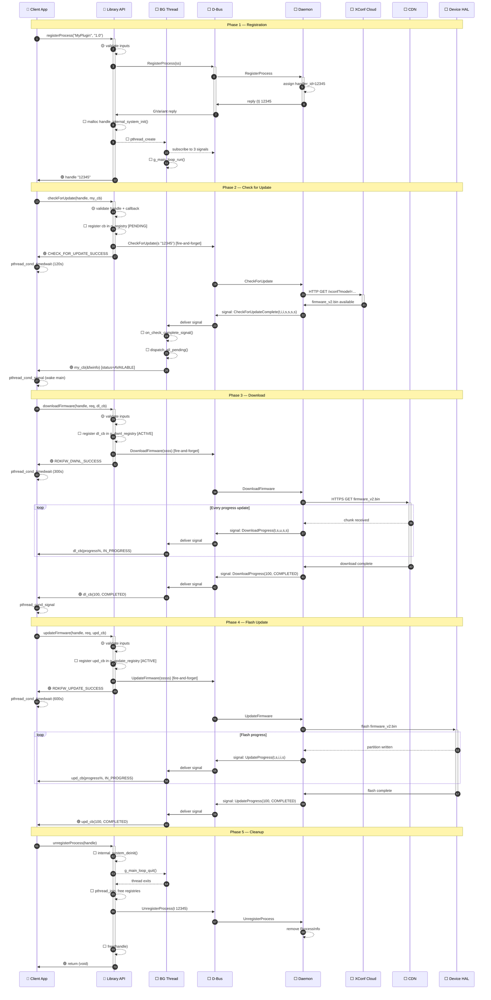

---

### 3.2 Daemon Unavailable + Retry

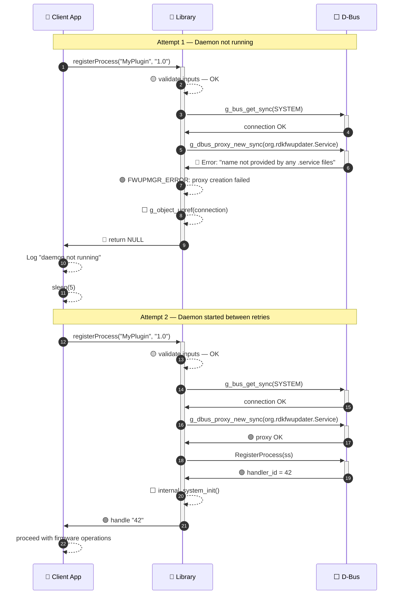

---

### 3.3 Callback Registration & Delivery

```mermaid
sequenceDiagram
    autonumber
    participant Caller as 🔵 Caller Thread
    participant API as 🔵 API Layer
    participant Reg as ⬜ Registry (mutex)
    participant Bus as ⬜ D-Bus
    participant BG as ⬜ BG Thread
    participant Dmn as ⬜ Daemon

    Note over Caller,Dmn: Step 1 — Register callback BEFORE sending D-Bus call

    Caller->>+API: checkForUpdate(handle, my_cb)
    API->>+Reg: 🔒 lock(g_registry.mutex)
    Reg-->>Reg: find IDLE slot
    Reg-->>Reg: store {callback=my_cb, handle_key=handle, state=PENDING}
    API->>-Reg: 🔓 unlock
    API->>Bus: fire-and-forget: CheckForUpdate(handle)
    API->>-Caller: 🟢 SUCCESS

    Note over Caller,Dmn: Step 2 — Signal arrives, two-phase dispatch

    Dmn->>Bus: signal: CheckForUpdateComplete(handler_id, ...)
    Bus->>+BG: on_check_complete_signal()

    BG->>+Reg: 🔒 lock(g_registry.mutex)
    Note over BG,Reg: Phase 1: Snapshot matching entries<br/>Copy callback pointers + data to local array<br/>Mark slots DISPATCHED
    BG->>-Reg: 🔓 unlock

    Note over BG: Phase 2: Dispatch WITHOUT holding lock
    BG->>Caller: my_cb(&fwinfo) — runs in BG thread context
    Note over Caller: Callback copies data, signals condvar

    BG->>+Reg: 🔒 lock(g_registry.mutex)
    Note over BG,Reg: Phase 3: Reset dispatched slots to IDLE
    BG->>-Reg: 🔓 unlock
    deactivate BG
```

---

### 3.4 Timeout Recovery

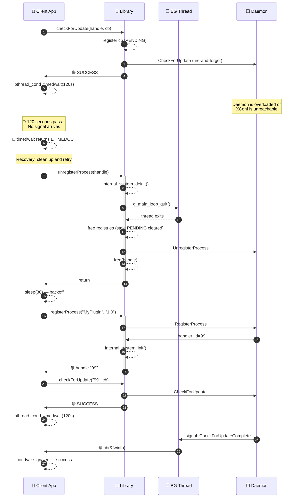

---

## 4. Thread Safety Diagram

### 4.1 Multi-Client Shared State Map

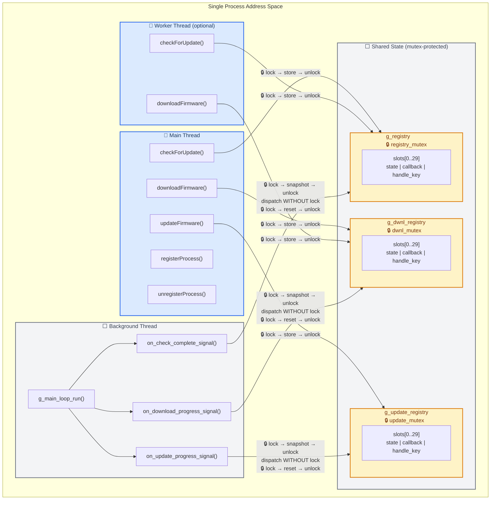

### 4.2 Two-Phase Dispatch (Deadlock Prevention)

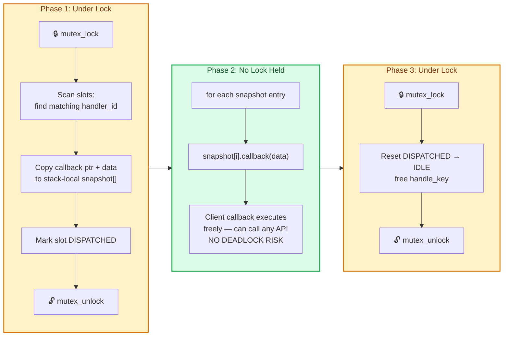

### 4.3 Connection Model — Why Each Call Is Independent

```mermaid
sequenceDiagram
    participant App as 🔵 Client
    participant Lib as 🔵 Library
    participant Bus as ⬜ D-Bus

    Note over App,Bus: Each API call creates + destroys its own connection

    App->>Lib: registerProcess()
    Lib->>+Bus: g_bus_get_sync() → conn_1 (sender :1.140)
    Lib->>Bus: RegisterProcess via conn_1
    Lib->>-Bus: g_object_unref(conn_1) — destroyed

    App->>Lib: checkForUpdate()
    Lib->>+Bus: g_bus_get_sync() → conn_2 (sender :1.141)
    Lib->>Bus: CheckForUpdate via conn_2
    Lib->>-Bus: g_object_unref(conn_2) — destroyed

    App->>Lib: downloadFirmware()
    Lib->>+Bus: g_bus_get_sync() → conn_3 (sender :1.142)
    Lib->>Bus: DownloadFirmware via conn_3
    Lib->>-Bus: g_object_unref(conn_3) — destroyed

    Note over Lib,Bus: BG Thread has separate PERSISTENT connection<br/>for signal subscription (lives entire session)
```

---

## 5. Memory Ownership Diagram

### 5.1 Ownership Boundaries

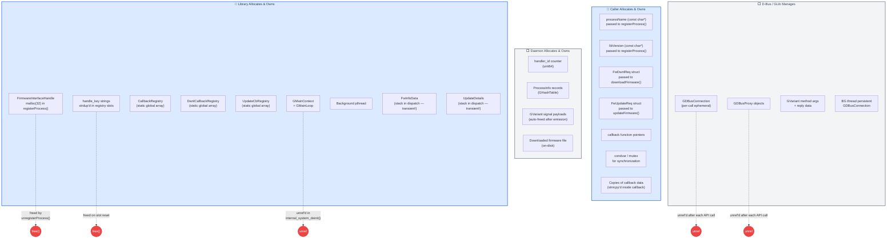

### 5.2 Callback Data Lifetime

```mermaid
flowchart LR
    subgraph SIGNAL["Signal Arrives"]
        SIG["D-Bus signal<br/>GVariant payload"]
    end

    subgraph PARSE["BG Thread Parses"]
        P1["g_variant_get()<br/>extract fields"]
        P2["Populate FwInfoData<br/>on STACK"]
        P3["Populate UpdateDetails<br/>on STACK"]
    end

    subgraph DISPATCH["Callback Executes"]
        CB["client_callback(&fwinfo)"]
        COPY["🟢 Client MUST copy<br/>any needed data NOW"]
        WARN["🔴 After callback returns:<br/>all pointers are INVALID"]
    end

    subgraph CLEANUP["Stack Unwinds"]
        CL["FwInfoData destroyed<br/>UpdateDetails destroyed<br/>GVariant unreffed"]
    end

    SIG --> PARSE --> DISPATCH --> CLEANUP

    style SIGNAL fill:#f3f4f6,stroke:#6b7280,color:#374151
    style PARSE fill:#f3f4f6,stroke:#6b7280,color:#374151
    style DISPATCH fill:#dbeafe,stroke:#2563eb,color:#1e3a5f
    style CLEANUP fill:#fecaca,stroke:#dc2626,color:#7f1d1d
    style COPY fill:#22c55e,stroke:#15803d,color:#fff
    style WARN fill:#ef4444,stroke:#b91c1c,color:#fff
```

### 5.3 Cleanup Sequence

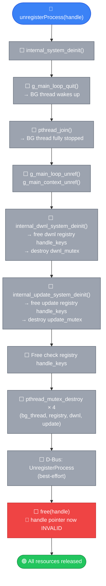

---

## 6. Logging Pipeline Diagram

### 6.1 Three-Module Logging Architecture

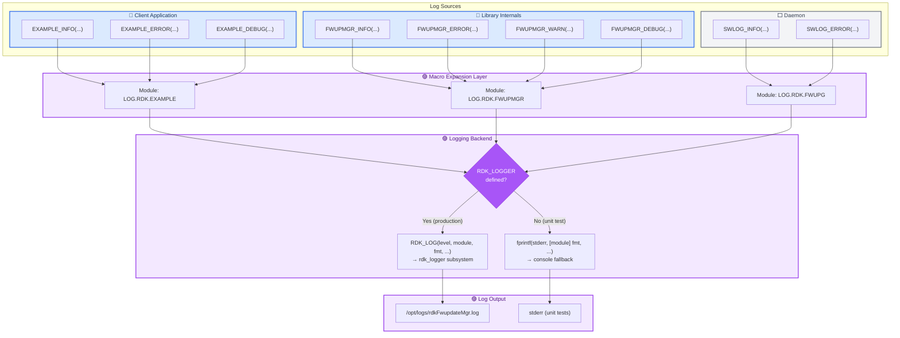

### 6.2 Log Points by API Function

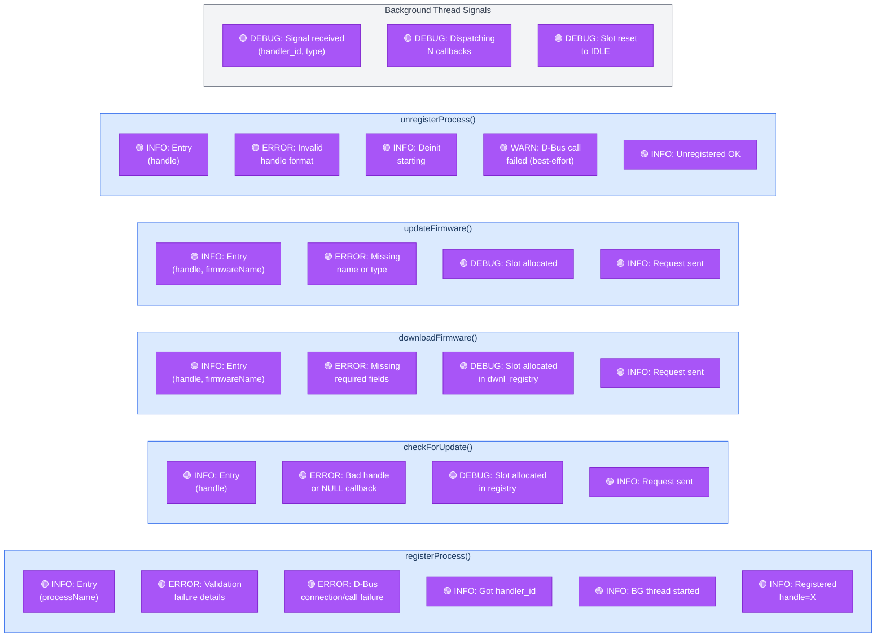

### 6.3 Correlation — Tracing a Request by handler_id

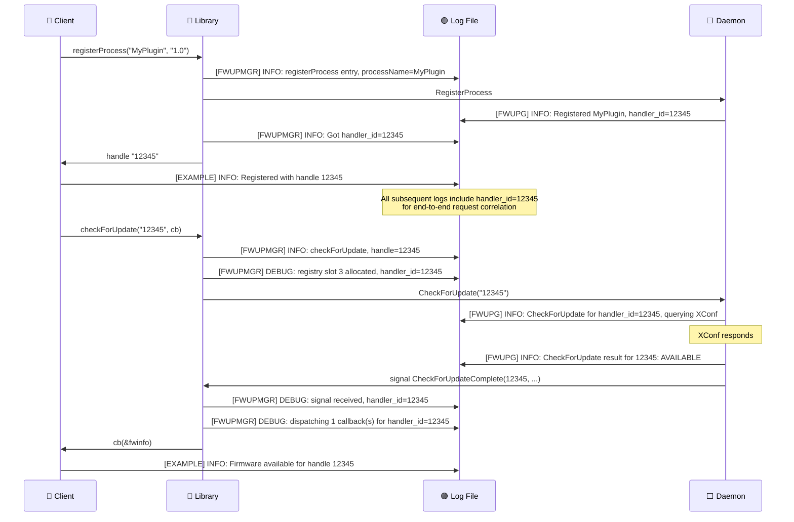

### 6.4 Log Lifecycle Ownership

```mermaid
flowchart TD
    subgraph APP["🔵 Client Application (caller's responsibility)"]
        INIT["log_init()<br/>⚠️ MUST call before any library API"]
        USE["Use library APIs<br/>(all logging works)"]
        EXIT["log_exit()<br/>⚠️ MUST call after unregisterProcess()"]
        INIT --> USE --> EXIT
    end

    subgraph LIB_INTERNAL["🔵 Library (never calls log_init/exit)"]
        LOG_CALL["FWUPMGR_INFO/ERROR/DEBUG/WARN<br/>Just emits — assumes log is initialized"]
    end

    USE -.-> LOG_CALL

    subgraph WRONG["🔴 WRONG — Double Init"]
        BAD["Library calling log_init()<br/>→ corrupts app's log state"]
    end

    style APP fill:#dbeafe,stroke:#2563eb,stroke-width:2px,color:#1e3a5f
    style LIB_INTERNAL fill:#dbeafe,stroke:#2563eb,stroke-width:2px,color:#1e3a5f
    style WRONG fill:#fecaca,stroke:#dc2626,stroke-width:2px,color:#7f1d1d
    style INIT fill:#22c55e,stroke:#15803d,color:#fff
    style EXIT fill:#22c55e,stroke:#15803d,color:#fff
    style BAD fill:#ef4444,stroke:#b91c1c,color:#fff
```

---

## Appendix: State Machine Diagrams

### A.1 Check Callback Registry Slot States

```mermaid
stateDiagram-v2
    [*] --> IDLE

    IDLE --> PENDING : checkForUpdate()<br/>registers callback
    PENDING --> DISPATCHED : Signal arrives<br/>Phase 1 snapshots
    DISPATCHED --> IDLE : Phase 3 resets<br/>after callback returns
    PENDING --> TIMED_OUT : Future: sweep thread<br/>(not yet implemented)
    TIMED_OUT --> IDLE : Cleanup

    state IDLE {
        [*] : Slot available
    }
    state PENDING {
        [*] : Callback stored, waiting for signal
    }
    state DISPATCHED {
        [*] : Callback is being invoked
    }
    state TIMED_OUT {
        [*] : Stale entry (future)
    }
```

### A.2 Download/Update Registry Slot States

```mermaid
stateDiagram-v2
    [*] --> IDLE

    IDLE --> ACTIVE : downloadFirmware() /<br/>updateFirmware()
    ACTIVE --> ACTIVE : Progress signal<br/>(still in progress)
    ACTIVE --> IDLE : Terminal signal<br/>(COMPLETED or ERROR)

    state IDLE {
        [*] : Slot available
    }
    state ACTIVE {
        [*] : Callback registered,<br/>receiving progress signals
    }
```

### A.3 Library Handle Lifecycle

```mermaid
stateDiagram-v2
    [*] --> UNLINKED : Library loaded

    UNLINKED --> REGISTERED : registerProcess()<br/>returns non-NULL handle
    UNLINKED --> UNLINKED : registerProcess()<br/>returns NULL (error)

    REGISTERED --> ACTIVE : checkForUpdate() /<br/>downloadFirmware() /<br/>updateFirmware()
    ACTIVE --> ACTIVE : More API calls
    ACTIVE --> REGISTERED : All callbacks complete

    REGISTERED --> UNLINKED : unregisterProcess()
    ACTIVE --> UNLINKED : unregisterProcess()<br/>(stale callbacks cleared)

    state UNLINKED {
        [*] : No handle, no BG thread
    }
    state REGISTERED {
        [*] : Handle valid,<br/>BG thread running,<br/>no pending ops
    }
    state ACTIVE {
        [*] : Handle valid,<br/>pending callbacks<br/>in registries
    }
```

---

*End of Visual Engineering Documentation*
