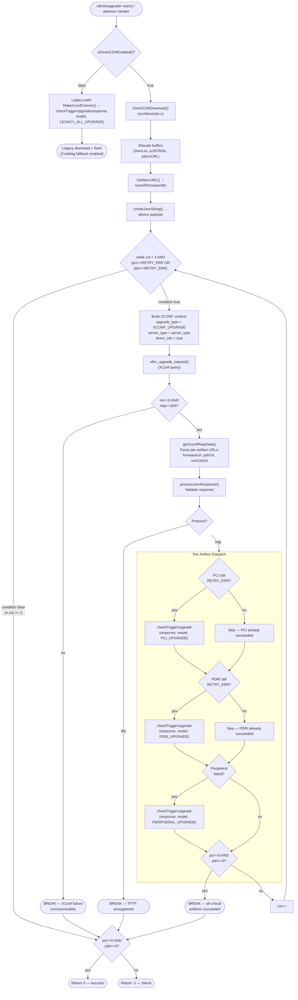
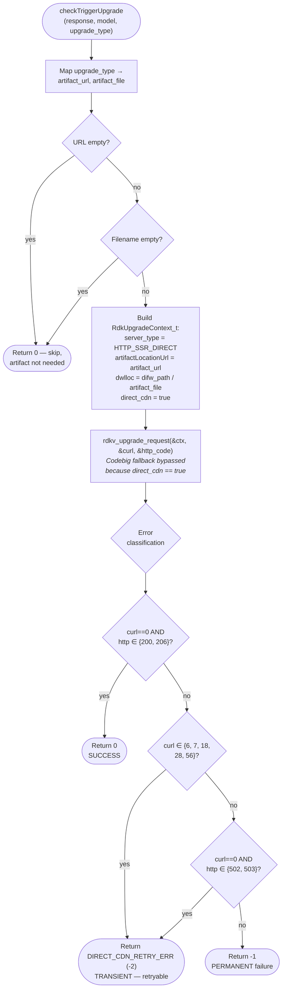

## Context

The current refactored `rdkfwupdater` repo uses a context-struct-driven download API (`RdkUpgradeContext_t` → `rdkv_upgrade_request()`), modular shared libraries (`librdksw_upgrade`, `librdksw_rfcIntf`, `librdksw_jsonparse`, etc.), and supports both a one-shot CLI binary (`rdkvfwupgrader`) and a persistent D-Bus daemon (`rdkFwupdateMgr`).

The legacy `stable2` branch implements Direct CDN (RDKE-874) as a monolithic function (`DirectCDNDownload()`) with positional-parameter APIs. PR #120 ports this into the open-source repo. We treat PR #120 as a **behavioral reference only** — the actual implementation must conform to the refactored architecture.

### Current State
- `Rfc_t` struct has 4 fields (throttle, topspeed, incr_cdl, mtls)
- `XCONFRES` has one shared download URL (`cloudFWLocation`)
- `GetServURL()` always returns `/xconf/swu/stb` path
- `checkTriggerUpgrade()` takes `(XCONFRES*, const char* model)` — processes all artifact types in one call
- `rdkv_upgrade_request()` takes `RdkUpgradeContext_t*` — no `directCdn` field
- `checkCodebigAccess()` always probes Codebig availability
- Download fallback chain: mTLS → direct → Codebig (always)

### Constraints
- RFC=false must produce zero behavioral change
- All function signature changes must be backward-compatible
- One-shot and daemon paths both need Direct CDN support
- Max 11 working days for full delivery including tests

---

## Goals / Non-Goals

**Goals:**
- Adopt Direct CDN download capability (RFC-gated)
- Per-artifact download URLs from XConf response
- Independent PCI/PDRI/Peripheral download with selective retry
- Codebig bypass when Direct CDN enabled
- Full L1 + L2 test coverage
- No regression to existing behavior when RFC disabled

**Non-Goals:**
- Refactoring existing download-engine internals
- Changing the D-Bus API surface (no new methods)
- Supporting TFTP in Direct CDN mode
- Implementing server-side XConf changes
- Parallel artifact downloads (serial is fine)

---

## Decisions

### D1: Feature gate via `RdkUpgradeContext_t` field (not function signature change)

**Decision:** Add `bool direct_cdn` field to `RdkUpgradeContext_t` instead of changing `rdkv_upgrade_request()` function signature.

**Rationale:** The refactored repo already uses a context-struct pattern. Adding a field to the struct is non-breaking — existing callers that zero-initialize (`{0}`) automatically get `direct_cdn = false`. No signature changes needed anywhere in the download chain.

**Alternative considered:** Add `bool directCdn` parameter to `rdkv_upgrade_request()` (as legacy PR #120 does with `upgradeRequest()`). Rejected — breaks all existing callers, incompatible with the refactored API pattern.

### D2: `checkTriggerUpgrade()` gains `upgrade_type` parameter for per-artifact mode

**Decision:** Change signature to `checkTriggerUpgrade(XCONFRES*, const char* model, int upgrade_type)` where `upgrade_type` = `LEGACY_ALL_UPGRADE` (-1) means "all artifacts" (legacy behavior) and `PCI_UPGRADE`/`PDRI_UPGRADE`/`PERIPHERAL_UPGRADE` targets a specific artifact.

**Note:** `PCI_UPGRADE` is defined as 0 in `rdkv_cdl.h`, so the legacy sentinel cannot be 0 — it uses `LEGACY_ALL_UPGRADE = -1` to avoid collision.

**Rationale:** The function is only called in two places (one-shot main, daemon handler). Adding a parameter with `LEGACY_ALL_UPGRADE` at legacy call sites is minimal churn.

**Alternative considered:** Create a separate `checkTriggerUpgradeByType()` function. Rejected — would duplicate 90% of the logic.

### D3: `DirectCDNDownload()` as a new orchestrator in `src/directcdn.c`

**Decision:** Create a new source file `src/directcdn.c` containing the `DirectCDNDownload()` orchestrator. It calls into existing shared infrastructure (`rdkv_upgrade_request()`, `getXconfRespData()`, `processJsonResponse()`, `checkTriggerUpgrade()`).

**Rationale:** Keeps the new orchestration logic isolated from `rdkv_main.c` (which is already 1200+ lines). Easy to unit-test independently. Clean file boundary.

**Alternative considered:** Inline into `rdkv_main.c` (as legacy does). Rejected — `rdkv_main.c` is already too large.

### D4: Per-artifact URL stored in `XCONFRES` (not in `RdkUpgradeContext_t`)

**Decision:** Extend `XCONFRES` with `firmwareUrl`, `pdriUrl`, `remCtrlUrl` fields. The `DirectCDNDownload()` orchestrator populates `RdkUpgradeContext_t.artifactLocationUrl` from these fields before each per-artifact call.

**Rationale:** `XCONFRES` is the canonical "parsed XConf response" structure. URLs belong there. The context struct is populated per-call from this data.

### D5: Peripheral product key discovery via static cache

**Decision:** Add `getPeripheralProduct(char *buf, size_t sz)` to `deviceutils.c`. It returns the cached product identifier set during `BuildRemoteInfo()`. If not yet populated, returns default `"remCtrl"`.

**Rationale:** The peripheral product name is discovered during remote-control info parsing (which happens before XConf query). Caching in a static avoids re-parsing.

### D6: No new D-Bus method for Direct CDN

**Decision:** Direct CDN behavior is transparent to D-Bus clients. The existing `CheckForUpdate` → `DownloadFirmware` → `UpdateFirmware` flow works unchanged. The daemon internally uses Direct CDN when RFC is enabled.

**Rationale:** Client-SDK and D-Bus interface stability. Operators control the feature via RFC, not client requests.

---

## Per-Subtask Design

### ST-1: RFC Feature Gate

**Affected files:** `src/include/rfcinterface.h`, `src/rfcInterface/rfcinterface.c`

**Changes:**
```
// rfcinterface.h — add to Rfc_t struct:
typedef struct rfcdetails {
    char rfc_throttle[RFC_VALUE_BUF_SIZE];
    char rfc_topspeed[RFC_VALUE_BUF_SIZE];
    char rfc_incr_cdl[RFC_VALUE_BUF_SIZE];
    char rfc_mtls[RFC_VALUE_BUF_SIZE];
    char rfc_directcdn[RFC_VALUE_BUF_SIZE];   // ← NEW
} Rfc_t;

// Add macro:
#define RFC_DIRECTCDN "Device.DeviceInfo.X_RDKCENTRAL-COM_RFC.Feature.SWDLDirect.Enable"

// Add function declaration:
bool isDirectCDNEnabled(void);
```

**Flow (rfcinterface.c):**
```
getRFCSettings():
  ... existing reads ...
  ret = read_RFCProperty("DIRECTCDN", RFC_DIRECTCDN, data, sizeof(data));
  if (ret != -1) {
      strncpy(rfc_list->rfc_directcdn, data, RFC_VALUE_BUF_SIZE - 1);
      rfc_list->rfc_directcdn[RFC_VALUE_BUF_SIZE - 1] = '\0';
  }

isDirectCDNEnabled():
  char rfc_data[RFC_VALUE_BUF_SIZE] = {0};
  int ret = read_RFCProperty("DIRECTCDN", RFC_DIRECTCDN, rfc_data, sizeof(rfc_data));
  if (ret == -1) return false;
  return (strncmp(rfc_data, "true", 4) == 0);
```

**Validation:** L1 test — mock `getRFCParameter()` to return true/false, verify `isDirectCDNEnabled()` result.

---

### ST-2: XConf URL Path Branching & Codebig Bypass

**Affected files:** `src/deviceutils/device_api.c`, `src/device_status_helper.c`

**Changes to `GetServURL()` (device_api.c):**
```
// In each URL construction branch, replace hardcoded path:
// BEFORE:
len = snprintf(pServURL, szBufSize, "%s/xconf/swu/stb", buf);

// AFTER:
bool directCdn = isDirectCDNEnabled();
if (directCdn) {
    len = snprintf(pServURL, szBufSize, "%s/xconf/firmware/stb/", buf);
} else {
    len = snprintf(pServURL, szBufSize, "%s/xconf/swu/stb", buf);
}
```

Three URL construction paths exist in `GetServURL()` (recovery, bootstrap, xconf-direct). All three must branch.

**Changes to `checkCodebigAccess()` (device_status_helper.c):**
```
bool checkCodebigAccess(void) {
    bool directCdn = isDirectCDNEnabled();
    if (directCdn) {
        SWLOG_INFO("CodebigAccess Not Present For direct cdn\n");
        return false;
    }
    // ... existing Codebig probe logic unchanged ...
}
```

**Validation:** L1 test — mock `isDirectCDNEnabled()` to true, verify `GetServURL()` returns `/xconf/firmware/stb/` path. Verify `checkCodebigAccess()` returns false without probing.

---

### ST-3: Enriched XConf Response Parsing

**Affected files:** `src/include/json_process.h`, `src/json_process.c`, `src/deviceutils/deviceutils.c`, `src/deviceutils/deviceutils.h`

**XCONFRES extension (json_process.h):**
```
typedef struct xconf_response {
    // ... existing fields ...
    char rdmCatalogueVersion[512];
    char firmwareUrl[CLD_URL_MAX_LEN];      // ← NEW: PCI direct URL
    char remCtrlUrl[CLD_URL_MAX_LEN];       // ← NEW: Peripheral direct URL
    char pdriUrl[CLD_URL_MAX_LEN];          // ← NEW: PDRI direct URL
} XCONFRES;
```

**Parsing logic (json_process.c — `getXconfRespData()`):**
```
// After existing field parsing:
extern Rfc_t rfc_list;

if (strncmp(rfc_list.rfc_directcdn, "true", 4) == 0) {
    // Direct CDN mode: parse per-artifact URLs
    GetJsonVal(pJson, "firmware_URL", pResponse->firmwareUrl, sizeof(pResponse->firmwareUrl));
    GetJsonVal(pJson, "additionalFwVerInfo_URL", pResponse->pdriUrl, sizeof(pResponse->pdriUrl));

    // Dynamic peripheral key
    char peripheral_product[64] = {0};
    char peripheral_product_url[100] = {0};
    int peri_ret = getPeripheralProduct(peripheral_product, sizeof(peripheral_product));
    if (peri_ret != -1) {
        snprintf(peripheral_product_url, sizeof(peripheral_product_url), "%s_URL", peripheral_product);
        GetJsonVal(pJson, peripheral_product, pResponse->peripheralFirmwares, sizeof(pResponse->peripheralFirmwares));
        GetJsonVal(pJson, peripheral_product_url, pResponse->remCtrlUrl, sizeof(pResponse->remCtrlUrl));
    }
} else {
    // Legacy: use containing-match for peripheral
    GetJsonValContaining(pJson, "remCtrl", pResponse->peripheralFirmwares, sizeof(pResponse->peripheralFirmwares));
}
```

**PDRI validation (json_process.c — `processJsonResponse()`):**
```
// After existing PDRI validation:
if ((*(response->cloudPDRIVersion)) != 0) {
    valid_pdri_img = validateImage(response->cloudPDRIVersion, model);
    if ((strstr(response->cloudPDRIVersion, "_PDRI_")) == NULL) {
        SWLOG_INFO("Invalid PDRI image\n");
        valid_pdri_img = false;
    }
}
```

**Peripheral product (deviceutils.c):**
```
static char pProductNumber[128] = {0};

int getPeripheralProduct(char *buf, size_t szIn) {
    if (buf == NULL || szIn == 0) return -1;
    if (pProductNumber[0] != 0) {
        snprintf(buf, szIn, "%s", pProductNumber);
    } else {
        snprintf(buf, szIn, "%s", "remCtrl");
    }
    return 0;
}

// In BuildRemoteInfo(), after GetJsonVal(pItem, "Product", productBuf, ...):
snprintf(pProductNumber, sizeof(pProductNumber), "remCtrl%s", productBuf);
```

**Validation:** L1 test — construct mock JSON with `firmware_URL`, `additionalFwVerInfo_URL`, `remCtrlXR15_URL` fields. Call `getXconfRespData()` with directCdn=true, verify struct populated. With directCdn=false, verify legacy path used.

---

### ST-4: Per-Artifact Download Orchestration

**Affected files:** `src/directcdn.c` (NEW), `src/include/rdkv_cdl.h`, `src/include/rdkv_upgrade.h`, `src/rdkv_main.c`, `src/dbus/rdkFwupdateMgr_handlers.c`, `Makefile.am`

**RdkUpgradeContext_t extension (rdkv_upgrade.h):**
```
typedef struct {
    // ... existing fields ...
    int download_only;
    bool direct_cdn;           // ← NEW: Direct CDN mode flag
} RdkUpgradeContext_t;
```

**New defines (rdkv_cdl.h):**
```
#define DIRECT_CDN_RETRY_ERR -2
#define JSON_STR_LEN 1000
```

**checkTriggerUpgrade signature change (rdkv_cdl.h):**
```
// BEFORE:
int checkTriggerUpgrade(XCONFRES *pResponse, const char *model);

// AFTER:
int checkTriggerUpgrade(XCONFRES *pResponse, const char *model, int upgrade_type);
// upgrade_type: LEGACY_ALL_UPGRADE (-1) = all (legacy), PCI_UPGRADE (0), PDRI_UPGRADE (1), PERIPHERAL_UPGRADE (3)
```

**checkTriggerUpgrade behavior change (rdkv_main.c):**
```
// When upgrade_type != LEGACY_ALL_UPGRADE (per-artifact mode):
//   - Only attempt the specified artifact type
//   - Use per-artifact URL from XCONFRES (firmwareUrl/pdriUrl/remCtrlUrl)
//   - Set context.direct_cdn = true
//   - Return DIRECT_CDN_RETRY_ERR (-2) on transient failure (retryable)
//   - Return 0 on success
//   - Return -1 on permanent failure (e.g. HTTP 404)
//   - Return 0 if URL or filename is empty (skip — artifact not needed)

// When upgrade_type == LEGACY_ALL_UPGRADE (-1):
//   - Existing behavior unchanged (PCI → PDRI → Peripheral sequential)
```

**DirectCDNDownload orchestrator (src/directcdn.c):**
```
int DirectCDNDownload(XCONFRES *response, char *cur_img_name,
                      DeviceProperty_t *device_info, int server_type, int *pHttp_code)
{
    int pci_status = DIRECT_CDN_RETRY_ERR;
    int pdri_status = DIRECT_CDN_RETRY_ERR;
    int peri_status = -1;
    int cnt = 0;
    int total_retry = 3;
    int ret = -1;

    // XConf query setup
    char *pJSONStr = malloc(JSON_STR_LEN);
    char *pServURL = malloc(URL_MAX_LEN);
    DownloadData DwnLoc = {0};
    MemDLAlloc(&DwnLoc, DEFAULT_DL_ALLOC);

    size_t len = GetServURL(pServURL, URL_MAX_LEN);
    if (len == 0) goto cleanup;
    createJsonString(pJSONStr, JSON_STR_LEN);

    // Retry loop
    while (cnt < total_retry && (pci_status == DIRECT_CDN_RETRY_ERR || pdri_status == DIRECT_CDN_RETRY_ERR)) {

        // XConf query (reuses existing rdkv_upgrade_request with XCONF_UPGRADE type)
        RdkUpgradeContext_t xconf_ctx = {0};
        xconf_ctx.upgrade_type = XCONF_UPGRADE;
        xconf_ctx.server_type = server_type;
        xconf_ctx.artifactLocationUrl = pServURL;
        xconf_ctx.dwlloc = &DwnLoc;
        xconf_ctx.pPostFields = pJSONStr;
        // ... populate remaining fields from device_info / globals ...

        void *curl = NULL;
        ret = rdkv_upgrade_request(&xconf_ctx, &curl, pHttp_code);

        if (ret != 0 || *pHttp_code != 200) break;

        // Parse response
        getXconfRespData(response, (char*)DwnLoc.pvOut);
        int json_res = processJsonResponse(response, cur_img_name, device_info->model, device_info->maint_status);
        if (json_res != 0) break;

        // Check protocol
        if (strncmp(response->cloudProto, "tftp", 4) == 0) break;  // TFTP not supported

        // Per-artifact downloads
        if (pci_status == DIRECT_CDN_RETRY_ERR)
            pci_status = checkTriggerUpgrade(response, device_info->model, PCI_UPGRADE);

        if (pdri_status == DIRECT_CDN_RETRY_ERR)
            pdri_status = checkTriggerUpgrade(response, device_info->model, PDRI_UPGRADE);

        if (peri_status != 0)
            peri_status = checkTriggerUpgrade(response, device_info->model, PERIPHERAL_UPGRADE);

        if (pci_status == 0 && pdri_status == 0) break;
        cnt++;
    }

cleanup:
    free(pServURL);
    free(pJSONStr);
    if (DwnLoc.pvOut) free(DwnLoc.pvOut);
    return (pci_status == 0 && pdri_status == 0) ? 0 : -1;
}
```

**Integration point (rdkv_main.c — main flow):**
```
// After initialValidation succeeds, before MakeXconfComms:
if (isDirectCDNEnabled()) {
    ret_curl_code = DirectCDNDownload(&response, cur_img_detail.cur_img_name,
                                       &device_info, server_type, &http_code);
} else {
    // Existing legacy path unchanged
    ret_curl_code = MakeXconfComms(&response, server_type, &http_code);
    if (ret_curl_code == 0 && http_code == 200) {
        json_res = processJsonResponse(...);
        if (proto == 1 && json_res == 0) {
            ret_curl_code = checkTriggerUpgrade(&response, device_info.model, LEGACY_ALL_UPGRADE);
        }
    }
}
```

**Daemon integration (rdkFwupdateMgr_handlers.c):**
The daemon's `CheckForUpdate` handler already caches XConf responses. When Direct CDN is enabled:
- The `DownloadFirmware` handler sets `context.direct_cdn = true` on the `RdkUpgradeContext_t`
- `rdkv_upgrade_request()` uses `context.artifactLocationUrl` from the per-artifact URL (set from cached `XCONFRES`)
- No new D-Bus methods needed

**Makefile.am change:**
```
bin_PROGRAMS= rdkvfwupgrader
rdkvfwupgrader_SOURCES = \
    ${top_srcdir}/src/rdkv_main.c \
    ${top_srcdir}/src/directcdn.c \    ← NEW
    ${top_srcdir}/src/chunk.c \
    ...
```

**Validation:** Compile check. Smoke test in Docker: invoke one-shot with RFC=true, verify XConf query goes to `/xconf/firmware/stb/` (can be observed via mock or log).

---

### ST-5: Selective Retry Logic

**Affected files:** `src/directcdn.c`

Already included in ST-4's `DirectCDNDownload()` design above. The retry is integral to the orchestrator. This subtask focuses on:

- Ensuring `checkTriggerUpgrade()` returns `DIRECT_CDN_RETRY_ERR` for transient download failures (network errors, timeouts)
- Ensuring it returns 0 for success
- Ensuring it returns other negative for permanent failures (validation errors, file not found)
- Peripheral status does NOT gate the retry loop
- Max 3 iterations

**Error classification in `checkTriggerUpgrade()` per-artifact mode (implemented):**
```
// Per-artifact download attempt:
int curl_ret = rdkv_upgrade_request(&artifact_ctx, &curl, &http_code);

// SUCCESS — download + HTTP status OK
if (curl_ret == 0 && (http_code == HTTP_SUCCESS || http_code == HTTP_CHUNK_SUCCESS))
    return 0;

// RETRYABLE — transient curl-level errors
if (curl_ret == CURL_COULDNT_RESOLVE_HOST || curl_ret == CURL_CONNECTIVITY_ISSUE ||
    curl_ret == CURLTIMEOUT || curl_ret == CURL_LOW_BANDWIDTH ||
    curl_ret == CURL_RECV_ERROR)
    return DIRECT_CDN_RETRY_ERR;

// RETRYABLE — transient HTTP-level errors (server-side temporary)
if (curl_ret == 0 && (http_code == 502 || http_code == 503))
    return DIRECT_CDN_RETRY_ERR;

// PERMANENT FAIL — everything else (HTTP 404, validation errors, etc.)
return -1;
```

**Curl code reference (from `rdkv_cdl.h`):**
| Code | Define | Classification |
|------|--------|----------------|
| 6 | `CURL_COULDNT_RESOLVE_HOST` | Retryable |
| 7 | `CURL_CONNECTIVITY_ISSUE` | Retryable |
| 18 | `CURL_LOW_BANDWIDTH` | Retryable |
| 28 | `CURLTIMEOUT` | Retryable |
| 56 | `CURL_RECV_ERROR` | Retryable |
| 0 + HTTP 502/503 | Server temporary error | Retryable |
| 0 + HTTP 404 | Resource not found | Permanent |
| Other | Unknown / unrecoverable | Permanent |

**Validation:** L1 test — mock `rdkv_upgrade_request()` to fail twice then succeed. Verify retry count = 2 and final result = 0.

---

### ST-6: L1 Unit Tests

**Affected files:** `unittest/basic_rdkv_main_gtest.cpp`, `unittest/fwdl_interface_gtest.cpp`, `unittest/mocks/` (as needed)

**Test cases:**
1. `getRFCSettings()` reads `RFC_DIRECTCDN` (success + failure)
2. `isDirectCDNEnabled()` returns true/false correctly
3. `getXconfRespData()` with directCdn=true parses `firmware_URL`, `additionalFwVerInfo_URL`, `<product>_URL`
4. `getXconfRespData()` with directCdn=false uses legacy `GetJsonValContaining`
5. `getPeripheralProduct()` returns cached product name
6. PDRI `_PDRI_` validation (pass + reject)
7. `GetServURL()` returns `/xconf/firmware/stb/` when directCdn=true
8. `checkCodebigAccess()` returns false when directCdn=true
9. `checkTriggerUpgrade(response, model, PCI_UPGRADE)` — per-artifact mode
10. `checkTriggerUpgrade(response, model, LEGACY_ALL_UPGRADE)` — legacy mode unchanged
11. DirectCDNDownload retry: fail→fail→succeed pattern
12. DirectCDNDownload: PCI+PDRI success, PERI fail → overall SUCCESS

**Mock updates:** `getRFCParameter` mock needs `Times(5)` instead of `Times(4)`.

---

### ST-7: L2 Functional Tests

**Affected files:** `test/functional-tests/tests/test_directcdn_download.py` (NEW), `run_l2.sh`

**Test scenarios:**
1. RFC disabled → full legacy path (regression)
2. RFC enabled → XConf URL contains `/xconf/firmware/stb/`
3. RFC enabled → per-artifact download URLs used
4. RFC enabled → per-artifact failure triggers retry
5. RFC enabled → peripheral failure alone → overall success

**`run_l2.sh` addition:**
```
rbuscli setv Device.DeviceInfo.X_RDKCENTRAL-COM_RFC.Feature.SWDLDirect.Enable boolean false
```

---

### ST-8: Developer Validation & QA Handoff

**Activities:**
- Full L1 + L2 regression in Docker
- RFC toggle (on/off) end-to-end verification
- Coverity / static analysis clean
- PR description with behavioral summary
- QA test scenarios document

---

## Direct CDN Enabled Download Flow

The diagram below shows the implemented end-to-end flow when Direct CDN is enabled via RFC. When the RFC is disabled (`isDirectCDNEnabled() == false`), the system follows the legacy path (`MakeXconfComms` → `checkTriggerUpgrade(..., LEGACY_ALL_UPGRADE)`) with zero behavioral change.

### Entry Points

Both the **one-shot binary** (`rdkvfwupgrader` via `src/rdkv_main.c`) and the **daemon** (`rdkFwupdateMgr` via `src/rdkFwupdateMgr.c`) evaluate `isDirectCDNEnabled()` after initial validation. If enabled, the one-shot binary calls `DirectCDNDownload()` directly; the daemon sets `context.direct_cdn = true` on the `RdkUpgradeContext_t` before calling `rdkv_upgrade_request()`.

### Orchestration Flow



### Per-Artifact Download Detail (`checkTriggerUpgrade` per-artifact mode)

When `checkTriggerUpgrade()` is called with `upgrade_type ∈ {PCI_UPGRADE, PDRI_UPGRADE, PERIPHERAL_UPGRADE}`, it enters per-artifact mode:



### URL-to-Artifact Mapping

| `upgrade_type` | XCONFRES URL field | XCONFRES filename field | Download path |
|---|---|---|---|
| `PCI_UPGRADE` (0) | `firmwareUrl` | `cloudFWFile` | `difw_path/cloudFWFile` |
| `PDRI_UPGRADE` (1) | `pdriUrl` | `cloudPDRIVersion` | `difw_path/cloudPDRIVersion` |
| `PERIPHERAL_UPGRADE` (3) | `remCtrlUrl` | `peripheralFirmwares` | `difw_path/peripheralFirmwares` |

### Key Behavioral Notes

- **Codebig bypass**: When `RdkUpgradeContext_t.direct_cdn == true`, the fallback chain inside `rdkv_upgrade_request()` skips Codebig. Downloads go direct-to-CDN only.
- **Selective retry**: Only artifacts with status `DIRECT_CDN_RETRY_ERR` are re-attempted on the next loop iteration. Already-succeeded artifacts are skipped.
- **Peripheral is non-blocking**: The retry loop condition only checks PCI and PDRI status. Peripheral failure alone does not prevent overall success.
- **XConf re-query per iteration**: Each retry iteration re-queries XConf. This is consistent with legacy behavior but means response could theoretically change between iterations.
- **No backoff**: Retries are immediate (no sleep between iterations), consistent with legacy.
- **Max 3 iterations**: Hard-coded `total_retry_cnt = 3`.

---

## Legacy → Refactored Mapping

| Legacy (PR #120) | Refactored Repo Equivalent |
|-------------------|---------------------------|
| `upgradeRequest(..., bool directCdn, ...)` positional param | `RdkUpgradeContext_t.direct_cdn` field in context struct |
| `checkTriggerUpgrade(response, model, directCdn, upgrade_type)` | `checkTriggerUpgrade(response, model, upgrade_type)` — directCdn inferred from `isDirectCDNEnabled()`; legacy callers pass `LEGACY_ALL_UPGRADE` (-1) |
| `DirectCDNDownload()` in rdkv_main.c | `DirectCDNDownload()` in `src/directcdn.c` (separate file) |
| Nested malloc pattern | Same pattern (C codebase, no alternative without refactor) |
| `extern Rfc_t rfc_list` for global access | Same (existing pattern in the refactored repo) |
| `#ifndef GTEST_ENABLE` guards around `isDirectCDNEnabled()` | Same pattern (already used for other RFC functions) |
| `getPeripheralProduct()` in deviceutils.c | Same location, same approach (static cache) |
| Function signature `int upgradeRequest(type, server, directCdn, url, dwlloc, json, http_code)` | No change to `rdkv_upgrade_request()` signature — context struct absorbs the new field |

---

## Assumptions

1. RFC parameter `SWDLDirect.Enable` already exists in TR-181 data model (confirmed via PR #120 review comments)
2. XConf server serves `firmware_URL`, `additionalFwVerInfo_URL`, and `<product>_URL` fields when queried at `/xconf/firmware/stb/`
3. Peripheral product name is available before XConf query (populated during `initialize()` → `BuildRemoteInfo()`)
4. TFTP is not supported in Direct CDN mode (consistent with PR #120)
5. Docker build environment can compile and run L1/L2 tests for the refactored repo
6. `DownloadData` / `MemDLAlloc` infrastructure is available (used by existing `MakeXconfComms()`)

---

## Risks / Trade-offs

| Risk | Impact | Mitigation |
|------|--------|------------|
| `checkTriggerUpgrade()` signature change breaks existing callers | Build failure | Only 2 call sites. Add `upgrade_type=LEGACY_ALL_UPGRADE` at both. Compile immediately after change. |
| XConf re-query per retry iteration (same as legacy) may get inconsistent responses | Firmware version mismatch between PCI/PDRI | Document as known limitation. Could cache first response in future enhancement. |
| `getPeripheralProduct()` returns default "remCtrl" if BuildRemoteInfo hasn't run | Wrong JSON key parsed | Verify initialization order in both one-shot and daemon paths. |
| No backoff between Direct CDN retry attempts | Server load during transient failure | Add 5-second sleep between retries (improvement over legacy which has none). |
| `RdkUpgradeContext_t.direct_cdn` field changes struct size | ABI change if library consumers depend on struct layout | Field added at end. All internal callers zero-init. No external ABI promise. |
| L2 test environment may not have XConf mock supporting new fields | L2 tests pass trivially | Extend existing XConf mock in L2 framework to return new fields. |

---

## Migration Plan

1. Feature is RFC-gated — ships disabled by default
2. Operator enables via: `rbuscli setv Device.DeviceInfo.X_RDKCENTRAL-COM_RFC.Feature.SWDLDirect.Enable boolean true`
3. Rollback: disable RFC → immediate revert to legacy behavior (no code rollback needed)
4. No data migration required
5. No breaking API changes to client-SDK or D-Bus interface

---

## Open Questions

1. **Should Direct CDN retry include a backoff delay?** Legacy has none. Recommend 5s delay between retries.
2. **Should the daemon expose per-artifact progress via D-Bus signals?** Deferred to future enhancement. Current scope: transparent to clients.
3. **Is `DownloadData`/`MemDLAlloc` freed between retry iterations in the orchestrator?** Must verify — potential stale buffer risk. Plan: reset `DwnLoc.datasize = 0` between iterations.
