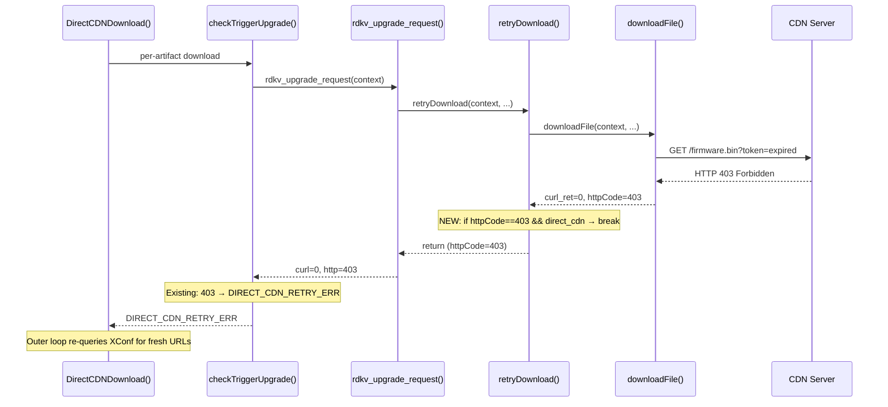
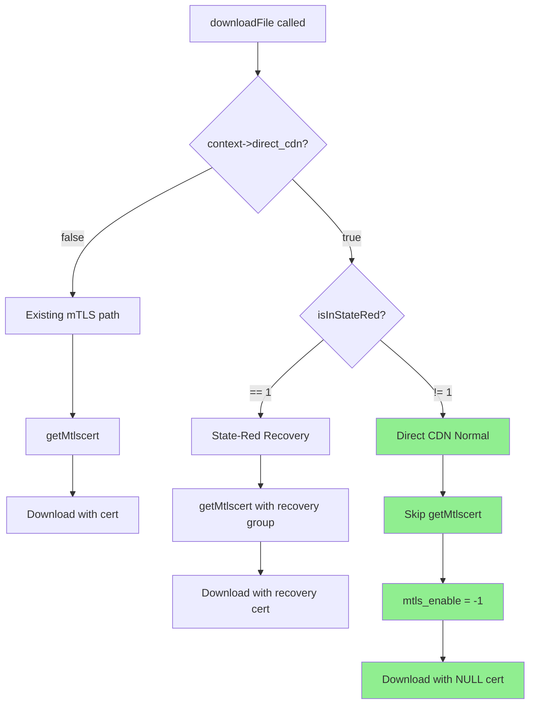

## Context

PR #249 (`topic/RDKEMW-9150`) refactored Direct CDN into the context-struct architecture (`RdkUpgradeContext_t` → `rdkv_upgrade_request()`). The `context->direct_cdn` flag correctly gates Codebig bypass and per-artifact orchestration, but two inner behaviors in `downloadFile()` and `retryDownload()` were not conditioned on this flag.

### PR-249 Baseline (What Already Works)

| Feature | Status | Evidence |
|---------|--------|----------|
| RFC gate `SWDLDirect.Enable` | ✅ | `src/rfcInterface/rfcinterface.c` |
| XConf URL path branching | ✅ | `GetServURL()` in `src/deviceutils/device_api.c` |
| Per-artifact URL parsing | ✅ | `src/json_process.c` |
| Codebig bypass flag | ✅ | `src/rdkv_upgrade.c:525,714` |
| Per-artifact selective retry | ✅ | `src/directcdn.c` loop |
| 403 → DIRECT_CDN_RETRY_ERR at checkTriggerUpgrade | ✅ | `src/rdkv_main.c:671-676` |

### Confirmed Gaps

| ID | Gap | Impact | Severity |
|----|-----|--------|----------|
| GAP-1 | `retryDownload()` retries 403 with stale token (120s wasted) | Slow token refresh, poor UX | HIGH |
| GAP-2 | `downloadFile()` fetches mTLS cert unconditionally | Unnecessary I/O, potential spurious state-red | HIGH |

### Constraints

- All changes MUST be additive guards — no control-flow restructuring
- MUST NOT change any function signatures, struct layouts, or Makefile dependencies
- MUST NOT modify behavior when `direct_cdn == false` (legacy path unchanged)
- MUST NOT alter existing `direct-cdn-adoption` or `direct-cdn-parity-guards` designs
- Build flag `LIBRDKCERTSELECTOR` creates two compilation paths; both MUST be guarded

---

## Goals / Non-Goals

**Goals:**
- Restore behavioral parity with RDKV-reference for token expiry and mTLS bypass
- Zero behavioral change when `direct_cdn == false`
- Independently testable per gap
- Each fix independently reviewable and independently deployable

**Non-Goals:**
- Refactoring retry architecture or introducing new retry layers
- Modifying `DirectCDNDownload()` or `checkTriggerUpgrade()` logic
- Changing cert-selector library behavior or interfaces
- Adding Direct CDN-specific telemetry markers (not present in reference)
- Modifying `directcdn.c`, `rdkv_main.c`, or daemon code paths

---

## Decisions

### D1: 403 short-circuit placement — inside `retryDownload()` while-loop break conditions

**Decision:** Add a break condition in the direct-path while loop of `retryDownload()` at ~line 1244, alongside existing 200/206/404/DWNL_BLOCK break conditions:

```c
if (*httpCode == 403 && context->direct_cdn) {
    SWLOG_INFO("%s: HTTP 403 with Direct CDN - token expired, breaking retry\n", __FUNCTION__);
    break;
}
```

**Rationale:** This is the minimal behavioral equivalent of RDKV-reference `rdkv_main.c:1114-1119` which returns immediately on 403 before ever calling a retry function. In the refactored architecture, the equivalent point is inside `retryDownload()` after the first `downloadFile()` call returns.

**Alternative considered:** Returning early from `rdkv_upgrade_request()` before calling `retryDownload()`. Rejected — `retryDownload()` is also the function that captures the first download attempt's result and performs the retry loop; restructuring it would violate the "no control-flow changes" constraint.

**Backward compatibility:** When `context->direct_cdn == false`, this condition is never true; existing 403 behavior (retry with delay) is preserved unchanged.

---

### D2: mTLS bypass placement — guard before `getMtlscert()` in `downloadFile()`

**Decision:** Add a guard before the `getMtlscert()` call in both `#ifdef LIBRDKCERTSELECTOR` and `#ifndef LIBRDKCERTSELECTOR` paths:

```c
if (context->direct_cdn && state_red != 1) {
    /* Direct CDN: token-authenticated URLs; skip mTLS cert fetch */
    mtls_enable = -1;
    /* sec remains zero-initialized — NULL cert passed to download */
} else {
    /* Existing mTLS cert fetch logic */
    getMtlscert(&sec, &thisCertSel);
    ...
}
```

**Rationale:** Direct CDN URLs contain embedded authentication tokens. Client certificates are neither required nor expected by the CDN. Fetching certs introduces:
- Unnecessary filesystem I/O (cert file reads)
- Risk of `MTLS_CERT_FETCH_FAILURE` → `RDKV_UPGRADE_ERROR_STATE_RED` on a path where certs are irrelevant

Reference behavior: `RDKV-reference/rdkv_main.c:702-714` — when `rfc_directcdn=="true"` AND `server_type==HTTP_SSR_DIRECT` AND `state_red_enable!=1`, NULL cert is passed to `doHttpFileDownload()`.

**Alternative considered:** Passing cert anyway and relying on CDN to ignore it. Rejected — cert fetch failure triggers state-red entry, which is a critical safety mechanism that MUST NOT fire due to an irrelevant cert lookup.

**State-red exception:** When `isInStateRed() == 1`, the device is in boot-time recovery. Recovery may use a different CDN path that requires certs. The guard preserves the existing recovery cert flow.

**Backward compatibility:** When `context->direct_cdn == false`, the guard is never active; existing mTLS behavior is preserved unchanged.

---

### D3: State-red interaction — recovery cert path preserved

**Decision:** The mTLS bypass guard SHALL be `context->direct_cdn && state_red != 1`. When state-red is active, existing cert-fetch logic executes regardless of `direct_cdn` flag.

**Rationale:** State-red recovery is a boot-time emergency path. The device may not have valid CDN tokens (tokens may have expired during the failed boot cycle). The recovery cert provides an alternative authentication mechanism that MUST remain available.

---

## Architecture & Control-Flow

### GAP-1: Token Expiry Short-Circuit



### GAP-2: mTLS Bypass



---

## Subtask-to-Design Mapping

| Subtask | Design Decision | Code Area | Spec Section |
|---------|----------------|-----------|--------------|
| 1: Update OpenSpec specs | — | — | `direct-cdn-download` §Token Expiry, §mTLS Bypass; `retry-recovery` §Inner Loop Short-Circuit |
| 2: 403 early-return | D1 | `src/rdkv_upgrade.c` `retryDownload()` ~L1244 | `retry-recovery` §Inner Loop Short-Circuit |
| 3: mTLS cert-skip | D2, D3 | `src/rdkv_upgrade.c` `downloadFile()` ~L1038 | `direct-cdn-download` §mTLS Bypass |
| 4: UT for 403 | D1 validation | `unittest/` | — |
| 5: UT for mTLS | D2, D3 validation | `unittest/` | — |

---

## Behavioral Requirements Traceability Matrix

| Requirement | Spec Section | Code Function | Lines (approx) | Test |
|-------------|-------------|---------------|-----------------|------|
| 403 → immediate break when direct_cdn | `retry-recovery` §Inner Loop | `retryDownload()` | ~1244-1260 | Subtask 4: mock 403 + direct_cdn=true → no sleep |
| 403 → normal retry when !direct_cdn | `retry-recovery` §unchanged | `retryDownload()` | ~1244-1260 | Subtask 4: mock 403 + direct_cdn=false → retries |
| Skip getMtlscert when direct_cdn && !state_red | `direct-cdn-download` §mTLS Bypass | `downloadFile()` | ~1038-1070 | Subtask 5: verify no cert fetch |
| Use recovery cert when direct_cdn && state_red | `direct-cdn-download` §mTLS Bypass | `downloadFile()` | ~1071-1095 | Subtask 5: verify RCVRY cert group |
| Legacy path unchanged when !direct_cdn | Both specs §backward compat | `downloadFile()`, `retryDownload()` | all | Subtask 4+5: verify no regression |

---

## Risks / Trade-offs

| Risk | Likelihood | Impact | Mitigation |
|------|-----------|--------|-----------|
| CDN rejects requests without mTLS headers | Low | Download failure | RFC kill-switch: `SWDLDirect.Enable=false` reverts to legacy path |
| Break condition accidentally triggers for non-CDN 403 | Very Low | Missed retry opportunity | Guard is AND-ed with `context->direct_cdn`; only true in DirectCDN path |
| Cert-selector `static` variable state issue | Low | Stale cert handle | Guard placed BEFORE cert-selector init; handle never created in CDN path |
| Regression in legacy (non-DirectCDN) download | Very Low | Production download failure | All changes gated by `context->direct_cdn == true`; legacy path untouched |

**Rollback**: Set RFC `Device.DeviceInfo.X_RDKCENTRAL-COM_RFC.Feature.SWDLDirect.Enable` to `"false"`. This disables the entire Direct CDN code path including the new guards.

---

## Open Questions

(none — all design decisions resolved during gap analysis)
