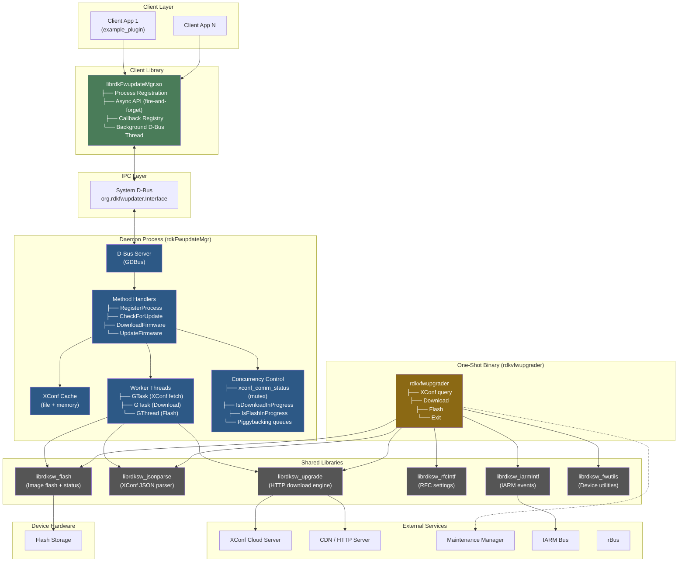
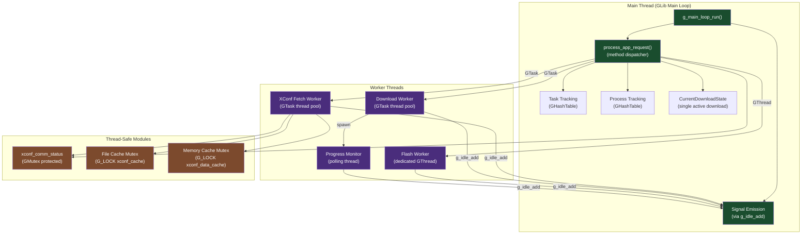
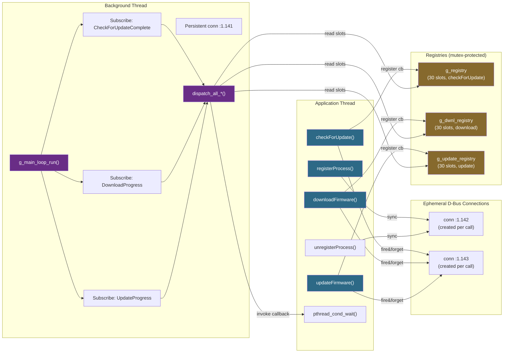
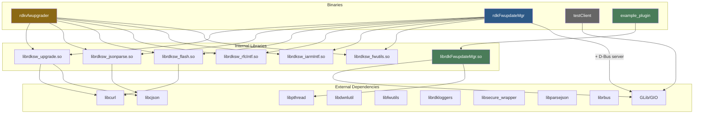
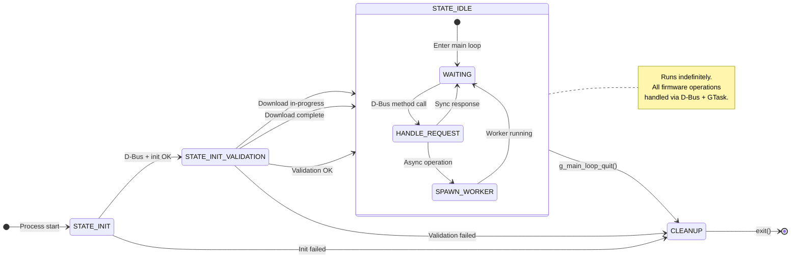
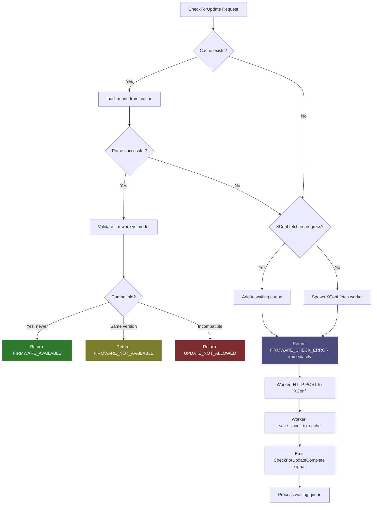

# Architecture Diagrams

> Mermaid-format diagrams for engineering design reviews.  
> Render with any Mermaid-compatible tool (GitHub, VS Code preview, mermaid.live).

---

## 1. System Component Diagram

---

## 2. Daemon Internal Architecture

---

## 3. Client Library Threading Model

---

## 4. Build Artifact Dependency Graph

---

## 5. Daemon State Machine

---

## 6. XConf Cache Decision Flow

