# Subsystem Architecture Diagrams

> **Scope:** Layered architecture, subsystem relationships, ownership maps  
> **Format:** Mermaid diagrams for rendering in Markdown viewers

---

## 1. Layered Architecture — Both Execution Models

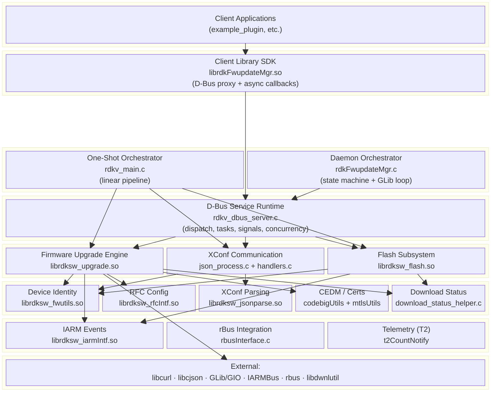

---

## 2. Subsystem Relationship / Interaction Map

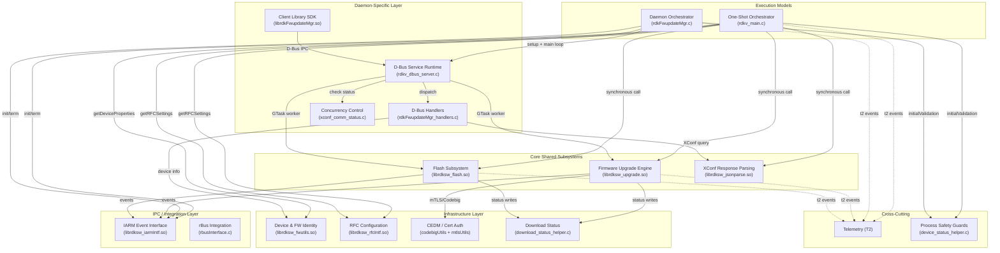

---

## 3. Ownership Map — Who Owns What

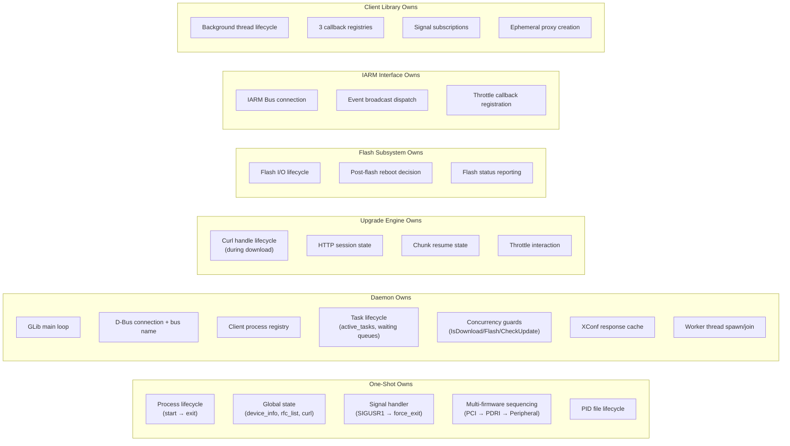

---

## 4. Data Flow — Firmware Update (Daemon Path)

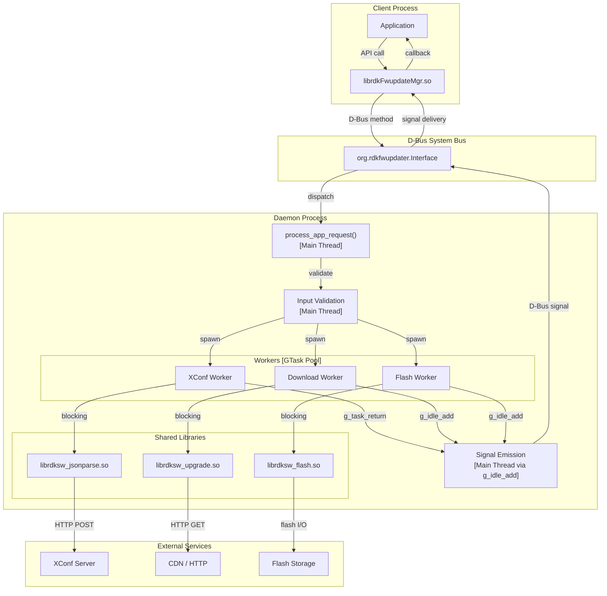

---

## 5. Library Dependency Graph

```mermaid
flowchart BT
    subgraph "External Dependencies"
        CURL["libcurl"]
        CJSON["libcjson"]
        GLIB["GLib/GIO"]
        IARMBUS["libIARMBus"]
        RBUS_LIB["librbus"]
        DWNLUTIL["libdwnlutil"]
        FWUTILS_EXT["libfwutils"]
        SECWRAP["libsecure_wrapper"]
        PARSEJSON["libparsejson"]
        PTHREAD["libpthread"]
        RFCAPI["librfcapi"]
        T2_LIB["libtelemetry_msgsender"]
    end

    subgraph "Internal Libraries"
        UPGRADE["librdksw_upgrade.so<br/>rdkv_upgrade.c, chunk.c<br/>codebigUtils.c, mtlsUtils.c"]
        JSONPARSE["librdksw_jsonparse.so<br/>json_process.c"]
        FLASH_LIB["librdksw_flash.so<br/>flash.c<br/>download_status_helper.c"]
        RFCINTF["librdksw_rfcIntf.so<br/>rfcinterface.c"]
        IARMINTF["librdksw_iarmIntf.so<br/>iarmInterface.c"]
        FWUTILS["librdksw_fwutils.so<br/>deviceutils.c, device_api.c"]
        CLIENTLIB["librdkFwupdateMgr.so<br/>process.c, api.c, async.c"]
    end

    subgraph "Binaries"
        ONESHOT_BIN["rdkvfwupgrader"]
        DAEMON_BIN["rdkFwupdateMgr"]
        EXAMPLE["example_plugin"]
    end

    %% Binary → Library
    ONESHOT_BIN --> UPGRADE
    ONESHOT_BIN --> JSONPARSE
    ONESHOT_BIN --> FLASH_LIB
    ONESHOT_BIN --> RFCINTF
    ONESHOT_BIN --> IARMINTF
    ONESHOT_BIN --> FWUTILS

    DAEMON_BIN --> UPGRADE
    DAEMON_BIN --> JSONPARSE
    DAEMON_BIN --> FLASH_LIB
    DAEMON_BIN --> RFCINTF
    DAEMON_BIN --> IARMINTF
    DAEMON_BIN --> FWUTILS
    DAEMON_BIN --> GLIB

    EXAMPLE --> CLIENTLIB
    CLIENTLIB --> GLIB
    CLIENTLIB --> PTHREAD

    %% Library → External
    UPGRADE --> CURL
    UPGRADE --> DWNLUTIL
    UPGRADE --> SECWRAP
    JSONPARSE --> CJSON
    JSONPARSE --> PARSEJSON
    FLASH_LIB --> CURL
    RFCINTF --> RFCAPI
    IARMINTF --> IARMBUS
    FWUTILS --> PARSEJSON
    FWUTILS --> SECWRAP
```

---

## 6. Concurrency Architecture (Daemon Only)

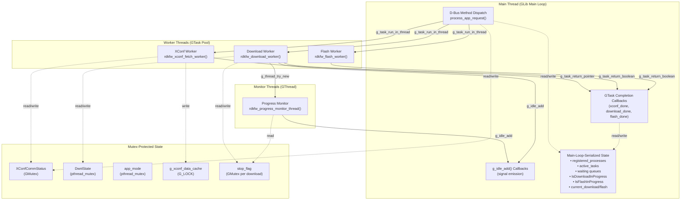

---

## 7. One-Shot Execution Lifecycle (`rdkvfwupgrader`)

> **Cross-reference:** [specs/updater-execution/spec.md](../specs/updater-execution/spec.md), [runtime/rdkvfwupgrader-sequence.md](../runtime/rdkvfwupgrader-sequence.md)

```mermaid
stateDiagram-v2
    [*] --> INVOCATION : Maintenance Manager / cron / TR-69

    state INVOCATION {
        [*] --> PARSE_ARGS : main(argc, argv)
        PARSE_ARGS --> LOG_INIT : log_init()
        LOG_INIT --> SIGNAL_SETUP : sigaction(SIGUSR1)
    }

    INVOCATION --> INITIALIZATION

    state INITIALIZATION {
        [*] --> DEVICE_PROPS : getDeviceProperties()
        DEVICE_PROPS --> IMAGE_DETAILS : getImageDetails()
        IMAGE_DETAILS --> RFC_SETTINGS : getRFCSettings()
        RFC_SETTINGS --> DIR_CREATE : createDir(difw_path)
        DIR_CREATE --> IARM_INIT : init_event_handler()
        IARM_INIT --> MAINT_QUERY : getJsonRpc(MaintenanceMode)
    }

    INITIALIZATION --> VALIDATION

    state VALIDATION {
        [*] --> BUILD_CHECK : GetBuildType() + RFC exclusion
        BUILD_CHECK --> PID_CHECK : CurrentRunningInst("/tmp/DIFD.pid")
        PID_CHECK --> REBOOT_CHECK : Check fw_preparing_to_reboot
        REBOOT_CHECK --> UPGRADE_FLAG : isUpgradeInProgress()
    }

    VALIDATION --> XCONF_PHASE : Validation passed
    VALIDATION --> EXIT_SKIP : Conflict detected

    state XCONF_PHASE {
        [*] --> BUILD_PAYLOAD : createJsonString()
        BUILD_PAYLOAD --> GET_URL : GetServURL()
        GET_URL --> HTTP_POST : rdkv_upgrade_request(XCONF_UPGRADE)
        HTTP_POST --> PARSE_RESP : getXconfRespData()
        PARSE_RESP --> VALIDATE_RESP : processJsonResponse()
    }

    XCONF_PHASE --> FIRMWARE_PIPELINE : Update available
    XCONF_PHASE --> EXIT_NO_UPDATE : No update

    state FIRMWARE_PIPELINE {
        [*] --> PCI_DOWNLOAD : rdkv_upgrade_request(PCI)
        PCI_DOWNLOAD --> PCI_FLASH : flashImage(PCI)
        PCI_FLASH --> DELAY_30S : sleep(30)
        DELAY_30S --> PDRI_DOWNLOAD : rdkv_upgrade_request(PDRI)
        PDRI_DOWNLOAD --> PDRI_FLASH : flashImage(PDRI)
        PDRI_FLASH --> PERIPHERAL_LOOP : For each peripheral
        PERIPHERAL_LOOP --> [*]
    }

    FIRMWARE_PIPELINE --> CLEANUP
    EXIT_SKIP --> CLEANUP
    EXIT_NO_UPDATE --> CLEANUP

    state CLEANUP {
        [*] --> IARM_REPORT : eventManager(MaintenanceMGR, status)
        IARM_REPORT --> UNINIT : uninitialize()
        UNINIT --> REMOVE_PID : unlink("/tmp/DIFD.pid")
    }

    CLEANUP --> [*] : exit(ret_code)
```

---

## 8. Data Flow — Firmware Update (One-Shot Path)

> Counterpart to §4 (Daemon Path). Shows the same firmware update lifecycle through the synchronous/procedural one-shot execution model.

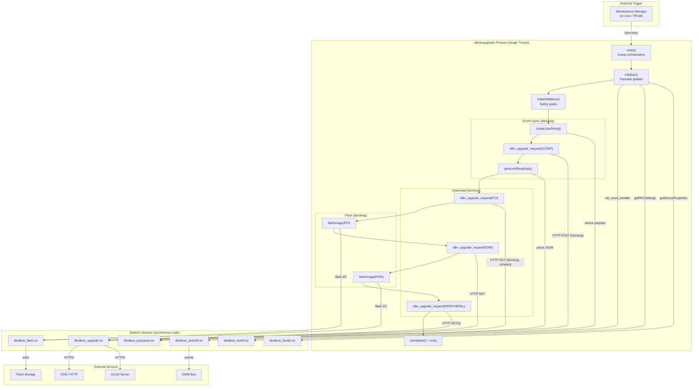

---

## 9. Execution Model Comparison — Side-by-Side

> Structural comparison showing how each execution model uses the same shared infrastructure differently.

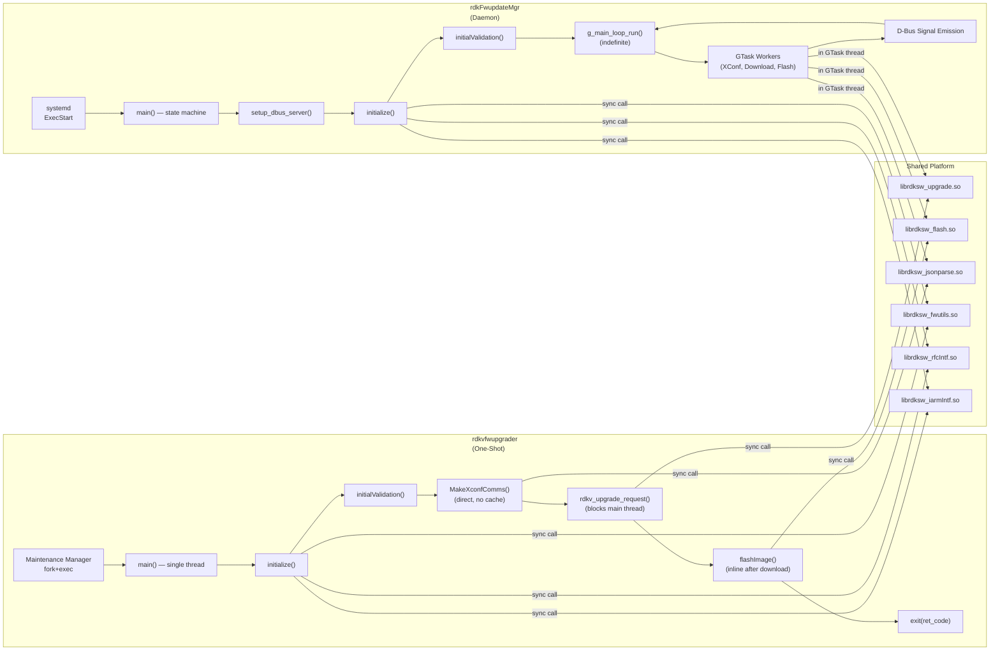

---

## 10. One-Shot Invocation & Recovery Model

> Shows how `rdkvfwupgrader` is triggered, how it interacts with the Maintenance Manager, and how recovery works across invocations.

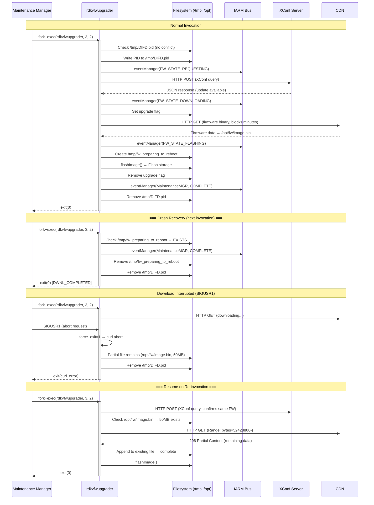

---

## 11. One-Shot Shared-Library Interaction Model

> Shows the synchronous call chain between `rdkvfwupgrader` and each shared library, with timing characteristics.

```mermaid
flowchart TD
    subgraph "rdkvfwupgrader Process"
        MAIN["main() — single thread<br/>All calls are BLOCKING"]
    end

    subgraph "Initialization Phase (~50ms)"
        LIB_FW["librdksw_fwutils.so<br/>getDeviceProperties()<br/>getImageDetails()"]
        LIB_RFC_I["librdksw_rfcIntf.so<br/>getRFCSettings()"]
        LIB_IARM_I["librdksw_iarmIntf.so<br/>init_event_handler()"]
    end

    subgraph "XConf Phase (5-60s)"
        LIB_JSON_X["librdksw_jsonparse.so<br/>createJsonString()"]
        LIB_UPG_X["librdksw_upgrade.so<br/>rdkv_upgrade_request(XCONF)"]
        LIB_JSON_P["librdksw_jsonparse.so<br/>getXconfRespData()<br/>processJsonResponse()"]
    end

    subgraph "Download Phase (seconds to minutes)"
        LIB_UPG_D["librdksw_upgrade.so<br/>rdkv_upgrade_request(PCI/PDRI/PERIPH)"]
    end

    subgraph "Flash Phase (seconds)"
        LIB_FLASH_F["librdksw_flash.so<br/>flashImage()"]
    end

    subgraph "Cleanup Phase (~10ms)"
        LIB_IARM_T["librdksw_iarmIntf.so<br/>term_event_handler()"]
    end

    MAIN -->|"1. sync"| LIB_FW
    MAIN -->|"2. sync"| LIB_RFC_I
    MAIN -->|"3. sync"| LIB_IARM_I
    MAIN -->|"4. sync"| LIB_JSON_X
    MAIN -->|"5. sync (network)"| LIB_UPG_X
    MAIN -->|"6. sync"| LIB_JSON_P
    MAIN -->|"7. sync (network, long)"| LIB_UPG_D
    MAIN -->|"8. sync (I/O)"| LIB_FLASH_F
    MAIN -->|"9. sync"| LIB_IARM_T
```

### Call Duration Characteristics

| Phase | Library | Duration | Blocking? | Interruptible? |
|-------|---------|----------|-----------|----------------|
| Init | librdksw_fwutils | ~1-5ms | File I/O | No |
| Init | librdksw_rfcIntf | ~5ms | File/IPC | No |
| Init | librdksw_iarmIntf | ~10ms | IPC handshake | No |
| XConf | librdksw_upgrade | **5-60 seconds** | Network | Via `force_exit` |
| Download | librdksw_upgrade | **Seconds to minutes** | Network | Via `force_exit` / throttle |
| Flash | librdksw_flash | **Seconds** | Storage I/O | No |
| Cleanup | librdksw_iarmIntf | ~1ms | IPC | No |

---

## 12. One-Shot vs Daemon — Subsystem Usage Overlay

> Shows which subsystems are active in each execution model and how they differ in invocation pattern.

```mermaid
flowchart TD
    subgraph "Shared Subsystems (Both Models)"
        style S fill:#e8f5e9
        S1["Firmware Upgrade Engine<br/>librdksw_upgrade.so"]
        S2["Flash Subsystem<br/>librdksw_flash.so"]
        S3["XConf Parsing<br/>librdksw_jsonparse.so"]
        S4["Device Identity<br/>librdksw_fwutils.so"]
        S5["RFC Configuration<br/>librdksw_rfcIntf.so"]
        S6["IARM Events<br/>librdksw_iarmIntf.so"]
        S7["Download Status<br/>download_status_helper.c"]
        S8["Process Safety<br/>device_status_helper.c"]
        S9["CEDM / Certs<br/>codebigUtils + mtlsUtils"]
        S10["Telemetry (T2)"]
    end

    subgraph "One-Shot Only"
        style OS fill:#fff3e0
        OS1["Linear Pipeline<br/>(PCI→PDRI→Peripheral)"]
        OS2["Multi-firmware Sequencing<br/>(30s inter-flash delay)"]
        OS3["Direct XConf Query<br/>(no cache, no dedup)"]
        OS4["Signal Abort (SIGUSR1)"]
        OS5["Maintenance Manager<br/>Status Reporting"]
        OS6["Exit Code Propagation"]
    end

    subgraph "Daemon Only"
        style D fill:#e3f2fd
        D1["D-Bus Service Runtime"]
        D2["Client Process Registry"]
        D3["GTask Worker Pool"]
        D4["Concurrency Guards"]
        D5["Piggyback Queues"]
        D6["XConf Response Cache"]
        D7["D-Bus Signal Broadcasting"]
        D8["Progress Monitor Thread"]
        D9["Client Library SDK"]
    end

    %% One-shot → Shared (synchronous)
    OS1 -->|"sync, blocks main"| S1
    OS1 -->|"sync, blocks main"| S2
    OS3 -->|"sync, blocks main"| S3
    OS5 -->|"fire-and-forget"| S6
    OS1 -->|"writes status"| S7
    OS4 -->|"checks force_exit"| S1

    %% Daemon → Shared (via workers)
    D3 -->|"async, blocks worker"| S1
    D3 -->|"async, blocks worker"| S2
    D3 -->|"async, blocks worker"| S3
    D1 -->|"init/term"| S6
    D3 -->|"writes status"| S7
    D4 -->|"guards access"| S1
    D4 -->|"guards access"| S2

    %% Cross-cutting
    S8 -.->|"PID check"| OS1
    S8 -.->|"PID check"| D1
```

---

## 13. One-Shot Threading & Abort Model

> Counterpart to §6 (Daemon Concurrency Architecture). Documents the simpler concurrency model of the one-shot binary.

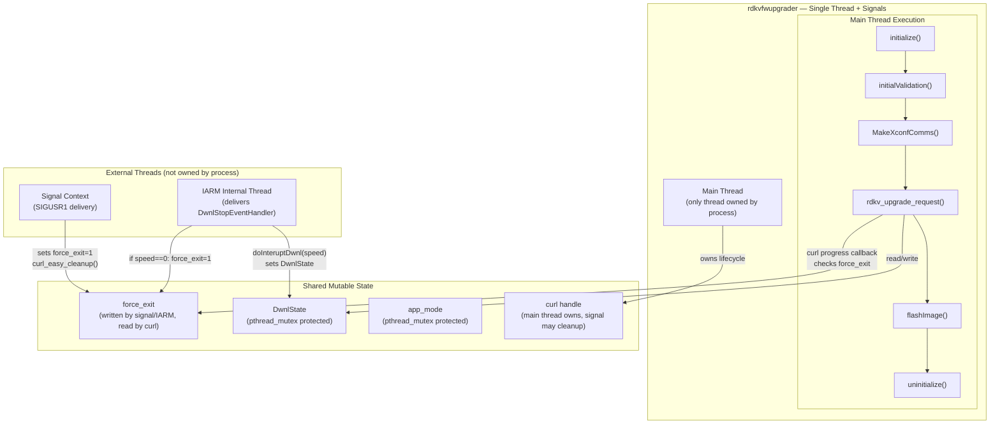

### Contrast: Concurrency Primitives

| Aspect | One-Shot | Daemon |
|--------|----------|--------|
| Threads owned | 1 (main only) | 1 main + N workers + progress monitors |
| Event loop | None | GLib main loop |
| Async dispatch | None | GTask + g_idle_add |
| Concurrency guards | PID file only | PID file + IsDownload + IsFlash + XConfComm |
| Mutex usage | 2 (DwnlState, app_mode) — mostly uncontested | 5+ (GMutex, G_LOCK, pthread_mutex) |
| Abort mechanism | SIGUSR1 → force_exit → curl abort | stop_flag per download + g_idle_add |
| Signal emission | N/A | D-Bus broadcast via main loop |
| State protection | Single-thread guarantee + signal-safe flag writes | Main-loop serialization + mutexes |

---

## 14. Maintenance Manager Integration (One-Shot)

> Shows how `rdkvfwupgrader` integrates with the RDK Maintenance Manager ecosystem.

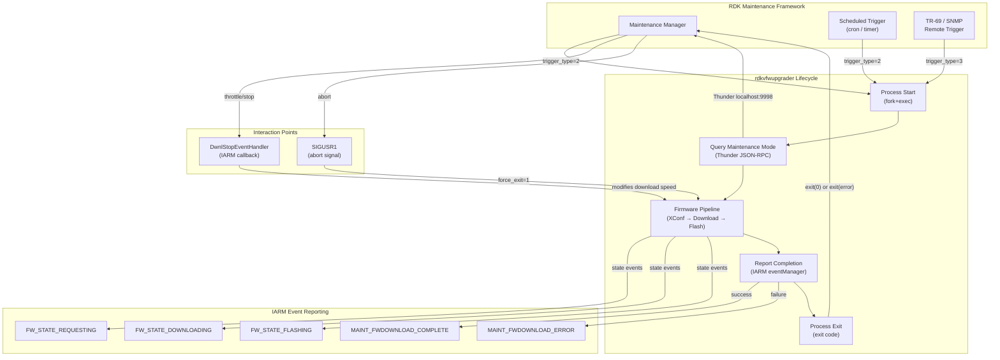

---

## 15. Firmware Orchestration — Download/Flash Sequencing (One-Shot)

> Detailed sequencing of multi-firmware operations showing blocking durations and inter-operation coordination.

```mermaid
gantt
    title rdkvfwupgrader — Firmware Operation Timeline
    dateFormat X
    axisFormat %s

    section Initialization
    initialize()           :init, 0, 50
    initialValidation()    :valid, 50, 100

    section XConf Query
    createJsonString()     :json, 100, 105
    HTTP POST to XConf     :xconf, 105, 165
    Parse response         :parse, 165, 170

    section PCI Firmware
    Download PCI (HTTP GET):dl_pci, 170, 770
    Flash PCI              :flash_pci, 770, 780

    section Inter-flash Delay
    sleep(30)              :delay, 780, 810

    section PDRI Firmware
    Download PDRI          :dl_pdri, 810, 910
    Flash PDRI             :flash_pdri, 910, 915

    section Peripheral
    Download Peripheral(s) :dl_periph, 915, 945

    section Cleanup
    uninitialize() + exit  :cleanup, 945, 950
```

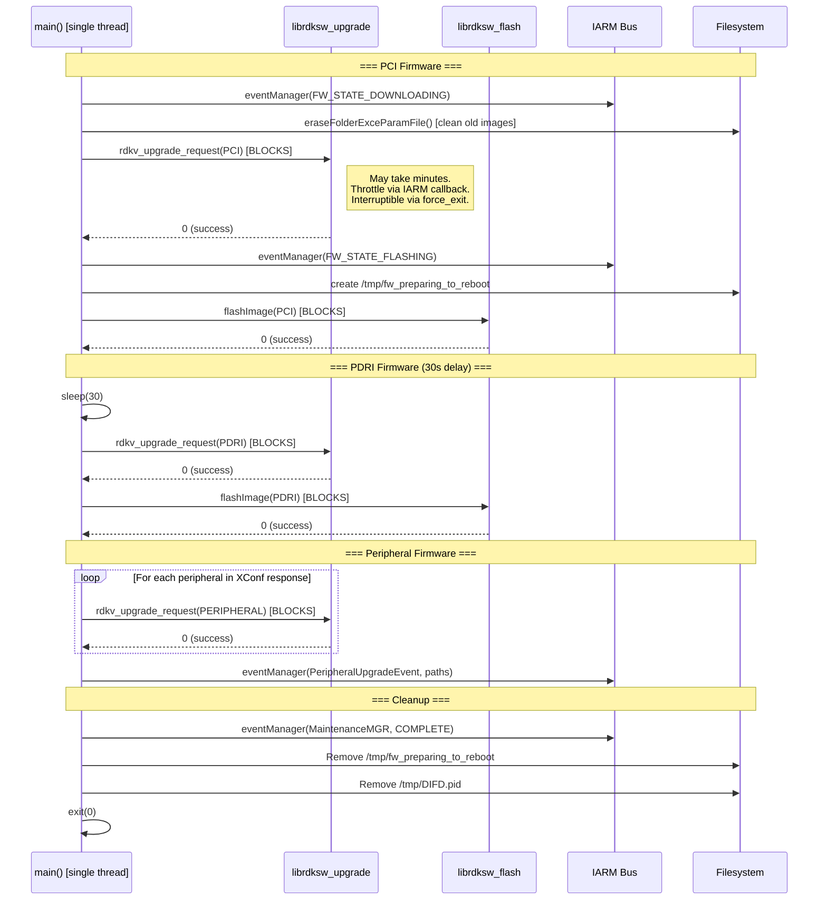
