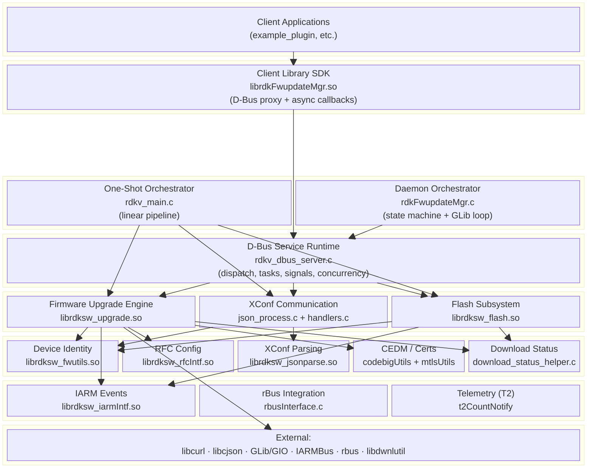
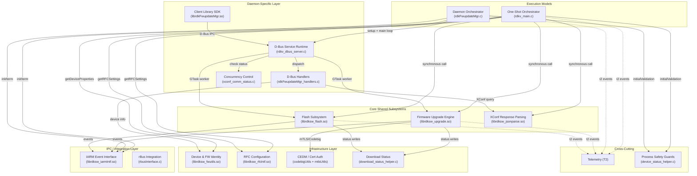
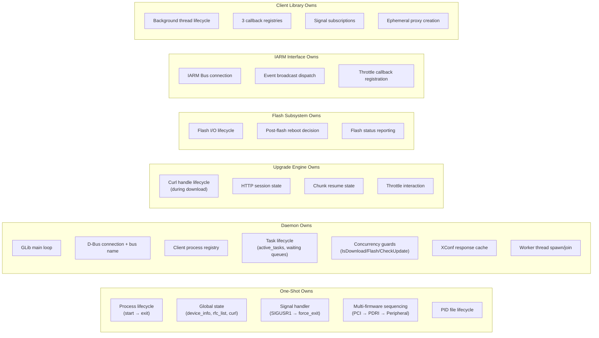
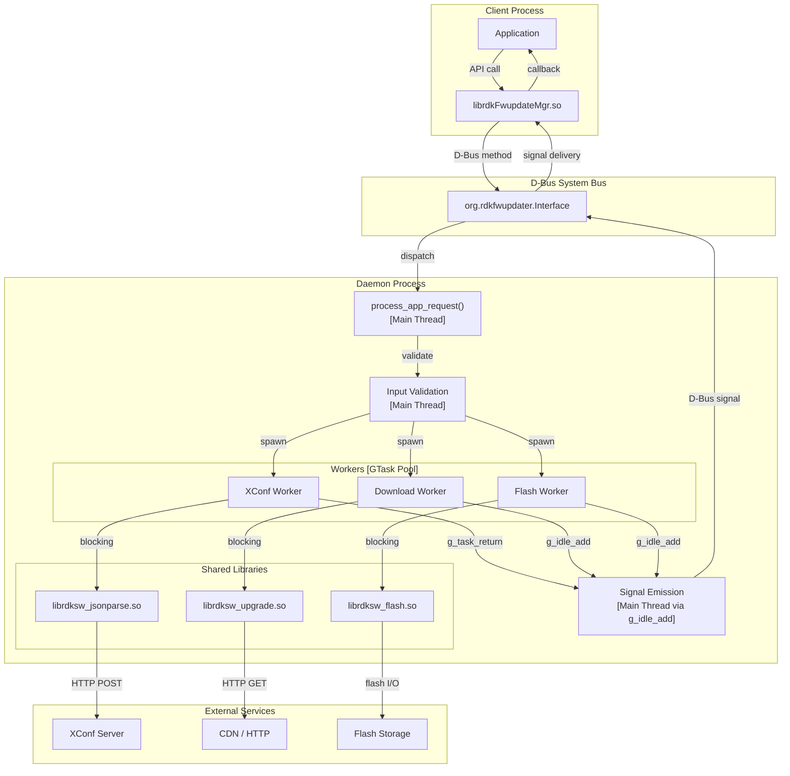
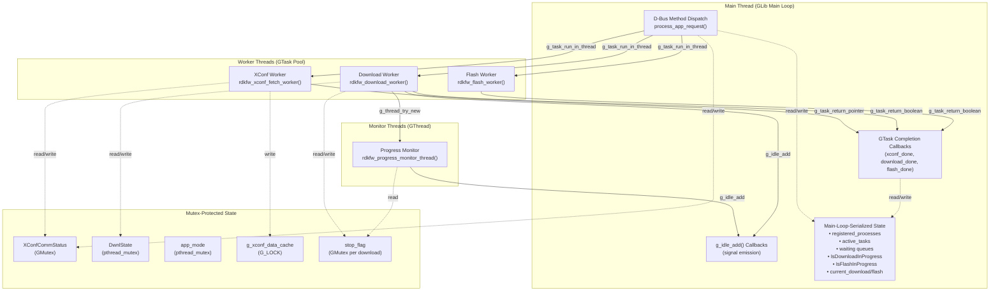

# Subsystem Architecture Diagrams

> **Scope:** Layered architecture, subsystem relationships, ownership maps  
> **Format:** Mermaid diagrams for rendering in Markdown viewers

---

## 1. Layered Architecture — Both Execution Models

---

## 2. Subsystem Relationship / Interaction Map

---

## 3. Ownership Map — Who Owns What

---

## 4. Data Flow — Firmware Update (Daemon Path)

---

## 5. Library Dependency Graph

```mermaid
flowchart BT
    subgraph "External Dependencies"
        CURL["libcurl"]
        CJSON["libcjson"]
        GLIB["GLib/GIO"]
        IARMBUS["libIARMBus"]
        RBUS_LIB["librbus"]
        DWNLUTIL["libdwnlutil"]
        FWUTILS_EXT["libfwutils"]
        SECWRAP["libsecure_wrapper"]
        PARSEJSON["libparsejson"]
        PTHREAD["libpthread"]
        RFCAPI["librfcapi"]
        T2_LIB["libtelemetry_msgsender"]
    end

    subgraph "Internal Libraries"
        UPGRADE["librdksw_upgrade.so<br/>rdkv_upgrade.c, chunk.c<br/>codebigUtils.c, mtlsUtils.c"]
        JSONPARSE["librdksw_jsonparse.so<br/>json_process.c"]
        FLASH_LIB["librdksw_flash.so<br/>flash.c<br/>download_status_helper.c"]
        RFCINTF["librdksw_rfcIntf.so<br/>rfcinterface.c"]
        IARMINTF["librdksw_iarmIntf.so<br/>iarmInterface.c"]
        FWUTILS["librdksw_fwutils.so<br/>deviceutils.c, device_api.c"]
        CLIENTLIB["librdkFwupdateMgr.so<br/>process.c, api.c, async.c"]
    end

    subgraph "Binaries"
        ONESHOT_BIN["rdkvfwupgrader"]
        DAEMON_BIN["rdkFwupdateMgr"]
        EXAMPLE["example_plugin"]
    end

    %% Binary → Library
    ONESHOT_BIN --> UPGRADE
    ONESHOT_BIN --> JSONPARSE
    ONESHOT_BIN --> FLASH_LIB
    ONESHOT_BIN --> RFCINTF
    ONESHOT_BIN --> IARMINTF
    ONESHOT_BIN --> FWUTILS

    DAEMON_BIN --> UPGRADE
    DAEMON_BIN --> JSONPARSE
    DAEMON_BIN --> FLASH_LIB
    DAEMON_BIN --> RFCINTF
    DAEMON_BIN --> IARMINTF
    DAEMON_BIN --> FWUTILS
    DAEMON_BIN --> GLIB

    EXAMPLE --> CLIENTLIB
    CLIENTLIB --> GLIB
    CLIENTLIB --> PTHREAD

    %% Library → External
    UPGRADE --> CURL
    UPGRADE --> DWNLUTIL
    UPGRADE --> SECWRAP
    JSONPARSE --> CJSON
    JSONPARSE --> PARSEJSON
    FLASH_LIB --> CURL
    RFCINTF --> RFCAPI
    IARMINTF --> IARMBUS
    FWUTILS --> PARSEJSON
    FWUTILS --> SECWRAP
```

---

## 6. Concurrency Architecture (Daemon Only)

