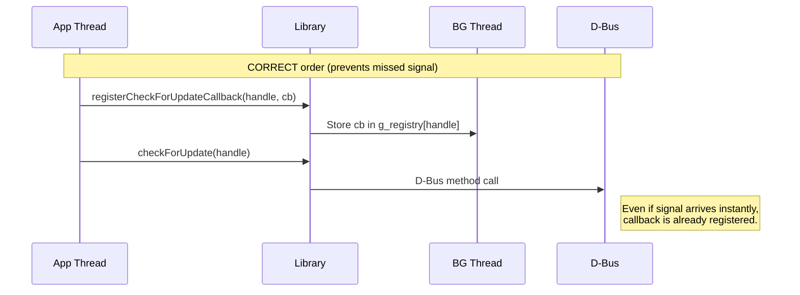
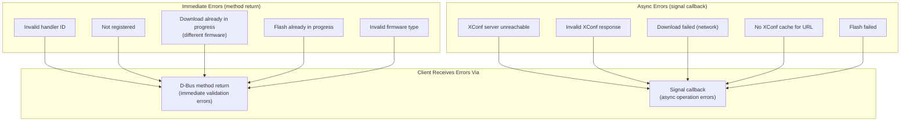
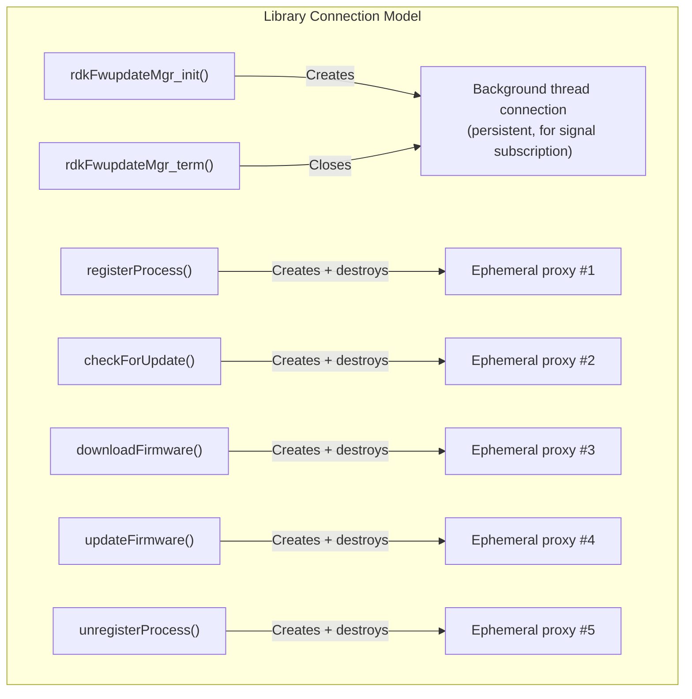

# Client-Daemon Interaction — End-to-End Flow

> **Evidence Level:** Verified from `librdkFwupdateMgr/src/rdkFwupdateMgr_api.c`, `rdkFwupdateMgr_async.c`, `rdkFwupdateMgr_process.c`, and `src/dbus/rdkv_dbus_server.c`  
> **Scope:** Complete journey of a firmware update from client application through library, D-Bus, daemon, and back via signals/callbacks

---

## 1. Architecture Overview

```mermaid
flowchart LR
    subgraph "Client Process"
        APP[Application Code]
        LIB[librdkFwupdateMgr.so]
        BG[Background Thread<br/>GLib Main Loop]
        CB[Callback Registries<br/>g_registry / g_dwnl_registry / g_update_registry]
    end
    
    subgraph "D-Bus System Bus"
        DBUS[(org.rdkfwupdater.Interface<br/>/org/rdkfwupdater/Service)]
    end
    
    subgraph "Daemon Process (rdkFwupdateMgr)"
        MAIN_LOOP[GLib Main Loop<br/>process_app_request()]
        TASKS[Task Tracking<br/>active_tasks + waiting queues]
        WORKERS[GTask Worker Pool]
    end
    
    APP -->|"API call (blocking D-Bus)"| LIB
    LIB -->|"Method call"| DBUS
    DBUS -->|"Dispatch"| MAIN_LOOP
    MAIN_LOOP -->|"Spawn"| WORKERS
    WORKERS -->|"g_task_return / g_idle_add"| MAIN_LOOP
    MAIN_LOOP -->|"Signal broadcast"| DBUS
    DBUS -->|"Signal delivery"| BG
    BG -->|"Invoke registered callback"| CB
    CB -->|"App callback (user thread)"| APP
```

---

## 2. Complete Firmware Update Lifecycle

```mermaid
sequenceDiagram
    participant APP as Client Application
    participant LIB as librdkFwupdateMgr<br/>(caller's thread)
    participant BG as Library Background Thread<br/>(GLib main loop)
    participant DBUS as D-Bus System Bus
    participant DAEMON_ML as Daemon Main Loop<br/>(process_app_request)
    participant DAEMON_W as Daemon Worker Thread<br/>(GTask)
    participant XCONF as XConf Cloud
    participant CDN as CDN Server

    Note over APP,CDN: ═══ PHASE 1: INITIALIZATION ═══

    APP->>LIB: rdkFwupdateMgr_init()
    activate LIB
    LIB->>LIB: internal_system_init()
    LIB->>BG: g_thread_new("fwupdate_bg_thread")
    activate BG
    BG->>BG: g_main_loop_new() + g_main_loop_run()
    Note right of BG: Background thread running.<br/>Subscribes to D-Bus signals:<br/>- CheckForUpdateComplete<br/>- DownloadProgress<br/>- UpdateProgress
    BG->>DBUS: g_dbus_connection_signal_subscribe() × 3
    LIB-->>APP: return (success)
    deactivate LIB

    Note over APP,CDN: ═══ PHASE 2: REGISTRATION ═══

    APP->>LIB: registerProcess("MyApp", "1.0")
    activate LIB
    Note over LIB: Creates fresh D-Bus proxy (ephemeral)
    LIB->>DBUS: g_dbus_proxy_call_sync("RegisterProcess", ("MyApp", "1.0"))
    DBUS->>DAEMON_ML: Dispatch RegisterProcess
    activate DAEMON_ML
    DAEMON_ML->>DAEMON_ML: Validate name/version
    DAEMON_ML->>DAEMON_ML: add_process_to_tracking() → handler_id=12345
    DAEMON_ML->>DBUS: Return (handler_id=12345)
    deactivate DAEMON_ML
    DBUS-->>LIB: GVariant (t: 12345)
    LIB->>LIB: Convert handler_id to string: "12345"
    LIB->>LIB: Return "12345" as FirmwareInterfaceHandle
    LIB-->>APP: handle = "12345"
    deactivate LIB

    Note over APP,CDN: ═══ PHASE 3: CHECK FOR UPDATE ═══

    APP->>LIB: registerCheckForUpdateCallback(handle, my_callback)
    activate LIB
    LIB->>BG: Add callback to g_registry[handle]
    Note right of BG: CRITICAL: Register BEFORE send!<br/>Prevents race with fast signal.
    LIB-->>APP: return (success)
    deactivate LIB

    APP->>LIB: checkForUpdate(handle)
    activate LIB
    Note over LIB: Creates fresh D-Bus proxy
    LIB->>DBUS: g_dbus_proxy_call_sync("CheckForUpdate", ("12345"))
    
    DBUS->>DAEMON_ML: Dispatch CheckForUpdate
    activate DAEMON_ML
    DAEMON_ML->>DAEMON_ML: Validate handler, registration ✓
    DAEMON_ML->>DBUS: Return (0, "", "", "", "check in progress", 3)
    Note right of DAEMON_ML: IMMEDIATE response.<br/>Client unblocked now.
    DAEMON_ML->>DAEMON_ML: Create TaskContext, add to tracking
    
    alt No fetch running
        DAEMON_ML->>DAEMON_ML: setXConfCommStatus(TRUE)
        DAEMON_ML->>DAEMON_W: g_task_run_in_thread(xconf_fetch_worker)
        activate DAEMON_W
    else Fetch already running (piggyback)
        DAEMON_ML->>DAEMON_ML: Task joins waiting queue
    end
    deactivate DAEMON_ML
    
    DBUS-->>LIB: GVariant (issssi: 0,"","","","check in progress",3)
    LIB->>LIB: Parse → FwUpdateData{status_code=3}
    LIB-->>APP: return FwUpdateData (FIRMWARE_CHECK_ERROR=3)
    deactivate LIB
    Note right of APP: App knows: check in progress.<br/>Real result comes via callback.

    Note over DAEMON_W,XCONF: Worker Thread (blocking)
    DAEMON_W->>XCONF: rdkFwupdateMgr_checkForUpdate() [HTTP POST]
    XCONF-->>DAEMON_W: JSON response (firmware info)
    DAEMON_W->>DAEMON_W: Package result as GVariant
    DAEMON_W->>DAEMON_W: g_task_return_pointer(result)
    deactivate DAEMON_W

    Note over DAEMON_ML,DBUS: Completion Callback (main loop)
    activate DAEMON_ML
    DAEMON_ML->>DAEMON_ML: rdkfw_xconf_fetch_done()
    DAEMON_ML->>DBUS: emit_signal("CheckForUpdateComplete", result)
    Note right of DBUS: Broadcast to ALL subscribers
    DAEMON_ML->>DAEMON_ML: Cleanup waiting tasks, reset status
    deactivate DAEMON_ML

    DBUS->>BG: Signal: CheckForUpdateComplete
    activate BG
    BG->>BG: on_check_update_signal_received()
    BG->>BG: Parse GVariant → FwUpdateData
    BG->>BG: Lookup callback in g_registry["12345"]
    BG->>APP: my_callback(handle, &fw_data)
    Note right of APP: App receives real result:<br/>FIRMWARE_AVAILABLE + version info
    deactivate BG

    Note over APP,CDN: ═══ PHASE 4: DOWNLOAD FIRMWARE ═══

    APP->>LIB: registerDownloadCallback(handle, my_dwnl_callback)
    activate LIB
    LIB->>BG: Add callback to g_dwnl_registry[handle]
    LIB-->>APP: return (success)
    deactivate LIB

    APP->>LIB: downloadFirmware(handle, "fw_v2.0.bin", "", "PCI")
    activate LIB
    LIB->>DBUS: g_dbus_proxy_call_sync("DownloadFirmware", ("12345","fw_v2.0.bin","","PCI"))
    
    DBUS->>DAEMON_ML: Dispatch DownloadFirmware
    activate DAEMON_ML
    DAEMON_ML->>DAEMON_ML: Validate all inputs ✓
    DAEMON_ML->>DAEMON_ML: Check cache: /opt/CDL/fw_v2.0.bin → not found
    DAEMON_ML->>DAEMON_ML: IsDownloadInProgress = TRUE
    DAEMON_ML->>DAEMON_W: g_task_run_in_thread(download_worker)
    activate DAEMON_W
    DAEMON_ML->>DBUS: Return ("RDKFW_DWNL_SUCCESS", "INPROGRESS", "started")
    deactivate DAEMON_ML
    
    DBUS-->>LIB: GVariant (sss)
    LIB-->>APP: return DownloadResult{INPROGRESS}
    deactivate LIB
    Note right of APP: App knows: download started.<br/>Progress comes via callback.

    Note over DAEMON_W,CDN: Worker Thread (blocking download)
    DAEMON_W->>CDN: rdkv_upgrade_request() [HTTP GET, download_only=1]
    
    loop Progress Updates (every 100ms)
        DAEMON_W->>DAEMON_ML: g_idle_add(emit_download_progress: N%)
        DAEMON_ML->>DBUS: emit_signal("DownloadProgress", N%)
        DBUS->>BG: Signal: DownloadProgress
        BG->>BG: on_download_progress_signal()
        BG->>APP: my_dwnl_callback(handle, progress=N%, INPROGRESS)
    end
    
    CDN-->>DAEMON_W: Download complete
    DAEMON_W->>DAEMON_ML: g_idle_add(emit_download_progress: 100%, COMPLETED)
    DAEMON_W->>DAEMON_W: g_task_return_boolean(TRUE)
    deactivate DAEMON_W
    
    DAEMON_ML->>DBUS: emit_signal("DownloadProgress", 100%, COMPLETED)
    DBUS->>BG: Signal: DownloadProgress (COMPLETED)
    BG->>APP: my_dwnl_callback(handle, progress=100%, COMPLETED)

    Note over APP,CDN: ═══ PHASE 5: UPDATE (FLASH) FIRMWARE ═══

    APP->>LIB: registerUpdateCallback(handle, my_update_callback)
    APP->>LIB: updateFirmware(handle, "fw_v2.0.bin", "/opt/CDL/fw_v2.0.bin", "PCI", "false")
    activate LIB
    LIB->>DBUS: g_dbus_proxy_call_sync("UpdateFirmware", (...))
    DBUS->>DAEMON_ML: Dispatch UpdateFirmware
    activate DAEMON_ML
    DAEMON_ML->>DAEMON_ML: Validate, check no download/flash in progress
    DAEMON_ML->>DAEMON_W: g_task_run_in_thread(flash_worker)
    DAEMON_ML->>DBUS: Return ("RDKFW_UPDATE_SUCCESS", "INPROGRESS", "started")
    deactivate DAEMON_ML
    DBUS-->>LIB: Response
    LIB-->>APP: return UpdateResult{INPROGRESS}
    deactivate LIB

    activate DAEMON_W
    DAEMON_W->>DAEMON_W: flashImage() [BLOCKING]
    DAEMON_W->>DAEMON_ML: g_idle_add(emit: COMPLETED)
    deactivate DAEMON_W
    DAEMON_ML->>DBUS: emit_signal("UpdateProgress", COMPLETED)
    DBUS->>BG: Signal: UpdateProgress
    BG->>APP: my_update_callback(handle, COMPLETED)

    Note over APP,CDN: ═══ PHASE 6: CLEANUP ═══

    APP->>LIB: unregisterProcess(handle)
    activate LIB
    LIB->>DBUS: g_dbus_proxy_call_sync("UnregisterProcess", ("12345","MyApp"))
    DBUS->>DAEMON_ML: Dispatch UnregisterProcess
    DAEMON_ML->>DAEMON_ML: remove_process_from_tracking()
    DAEMON_ML->>DBUS: Return (TRUE)
    DBUS-->>LIB: Response
    LIB->>LIB: Free handle string
    LIB-->>APP: return (success)
    deactivate LIB

    APP->>LIB: rdkFwupdateMgr_term()
    LIB->>BG: g_main_loop_quit()
    BG->>BG: Unsubscribe signals, exit loop
    deactivate BG
    LIB->>LIB: g_thread_join(bg_thread)
    LIB-->>APP: return (success)
```



---

## 3. Thread Context Annotations

| Operation | Thread | Evidence |
|-----------|--------|----------|
| `registerProcess()` | Caller's thread (blocking D-Bus call) | `g_dbus_proxy_call_sync` in `rdkFwupdateMgr_process.c` |
| `checkForUpdate()` | Caller's thread (blocking D-Bus call) | `g_dbus_proxy_call_sync` in `rdkFwupdateMgr_api.c` |
| `downloadFirmware()` | Caller's thread (blocking D-Bus call) | `g_dbus_proxy_call_sync` in `rdkFwupdateMgr_api.c` |
| `updateFirmware()` | Caller's thread (blocking D-Bus call) | `g_dbus_proxy_call_sync` in `rdkFwupdateMgr_api.c` |
| Callback invocation | Library background thread | `background_thread_func` in `rdkFwupdateMgr_async.c` |
| Signal subscription | Library background thread | `g_dbus_connection_signal_subscribe` in background loop |
| D-Bus dispatch | Daemon main loop thread | `process_app_request` is GDBus interface vtable callback |
| XConf fetch | Daemon GTask worker thread | `rdkfw_xconf_fetch_worker` via `g_task_run_in_thread` |
| Download | Daemon GTask worker thread | `rdkfw_download_worker` via `g_task_run_in_thread` |
| Progress monitor | Daemon dedicated GThread | `rdkfw_progress_monitor_thread` via `g_thread_try_new` |
| Flash | Daemon GTask worker thread | `rdkfw_flash_worker` via `g_task_run_in_thread` |
| Signal emission | Daemon main loop thread | via `g_idle_add()` from worker → main loop serialized |

---

## 4. Race Condition Prevention

### 4.1 Library-Side: Register Callback Before Method Call



**[FACT]** The example_app.c demonstrates this pattern explicitly:
```c
registerCheckForUpdateCallback(handle, checkForUpdateCallback);  // FIRST
FwUpdateData result = checkForUpdate(handle);                    // THEN
```

### 4.2 Daemon-Side: Immediate Response + Signal Pattern

**[FACT]** The daemon sends the D-Bus method response BEFORE spawning the worker. This means:
1. Client's `g_dbus_proxy_call_sync()` returns immediately
2. Client's background thread is already subscribed to signals  
3. Worker completes → signal broadcast → callback fires in client BG thread

### 4.3 Piggyback Queue Safety

**[FACT]** The `waiting_checkUpdate_ids` and `waiting_download_ids` lists are only accessed from the main loop thread (either in `process_app_request` or in the `_done` completion callback). No mutex needed because GLib main loop serializes access.

---

## 5. Error Propagation Paths



---

## 6. D-Bus Message Format Reference

### Methods (Client → Daemon)

| Method | Input Signature | Output Signature |
|--------|----------------|------------------|
| `RegisterProcess` | `(ss)` name, version | `(t)` handler_id |
| `UnregisterProcess` | `(ts)` handler_id, name | `(b)` success |
| `CheckForUpdate` | `(s)` handler_id | `(issssi)` result, ver, avail, details, status, code |
| `DownloadFirmware` | `(ssss)` handler, name, url, type | `(sss)` result, status, message |
| `UpdateFirmware` | `(sssss)` handler, name, path, type, reboot | `(sss)` result, status, message |

### Signals (Daemon → Client, broadcast)

| Signal | Signature | Fields |
|--------|-----------|--------|
| `CheckForUpdateComplete` | `(tiissss)` | handler_id, result, status_code, current_ver, avail_ver, details, message |
| `DownloadProgress` | `(tsuss)` | handler_id, firmware_name, progress, status, message |
| `UpdateProgress` | `(tsuss)` | handler_id, firmware_name, progress, status, message |

---

## 7. Connection Lifecycle



**[FACT]** Each API call creates a fresh `GDBusProxy` and disposes it after the synchronous call completes. Only the background thread maintains a persistent connection for signal reception.

**[INFERENCE]** This design trades per-call overhead (~5ms proxy creation) for simplicity — no connection state to manage, no reconnect logic needed in the API layer.

---

## 8. Typical Timing Profile

| Phase | Client Thread Blocked | Wall Clock |
|-------|----------------------|------------|
| `registerProcess()` | ~10-50ms (D-Bus round-trip) | Same |
| `checkForUpdate()` | ~10-50ms (immediate response) | Same |
| XConf fetch (async) | 0 (callback notification) | 5-60s |
| `downloadFirmware()` | ~10-50ms (immediate response) | Same |
| Download (async) | 0 (progress callbacks) | 30s-10min |
| `updateFirmware()` | ~10-50ms (immediate response) | Same |
| Flash (async) | 0 (callback notification) | 10-120s |
| `unregisterProcess()` | ~10-50ms (D-Bus round-trip) | Same |

**Total client thread blocking time: ~50-250ms**  
**Total wall-clock time for full update: 1-15 minutes**
