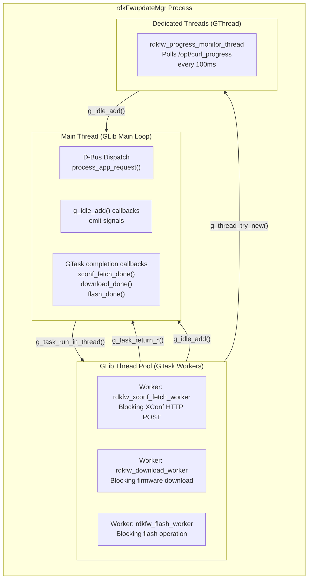
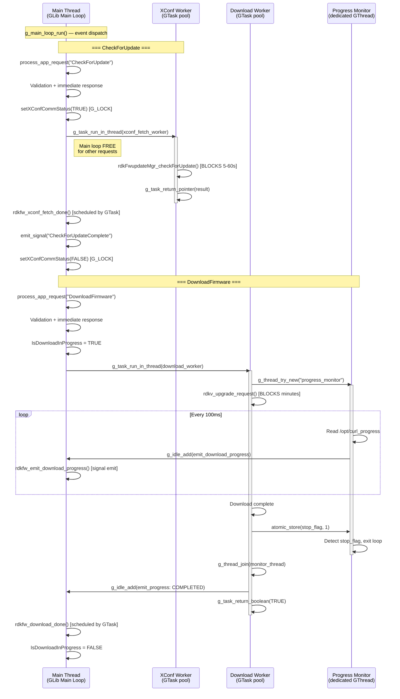
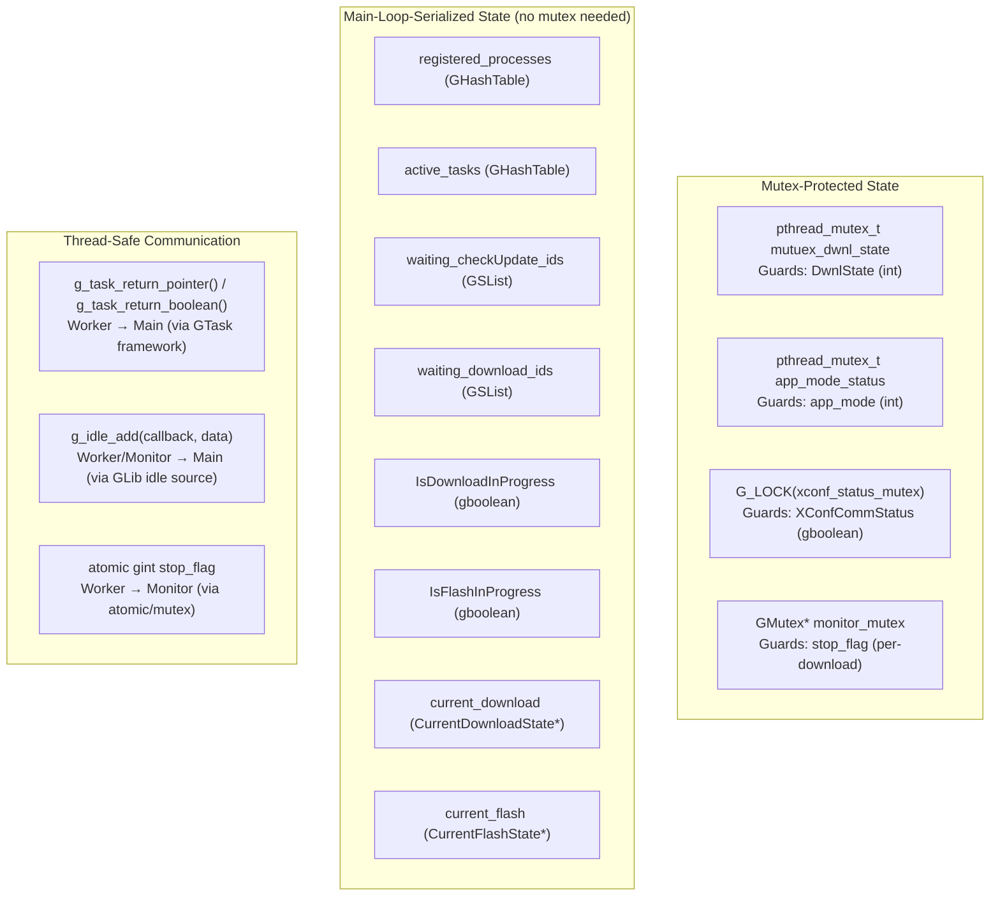
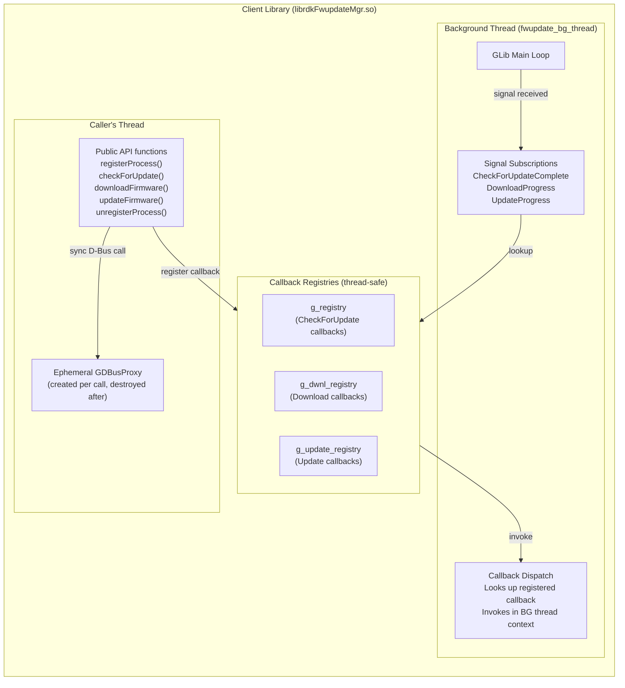

# Daemon Threading Model

> **Evidence Level:** Verified from `src/dbus/rdkv_dbus_server.c`, `src/rdkFwupdateMgr.c`, `librdkFwupdateMgr/src/rdkFwupdateMgr_async.c`  
> **Scope:** Every thread context in both daemon and client library, with synchronization primitives

---

## 1. Daemon Thread Architecture



---

## 2. Thread Inventory

### 2.1 Daemon Threads

| Thread | Creation | Lifetime | Purpose | Blocking Calls |
|--------|----------|----------|---------|----------------|
| **Main Thread** | Process start | Entire daemon lifecycle | GLib main loop, D-Bus dispatch, signal emission, state management | `g_main_loop_run()` (event wait) |
| **XConf Worker** | On first CheckForUpdate | Until XConf response received | Blocking HTTP POST to XConf server | `rdkFwupdateMgr_checkForUpdate()` |
| **Download Worker** | On DownloadFirmware | Until download completes | Blocking HTTP GET for firmware | `rdkv_upgrade_request()` |
| **Flash Worker** | On UpdateFirmware | Until flash completes | Blocking flash I/O | `flashImage()` |
| **Progress Monitor** | Spawned by Download Worker | Until download worker signals stop | Poll progress file, emit signals | `g_usleep(100000)` (100ms sleep) |

### 2.2 Client Library Threads

| Thread | Creation | Lifetime | Purpose | Blocking Calls |
|--------|----------|----------|---------|----------------|
| **Caller Thread** | Application owns | Application-managed | Synchronous D-Bus proxy calls | `g_dbus_proxy_call_sync()` (10-50ms) |
| **Background Thread** | `rdkFwupdateMgr_init()` | Until `rdkFwupdateMgr_term()` | GLib main loop for signal subscription and callback dispatch | `g_main_loop_run()` (event wait) |

---

## 3. Detailed Thread Interaction Diagram



---

## 4. Synchronization Primitives

### 4.1 Daemon Process



### 4.2 Synchronization Rules

| Rule | Mechanism | Rationale |
|------|-----------|-----------|
| Only one XConf fetch at a time | `XConfCommStatus` via `G_LOCK` | Prevents duplicate network calls |
| Worker → Main loop data transfer | `g_task_return_*()` | GTask framework ensures main-loop dispatch |
| Worker → Signal emission | `g_idle_add()` | Schedules function on main loop (thread-safe) |
| Stop progress monitor | Atomic int + `GMutex` | Worker sets flag, monitor polls it |
| Download/Flash state flags | Main loop serialization | Only modified in main-loop context callbacks |
| `DwnlState` | `pthread_mutex_t` | Read from IARM callback context (possibly different thread) |
| `app_mode` | `pthread_mutex_t` | Written from IARM callback (`interuptDwnl`) |

---

## 5. Client Library Threading Model



### 5.1 Library Thread Safety Guarantees

| Operation | Thread Safety | Evidence |
|-----------|--------------|----------|
| `registerCheckForUpdateCallback()` | Safe from any thread | Modifies `g_registry` (GLib hash table with internal locking) |
| `registerDownloadCallback()` | Safe from any thread | Modifies `g_dwnl_registry` |
| Callback invocation | Always on BG thread | `background_thread_func` processes signals |
| `rdkFwupdateMgr_init()` | Call once from single thread | Creates BG thread, not reentrant |
| `rdkFwupdateMgr_term()` | Call once from single thread | Joins BG thread |
| API calls (`checkForUpdate` etc.) | Safe from any thread | Each creates independent proxy |

---

## 6. Thread Lifecycle Diagram

```mermaid
gantt
    title Thread Lifetimes During Firmware Update Operation
    dateFormat ss
    axisFormat %S

    section Daemon
    Main Thread (GLib Loop)     :active, main, 00, 200s
    XConf Worker               :crit, xconf, 05, 20s
    Download Worker            :crit, dwnl, 30, 120s
    Progress Monitor           :monitor, 31, 119s
    Flash Worker               :crit, flash, 155, 30s

    section Client Library
    App Thread (API calls)     :app, 00, 200s
    BG Thread (signal RX)      :active, bg, 00, 200s
```



---

## 7. Cross-Thread Data Flow Matrix

| From → To | Data | Mechanism | Ownership Transfer |
|-----------|------|-----------|-------------------|
| Main → XConf Worker | `AsyncXconfFetchContext` | `g_task_set_task_data()` | Main allocates, completion CB frees |
| XConf Worker → Main | `GVariant* result` | `g_task_return_pointer()` | Worker creates, completion CB unrefs |
| Main → Download Worker | `AsyncDownloadContext` | `g_task_set_task_data()` | Main allocates, completion CB frees |
| Download Worker → Main | `gboolean success` | `g_task_return_boolean()` | Value type (no ownership) |
| Download Worker → Monitor | `ProgressMonitorContext*` | Thread argument | Worker allocates + frees after join |
| Monitor → Main | `ProgressUpdate*` | `g_idle_add()` | Monitor allocates, idle CB frees |
| Download Worker → Main | `ProgressUpdate*` (final) | `g_idle_add()` | Worker allocates, idle CB frees |
| IARM → Main | `int app_mode` | `interuptDwnl()` callback | Value type via mutex |

---

## 8. Potential Concurrency Hazards

| Hazard | Risk | Mitigation |
|--------|------|------------|
| Signal arrives before callback registered (client) | Missed update notification | Library pattern: register callback BEFORE calling API |
| `interuptDwnl()` modifies `force_exit` during download | Race with download worker reading it | `force_exit` is `int` — atomic on most platforms; curl checks it periodically |
| Multiple CheckForUpdate during XConf fetch | Duplicate worker spawn | `XConfCommStatus` flag with G_LOCK prevents this |
| Download worker + Progress monitor access `current_download` | Data race | Monitor only reads progress file, not shared struct; Worker sets stop flag via mutex |
| Main loop callbacks accessing freed context | Use-after-free | GTask framework guarantees completion CB runs after worker; `g_idle_add` serializes |
| Client unregister while signal in flight | Callback invoked on stale handle | **[INFERENCE]** Possible issue — signal could arrive after unregister but before term |

---

## 9. GLib Async Patterns Used

### 9.1 GTask (Offload blocking work)
```
Main Thread                    Worker Thread
    │                              │
    ├─ g_task_new()                │
    ├─ g_task_set_task_data()      │
    ├─ g_task_run_in_thread()──────┤
    │  (main loop continues)       ├─ worker_func(task, data)
    │                              ├─ <blocking I/O>
    │                              ├─ g_task_return_pointer()
    │  ┌───────────────────────────┘
    ├──┤ completion_callback()
    │  │ (runs on main loop)
    │  └───────────────────────
```

### 9.2 g_idle_add (Thread-safe main loop dispatch)
```
Worker Thread                  Main Thread
    │                              │
    ├─ Allocate ProgressUpdate     │
    ├─ g_idle_add(emit_fn, data)───┤
    │  (worker continues)          ├─ emit_fn(data) [on next loop iteration]
    │                              ├─ g_dbus_connection_emit_signal()
    │                              ├─ g_free(data)
    │                              ├─ return G_SOURCE_REMOVE
```

### 9.3 Dedicated GThread (Long-running monitoring)
```
Download Worker                Monitor Thread
    │                              │
    ├─ g_thread_try_new()──────────┤
    │  (download proceeds)         ├─ while (!stop_flag)
    │                              │    ├─ read progress file
    │                              │    ├─ g_idle_add(emit_progress)
    │                              │    └─ g_usleep(100000)
    ├─ atomic_store(stop_flag, 1)──┤
    │                              ├─ exit loop
    ├─ g_thread_join()─────────────┤
    │  (waits for monitor)         └─ thread exits
```

---

## 10. Summary: What Runs Where

| Context | What Happens Here | Never Do Here |
|---------|-------------------|---------------|
| **Daemon Main Loop** | D-Bus dispatch, validation, state changes, signal emission, completion callbacks | Blocking I/O, network calls, sleep |
| **Daemon Worker Thread** | XConf queries, firmware downloads, flash operations | Direct D-Bus calls, direct state mutation |
| **Daemon Monitor Thread** | File polling, progress tracking | Direct D-Bus calls (uses `g_idle_add`) |
| **Client Caller Thread** | Synchronous D-Bus proxy calls (brief blocking) | Long waits, callback registration after API call |
| **Client BG Thread** | Signal reception, callback dispatch | Blocking calls, API invocations |
