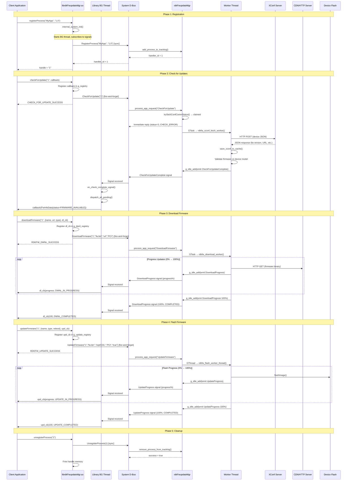
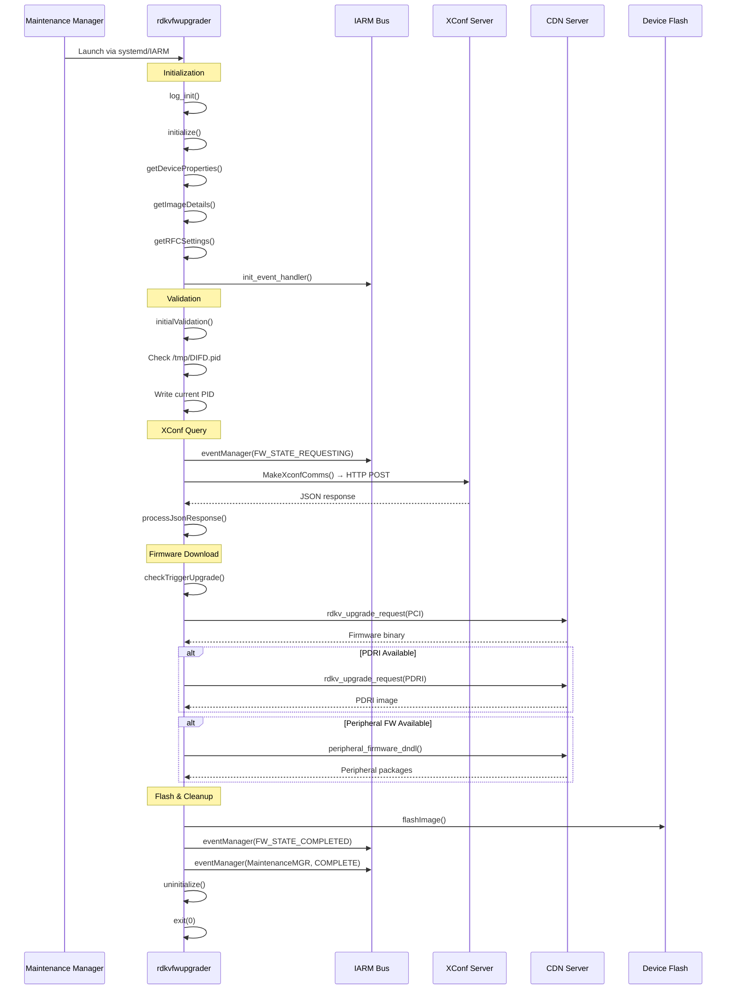
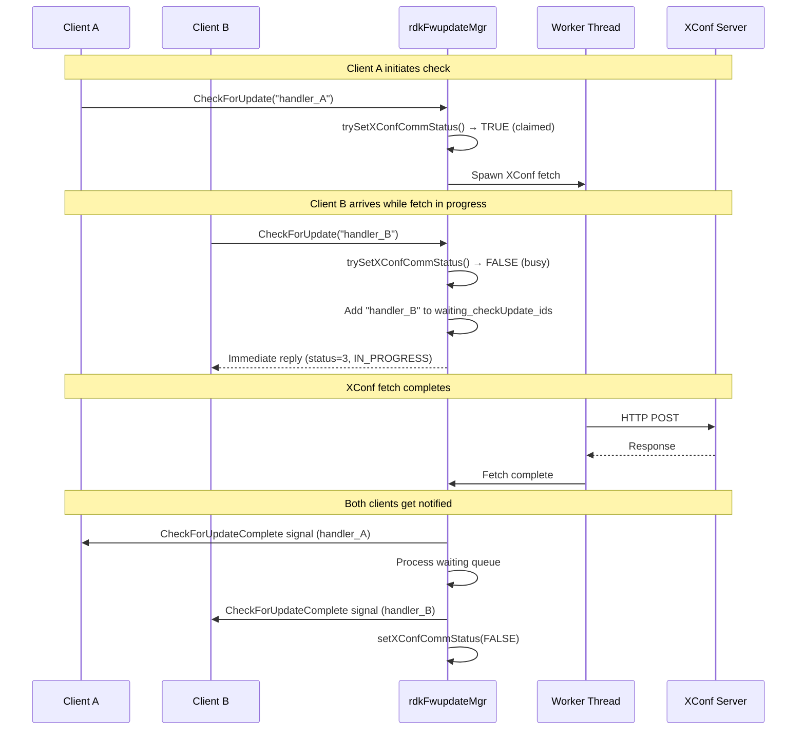
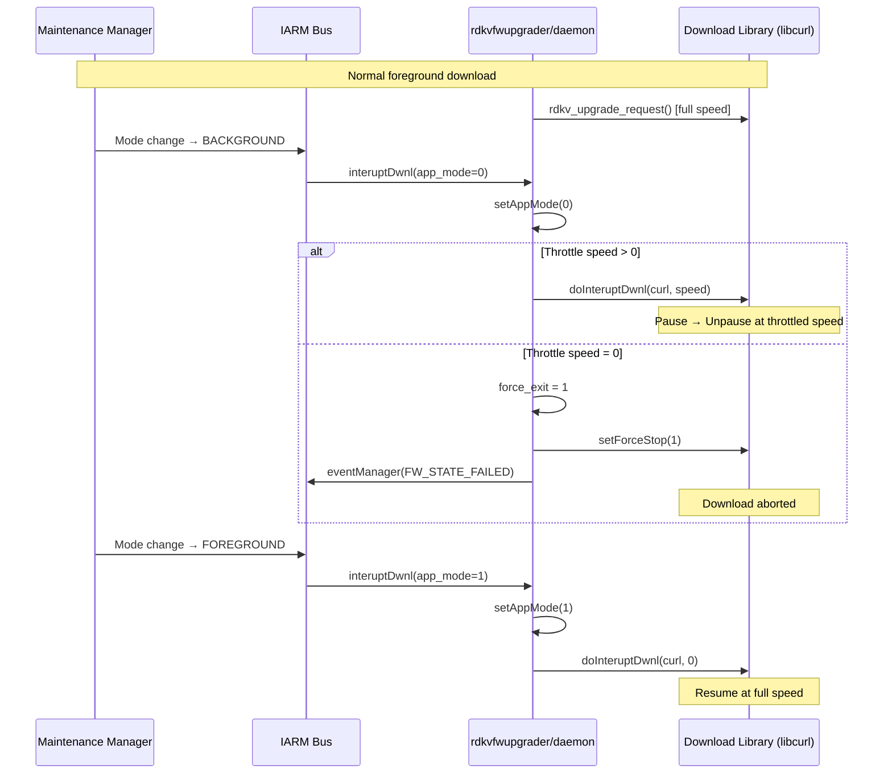

# Firmware Update Flows — End-to-End Sequences

> **Evidence Level:** Facts verified from source code across all subsystems

---

## 1. Complete Firmware Update Workflow (Daemon Mode)

---

## 2. One-Shot Binary Flow (rdkvfwupgrader)

---

## 3. Piggybacking Flow (Multiple Clients)

---

## 4. Download Throttling Flow

