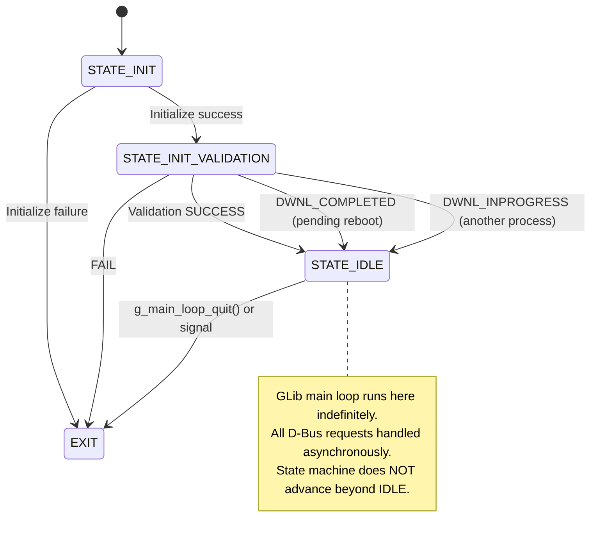
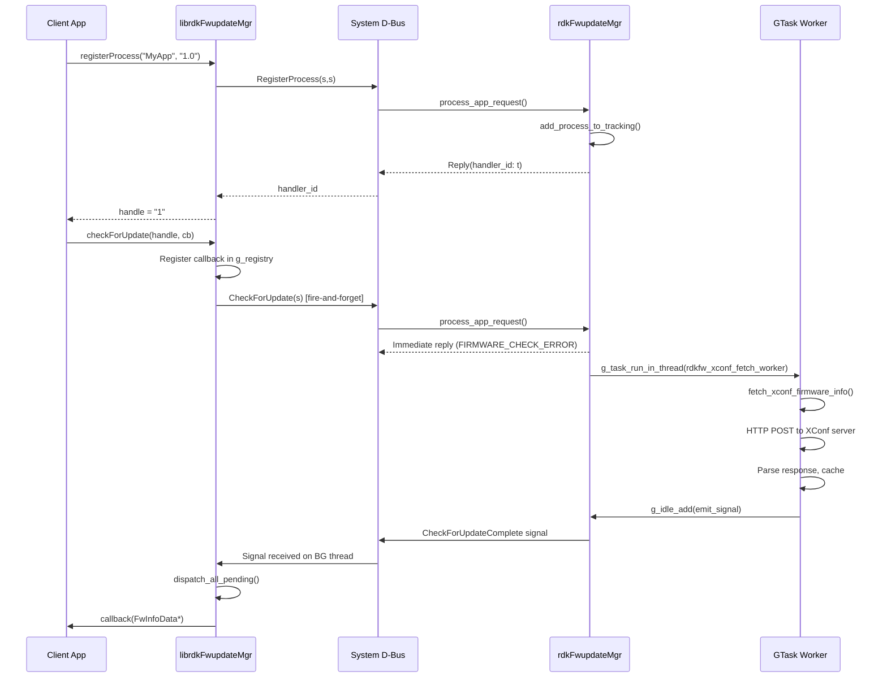

# rdkFwupdateMgr — Daemon Lifecycle

> **Evidence Level:** Facts verified from `src/rdkFwupdateMgr.c` and `src/dbus/`  
> **Entry Point:** `main()` in `rdkFwupdateMgr.c`  
> **Startup:** `systemd` via `rdkFwupdateMgr.service`

---

## 1. systemd Service Configuration

**[FACT]** From `rdkFwupdateMgr.service`:
```ini
[Unit]
Description=To start rdkFwupdateMgr
After=tr69hostif.service dbus.service
Requires=tr69hostif.service

[Service]
Type=simple
ExecStart=/bin/sh -c '/usr/bin/rdkFwupdateMgr 0 1 > /opt/logs/swupdate.log 2>&1'
RemainAfterExit=yes

[Install]
WantedBy=ntp-time-sync.target
```

- **[FACT]** Invoked with arguments `0 1` (retry_count=0, trigger_type=1=Bootup)
- **[FACT]** Depends on `tr69hostif.service` and `dbus.service`
- **[FACT]** Wanted by `ntp-time-sync.target` — starts after time synchronization
- **[FACT]** Stdout/stderr redirected to `/opt/logs/swupdate.log`

---

## 2. State Machine



### 2.1 Future States (Defined but Unused)

**[FACT]** The `FwUpgraderState` enum defines:
- `STATE_CHECK_UPDATE` — marked "(Future)" in comments
- `STATE_DOWNLOAD_UPDATE` — marked "(Future)" in comments  
- `STATE_UPGRADE` — marked "(Future)" in comments

**[INFERENCE]** These were designed for potential future use where the daemon self-initiates upgrades rather than waiting for D-Bus requests.

---

## 3. Initialization Phases

### 3.1 STATE_INIT

**[FACT]** Executes in order:

1. **Logger initialization** — `rdk_logger_ext_init()` or `log_init()`
2. **SIGUSR1 signal handler** — installs `handle_signal()` for graceful download abort
3. **D-Bus server setup**:
   - `init_task_system()` — creates hash tables for active tasks, downloads, process tracking; initializes XConf comm status
   - `setup_dbus_server()` — registers GDBus object, claims bus name
   - `g_main_loop_new(NULL, FALSE)` — creates GLib main event loop
4. **`initialize()`** — loads device properties, image details, RFC settings, creates download dir, inits IARM
5. **Argument parsing** — parses trigger_type from argv[2]

**Key difference from rdkvfwupgrader:** The daemon sets up D-Bus **before** `initialize()`, ensuring the service is available as soon as possible.

### 3.2 STATE_INIT_VALIDATION

**[FACT]** Calls `initialValidation()` which checks:
- Auto-exclusion via RFC
- Whether another instance is running
- Whether a previous download completed

**[FACT]** Unlike the one-shot binary, the daemon **always transitions to STATE_IDLE** regardless of validation outcome (except on `INITIAL_VALIDATION_FAIL`):
- `INITIAL_VALIDATION_SUCCESS` → `STATE_IDLE`
- `INITIAL_VALIDATION_DWNL_COMPLETED` → `STATE_IDLE` (wait for reboot or next request)
- `INITIAL_VALIDATION_DWNL_INPROGRESS` → `STATE_IDLE` (wait for completion)

### 3.3 STATE_IDLE

**[FACT]** `g_main_loop_run(main_loop)` — blocks indefinitely, processing:
- D-Bus method calls (dispatched by `process_app_request()`)
- GTask completion callbacks
- `g_idle_add()` callbacks from worker threads
- Timer sources (if any)

**[FACT]** The daemon logs its service coordinates:
```
D-Bus Service: org.rdkfwupdater.Interface
Object Path: /org/rdkfwupdater/Service
Active Tasks: <count>
```

---

## 4. Request Processing Model



---

## 5. Error Handling Philosophy

**[FACT]** Critical difference from rdkvfwupgrader:

| Scenario | rdkvfwupgrader | rdkFwupdateMgr |
|----------|---------------|----------------|
| PCI upgrade fails | May `exit(1)` | Logs error, continues running |
| Fatal library error | `exit(1)` | Logs error, continues running |
| XConf fetch fails | `exit(ret_curl_code)` | Reports via D-Bus signal, stays in IDLE |
| Invalid arguments | `exit(ret_curl_code)` | `exit(ret_curl_code)` (only at startup) |
| SIGUSR1 | Force-stops download, exits | Force-stops download, stays running |

**[FACT]** The daemon is designed to **never exit** on operation errors. Comment in code: `"// Daemon NEVER exits"` and `"// Daemon continues running - just log error and continue"`.

---

## 6. Shutdown Sequence

**[FACT]** When `g_main_loop_run()` returns (e.g., `g_main_loop_quit()` called):

1. `cleanup_dbus()`:
   - `cleanupXConfCommStatus()` — destroy mutex
   - Free all active `TaskContext` entries
   - `cleanup_process_tracking()` — destroy process/download hash tables
   - Unregister D-Bus object
   - Release connection and bus name
   - Free main loop
2. `uninitialize(init_validate_status)`:
   - Telemetry cleanup
   - Destroy download state and app mode mutexes
   - Terminate IARM event handler
   - Remove PID file
   - Close logger
3. `exit(ret_curl_code)`

---

## 7. Shared Code with rdkvfwupgrader

**[FACT]** Both binaries share significant code duplication:

| Shared Function | Purpose |
|----------------|---------|
| `initialize()` / `uninitialize()` | Device info, RFC, IARM init/cleanup |
| `initialValidation()` | Pre-flight validation |
| `handle_signal()` | SIGUSR1 handler |
| `interuptDwnl()` | Download throttling callback |
| `setDwnlState()` / `getDwnlState()` | Download state management |
| `setAppMode()` / `getAppMode()` | App mode management |
| `checkTriggerUpgrade()` | Firmware upgrade orchestration |
| `MakeXconfComms()` | XConf server communication |
| `t2CountNotify()` / `t2ValNotify()` | Telemetry |

**[FACT]** These functions are **duplicated** in both `rdkv_main.c` and `rdkFwupdateMgr.c` rather than being in a shared library. The daemon versions differ in error handling (no `exit()` on operation errors).

**[INFERENCE]** This duplication is a natural artifact of the daemon being developed from the original one-shot binary. Future refactoring could extract shared logic into a common library.
