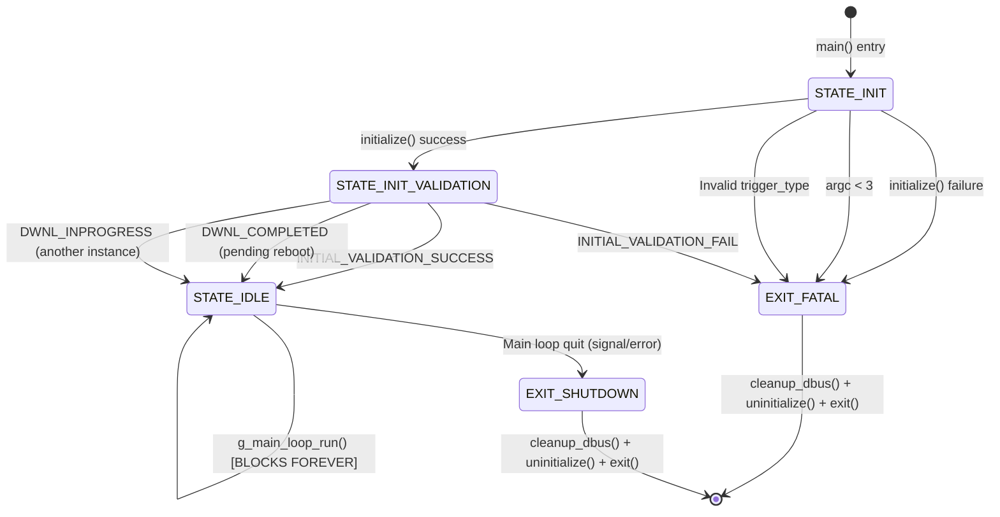
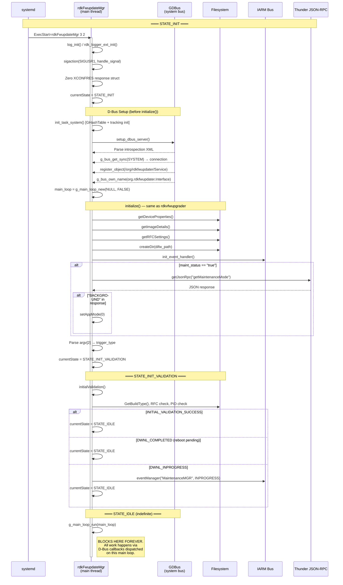
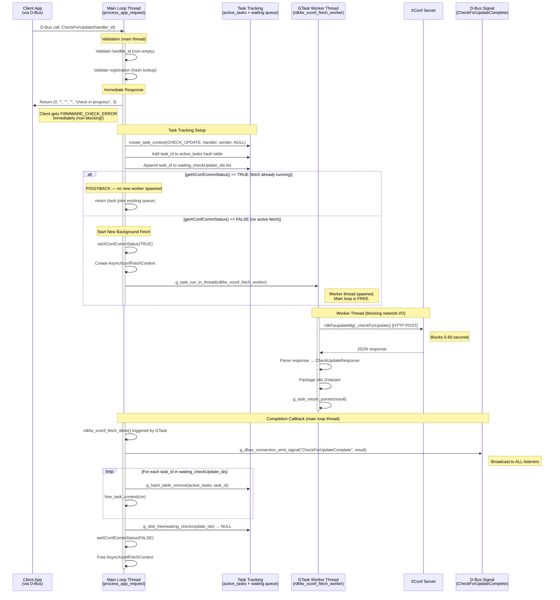
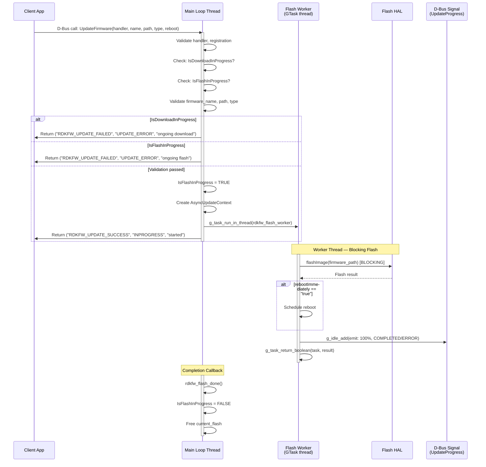
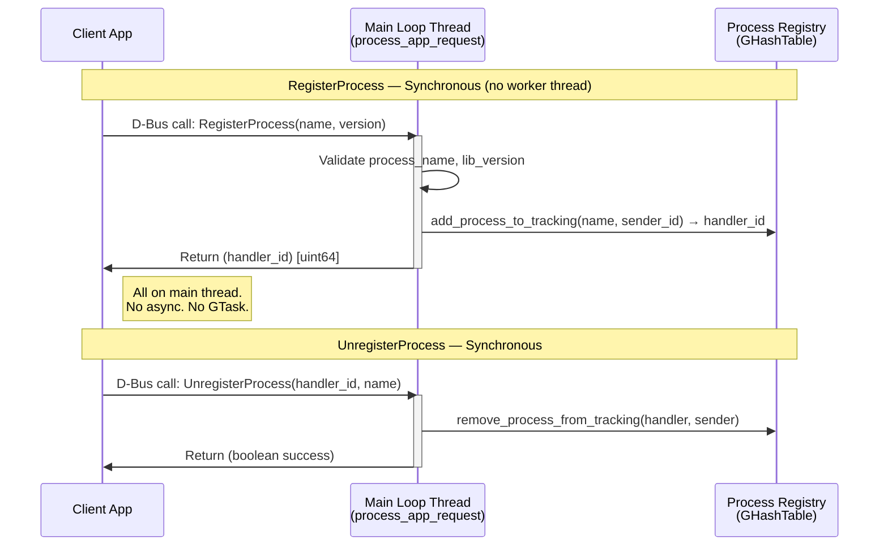

# rdkFwupdateMgr Daemon — Detailed Runtime Execution Sequence

> **Evidence Level:** Verified from `src/rdkFwupdateMgr.c` and `src/dbus/rdkv_dbus_server.c`  
> **Thread Contexts:** GLib Main Loop Thread + GTask Worker Pool + Progress Monitor Threads  
> **Primary Execution Model:** Event-driven (GLib main loop) with async offloading via GTask

---

## 1. Process Identity

| Property | Value |
|----------|-------|
| Binary | `/usr/bin/rdkFwupdateMgr` |
| Systemd unit | `rdkFwupdateMgr.service` |
| Bus name | `org.rdkfwupdater.Interface` |
| Object path | `/org/rdkfwupdater/Service` |
| Invocation | `rdkFwupdateMgr <retry_count> <trigger_type>` |
| Lifetime | Indefinite (systemd-managed daemon) |

---

## 2. Startup Sequence — State Machine



**[FACT]** Unlike `rdkvfwupgrader`, the daemon always transitions to `STATE_IDLE` (even with DWNL_INPROGRESS or DWNL_COMPLETED), never exits on validation status alone. Only `INITIAL_VALIDATION_FAIL` causes exit.

---

## 3. Complete Startup Sequence Diagram



---

## 4. Steady-State Operation — D-Bus Request Handling

### 4.1 CheckForUpdate Request Flow



### 4.2 DownloadFirmware Request Flow

```mermaid
sequenceDiagram
    participant CLIENT as Client App
    participant MAIN as Main Loop Thread
    participant STATE as Download State<br/>(current_download)
    participant WORKER as Download Worker<br/>(GTask thread)
    participant MONITOR as Progress Monitor<br/>(GThread)
    participant CDN as CDN / HTTP Server
    participant SIGNAL as D-Bus Signal<br/>(DownloadProgress)

    CLIENT->>MAIN: D-Bus call: DownloadFirmware(handler, name, url, type)
    activate MAIN
    
    Note over MAIN: Validation Phase (main thread)
    MAIN->>MAIN: Validate handler_id, registration
    MAIN->>MAIN: Validate firmware_name, type (PCI/PDRI/PERIPHERAL)
    MAIN->>MAIN: Validate URL format (http/https prefix)
    
    alt IsDownloadInProgress && different firmware
        MAIN->>CLIENT: Return ("RDKFW_DWNL_FAILED", "DWNL_ERROR", "ongoing download")
        Note right of CLIENT: Rejected
    else File already cached at /opt/CDL/<name>
        MAIN->>CLIENT: Return ("RDKFW_DWNL_SUCCESS", "COMPLETED", "already downloaded")
        MAIN->>SIGNAL: g_idle_add(emit_progress: 100%, COMPLETED)
    else IsDownloadInProgress && same firmware (PIGGYBACK)
        MAIN->>STATE: Append handler_id to waiting_handler_ids
        MAIN->>CLIENT: Return ("RDKFW_DWNL_SUCCESS", "INPROGRESS", "in progress")
        MAIN->>SIGNAL: g_idle_add(emit_progress: current%, INPROGRESS)
    else New download
        MAIN->>STATE: IsDownloadInProgress = TRUE
        MAIN->>STATE: Allocate CurrentDownloadState
        MAIN->>MAIN: Create AsyncDownloadContext
        MAIN->>WORKER: g_task_run_in_thread(rdkfw_download_worker)
        MAIN->>CLIENT: Return ("RDKFW_DWNL_SUCCESS", "INPROGRESS", "started")
    end
    deactivate MAIN

    Note over WORKER,CDN: Worker Thread — Blocking Download
    activate WORKER
    WORKER->>WORKER: Resolve effective URL (client URL or XConf cache)
    WORKER->>WORKER: Build download path: <difw_path>/<firmware_name>
    WORKER->>WORKER: getDeviceProperties(), getRFCSettings()
    WORKER->>WORKER: Build RdkUpgradeContext_t (download_only=1)
    
    Note over WORKER,MONITOR: Spawn Progress Monitor
    WORKER->>MONITOR: g_thread_try_new("rdkfw_progress_monitor")
    activate MONITOR
    Note right of MONITOR: Polls /opt/curl_progress<br/>every 100ms
    
    WORKER->>CDN: rdkv_upgrade_request(upgrade_ctx)
    Note right of CDN: BLOCKING. Minutes for<br/>large firmware images.
    
    loop While download active
        MONITOR->>MONITOR: Read /opt/curl_progress
        MONITOR->>SIGNAL: g_idle_add(emit_progress: N%, INPROGRESS)
        SIGNAL-->>CLIENT: D-Bus signal: DownloadProgress
    end
    
    CDN-->>WORKER: Download complete (or error)
    
    WORKER->>MONITOR: Set stop_flag = TRUE (via atomic int)
    MONITOR->>MONITOR: Detects stop, exits loop
    deactivate MONITOR
    WORKER->>WORKER: g_thread_join(monitor_thread)
    
    WORKER->>SIGNAL: g_idle_add(emit_progress: 100%, COMPLETED)
    WORKER->>WORKER: g_task_return_boolean(task, TRUE/FALSE)
    deactivate WORKER
    
    Note over MAIN: Completion Callback (main loop)
    activate MAIN
    MAIN->>MAIN: rdkfw_download_done() [GTask callback]
    MAIN->>STATE: IsDownloadInProgress = FALSE
    MAIN->>STATE: Free current_download
    deactivate MAIN
```



### 4.3 UpdateFirmware Request Flow



### 4.4 RegisterProcess / UnregisterProcess



---

## 5. Concurrency Control Summary

| Guard Variable | Protected By | Scope | Purpose |
|---------------|--------------|-------|---------|
| `XConfCommStatus` | `G_LOCK(xconf_status_mutex)` | Global | Prevents duplicate XConf fetch workers |
| `IsDownloadInProgress` | Main loop serialization | Global (bool) | Prevents concurrent downloads |
| `IsFlashInProgress` | Main loop serialization | Global (bool) | Prevents concurrent flashes |
| `DwnlState` | `pthread_mutex_t mutuex_dwnl_state` | Per-process | Download progress state |
| `app_mode` | `pthread_mutex_t app_mode_status` | Per-process | Throttle mode (FG/BG) |
| `registered_processes` | Main loop serialization | GHashTable | Client registry |
| `active_tasks` | Main loop serialization | GHashTable | In-flight task tracking |
| `waiting_checkUpdate_ids` | Main loop serialization | GSList | Piggyback queue for CheckUpdate |
| `waiting_download_ids` | Main loop serialization | GSList | Piggyback queue for Download |

**[FACT]** Most mutable state is only touched from the main loop thread — GTask completion callbacks and `g_idle_add` ensure main-loop serialization. Worker threads communicate results back via `g_task_return_*()`.

---

## 6. Daemon Shutdown Sequence

```mermaid
sequenceDiagram
    participant SIG as Signal / systemd
    participant LOOP as GLib Main Loop
    participant DBUS as D-Bus Subsystem
    participant TASK as Task System
    participant INIT as Subsystem Cleanup

    SIG->>LOOP: SIGTERM or g_main_loop_quit()
    activate LOOP
    LOOP->>LOOP: g_main_loop_run() returns
    
    Note over LOOP,INIT: cleanup_and_exit label
    LOOP->>DBUS: cleanup_dbus()
    activate DBUS
    DBUS->>DBUS: cleanupXConfCommStatus()
    DBUS->>TASK: Iterate active_tasks → free_task_context() each
    DBUS->>TASK: g_hash_table_destroy(active_tasks)
    DBUS->>DBUS: cleanup_process_tracking()
    DBUS->>DBUS: g_dbus_connection_unregister_object()
    DBUS->>DBUS: g_object_unref(connection)
    DBUS->>DBUS: g_bus_unown_name(owner_id)
    DBUS->>DBUS: g_main_loop_unref(main_loop)
    deactivate DBUS
    
    LOOP->>INIT: uninitialize(init_validate_status)
    activate INIT
    INIT->>INIT: t2_uninit()
    INIT->>INIT: pthread_mutex_destroy() × 2
    INIT->>INIT: term_event_handler() [IARM disconnect]
    INIT->>INIT: updateUpgradeFlag(2)
    INIT->>INIT: unlink("/tmp/DIFD.pid") [if applicable]
    deactivate INIT
    
    LOOP->>LOOP: log_exit()
    LOOP->>LOOP: exit(ret_curl_code)
    deactivate LOOP
```

---

## 7. Key Behavioral Differences from rdkvfwupgrader

| Aspect | rdkvfwupgrader (one-shot) | rdkFwupdateMgr (daemon) |
|--------|--------------------------|------------------------|
| XConf fetch | Synchronous in main() | GTask worker thread |
| Download | Synchronous, blocks everything | GTask worker + progress monitor thread |
| Flash | Synchronous | GTask worker thread |
| D-Bus | Not used | Core IPC mechanism |
| Client interaction | None | RegisterProcess → methods → signals |
| Lifetime | Seconds-to-minutes | Indefinite |
| Error recovery | Exit with error code | Log error, reset state, remain running |
| Concurrency | Single operation | Multiple piggybacked clients |
| Signal handling | Abort + exit | Abort current operation, remain running |
| Main loop | Linear execution | GLib event loop (g_main_loop_run) |

---

## 8. Operational Invariants

1. **[FACT]** D-Bus setup occurs BEFORE `initialize()` — the daemon is reachable before initialization completes
2. **[FACT]** The state machine always converges to `STATE_IDLE` unless `INITIAL_VALIDATION_FAIL`
3. **[FACT]** Once in `STATE_IDLE`, the daemon never leaves it (no state transitions occur)
4. **[FACT]** All request validation runs synchronously on the main loop thread
5. **[FACT]** Only one XConf fetch can run at a time (enforced by `XConfCommStatus`)
6. **[FACT]** Only one download can run at a time (enforced by `IsDownloadInProgress`)
7. **[FACT]** Only one flash can run at a time (enforced by `IsFlashInProgress`)
8. **[FACT]** Worker threads never directly emit D-Bus signals — always via `g_idle_add()` or `g_task_return_*()`
9. **[FACT]** Client gets immediate D-Bus response; real results arrive via signal broadcast
10. **[INFERENCE]** The XConf commented-out code in STATE_INIT_VALIDATION indicates future intent to do proactive update checks on startup
