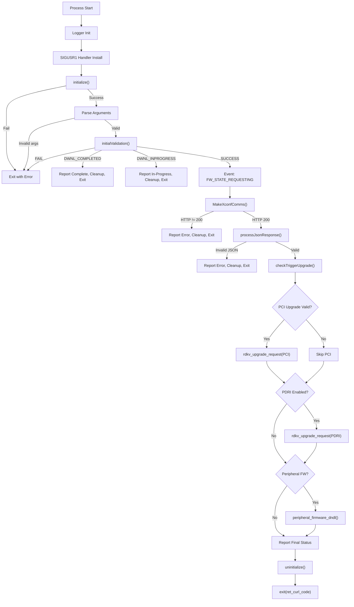

# rdkvfwupgrader — One-Shot Binary Lifecycle

> **Evidence Level:** Facts verified from `src/rdkv_main.c`  
> **Entry Point:** `main()` at line 1047

---

## 1. Invocation

```
rdkvfwupgrader <retry_count> <trigger_type>
```

- **[FACT]** Requires exactly 2 arguments (argc >= 3)
- **[FACT]** `retry_count` (argv[1]) is accepted but no longer parsed — hardcoded fallback mechanism used
- **[FACT]** `trigger_type` (argv[2]) determines the upgrade trigger context

| Trigger Type | Meaning |
|-------------|---------|
| 1 | Bootup |
| 2 | Scheduled (cron) |
| 3 | TR-69/SNMP triggered |
| 4 | App triggered |
| 5 | Delayed download |
| 6 | State Red recovery |

**[INFERENCE]** Typically invoked by Maintenance Manager or systemd timer.

---

## 2. Execution Flow



---

## 3. Phase Details

### 3.1 Initialization (`initialize()`)

**[FACT]** Performs in order:
1. `t2_init("rdkfwupgrader")` — Telemetry 2.0 initialization (conditional)
2. `getDeviceProperties(&device_info)` — Load model, partner ID, serial, difw_path, maint_status
3. `getImageDetails(&cur_img_detail)` — Load current firmware image name
4. `getRFCSettings(&rfc_list)` — Load RFC throttle/mTLS/incremental CDL settings
5. `createDir(device_info.difw_path)` — Ensure download directory exists
6. `init_event_handler()` — Initialize IARM event handler
7. Check MaintenanceManager mode via JSON-RPC → set app mode (foreground/background)

### 3.2 Initial Validation (`initialValidation()`)

**[FACT]** Validates:
1. **Auto-exclusion:** RFC `AutoExcluded` flag checked; non-PROD builds with `true` are excluded
2. **Instance check:** `CurrentRunningInst(DIFDPID)` checks if `/tmp/DIFD.pid` indicates another running instance
3. **Previous completion:** `/tmp/fw_preparing_to_reboot` indicates prior download completed
4. **PID file:** Writes current PID to `/tmp/DIFD.pid`
5. **Previous image validation:** `prevCurUpdateInfo()` validates previous flash result

Returns: `INITIAL_VALIDATION_SUCCESS` (0), `INITIAL_VALIDATION_FAIL` (1), `INITIAL_VALIDATION_DWNL_INPROGRESS` (2), `INITIAL_VALIDATION_DWNL_COMPLETED` (3)

### 3.3 XConf Communication (`MakeXconfComms()`)

**[FACT]** Performs:
1. Allocate download data buffer
2. Get XConf server URL via `GetServURL()`
3. Build device JSON string via `createJsonString()`
4. Construct `RdkUpgradeContext_t` with `XCONF_UPGRADE` type
5. Call `rdkv_upgrade_request()` — sends HTTP POST to XConf server
6. On success: parse response via `getXconfRespData()` into `XCONFRES` structure

### 3.4 Upgrade Triggering (`checkTriggerUpgrade()`)

**[FACT]** Multi-stage upgrade process:
1. **PCI:** `checkForValidPCIUpgrade()` → if valid, `rdkv_upgrade_request()` with PCI context
2. **PDRI:** If PDRI enabled and not skipped (immediate reboot + PCI valid), download PDRI image
3. **Peripheral:** If `/etc/os-release` exists and peripheral firmwares listed, call `peripheral_firmware_dndl()`
4. **Opt-out handling:** Checks `/opt/maintenance_mgr_record.conf` for `IGNORE_UPDATE` / `ENFORCE_OPTOUT`

### 3.5 Signal Handling

**[FACT]** `SIGUSR1` handler (`handle_signal()`):
- Sets `force_exit = 1`
- Calls `setForceStop(1)` — tells download library to abort
- Reports `MAINT_FWDOWNLOAD_ERROR` and `FW_STATE_FAILED`
- Updates upgrade flag

### 3.6 Download Throttling

**[FACT]** `interuptDwnl()` is a callback from Maintenance Manager via IARM:
- Background mode (app_mode=0): Throttle download to `rfc_topspeed` bytes/sec
- Foreground mode (app_mode=1): Remove throttle (full speed)
- If throttle speed is 0: Force-stop the download

---

## 4. Error Handling Strategy

**[FACT]** The one-shot binary calls `exit()` on fatal errors:
- Initialize failure → `exit(ret_curl_code)`
- Invalid arguments → `exit(ret_curl_code)`
- Fatal library errors (`RDKV_UPGRADE_ERROR_THROTTLE_ZERO`, `RDKV_UPGRADE_ERROR_FORCE_EXIT`) → `exit(1)`
- Opt-out enforcement → `exit(1)`

**[FACT]** Before exit, always calls `uninitialize()` which:
- Destroys mutexes
- Terminates event handler
- Removes PID file (`/tmp/DIFD.pid`)
- Closes logger

---

## 5. Key Global State

| Variable | Type | Purpose |
|----------|------|---------|
| `device_info` | `DeviceProperty_t` | Device model, partner, serial, difw_path |
| `cur_img_detail` | `ImageDetails_t` | Current running image name |
| `rfc_list` | `Rfc_t` | RFC settings (throttle, mTLS, incremental CDL) |
| `DwnlState` | `int` (mutex-protected) | Current download state |
| `app_mode` | `int` (mutex-protected) | 1=foreground, 0=background |
| `force_exit` | `int` | Signal flag to abort download |
| `curl` | `void*` | Active CURL handle |
| `trigger_type` | `int` | Upgrade trigger type (1-6) |
