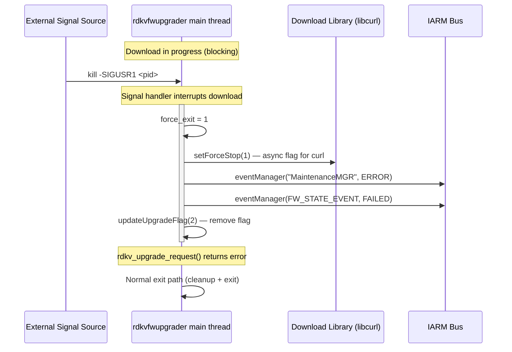
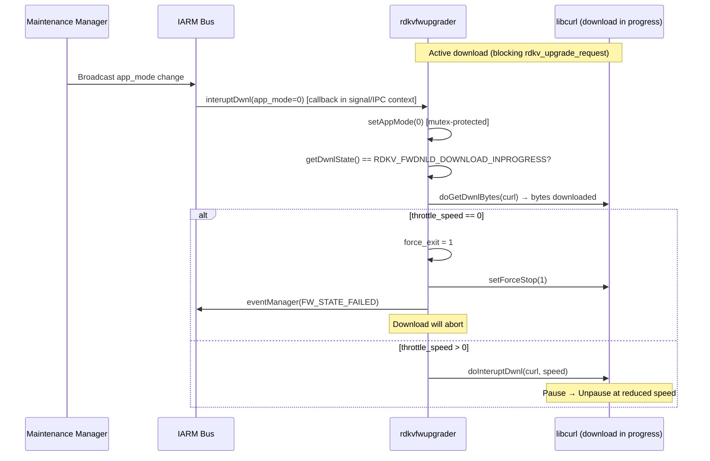

# rdkvfwupgrader — Detailed Runtime Execution Sequence

> **Evidence Level:** Verified from `src/rdkv_main.c` call-by-call  
> **Thread Context:** Single-threaded process (main thread only, no worker threads)  
> **All operations are synchronous/blocking unless noted**

---

## 1. Process Invocation Context

**[FACT]** Invoked externally, typically by:
- Maintenance Manager via IARM event triggering systemd unit
- Cron scheduled job (trigger_type=2)
- TR-69/SNMP triggered event (trigger_type=3)
- Application-triggered request (trigger_type=4)

**[INFERENCE]** The calling entity is responsible for passing the correct trigger_type argument.

```
Invocation: /usr/bin/rdkvfwupgrader <retry_count> <trigger_type>
Example:    /usr/bin/rdkvfwupgrader 3 2
```

---

## 2. Complete Execution Timeline

```mermaid
sequenceDiagram
    participant MM as Maintenance Manager<br/>(or Caller)
    participant PROC as rdkvfwupgrader<br/>(single thread)
    participant FS as Filesystem<br/>(/etc, /tmp, /opt)
    participant IARM as IARM Bus
    participant T2 as Telemetry 2.0
    participant THUNDER as Thunder JSON-RPC<br/>(localhost:9998)
    participant XCONF as XConf Cloud Server
    participant CDN as CDN / HTTP Server
    participant FLASH as Flash HAL

    Note over MM,FLASH: ═══ PHASE 1: INITIALIZATION (blocking) ═══

    MM->>PROC: fork+exec("/usr/bin/rdkvfwupgrader 3 2")
    activate PROC
    
    PROC->>PROC: log_init() [or rdk_logger_ext_init()]
    PROC->>PROC: sigaction(SIGUSR1, handle_signal)
    PROC->>PROC: Zero XCONFRES response struct
    PROC->>T2: t2_init("rdkfwupgrader") [if T2_EVENT_ENABLED]
    PROC->>T2: t2CountNotify("SYST_INFO_C_CDL", 1)
    
    Note over PROC,FS: initialize() — blocking I/O
    PROC->>FS: getDeviceProperties() → read /etc/device.properties
    FS-->>PROC: device_info (model, partner, difw_path, maint_status)
    PROC->>FS: getImageDetails() → read version files
    FS-->>PROC: cur_img_detail (current firmware name)
    PROC->>FS: getRFCSettings() → read RFC config
    FS-->>PROC: rfc_list (throttle, mtls, incr_cdl, topspeed)
    PROC->>FS: createDir(device_info.difw_path)
    PROC->>IARM: init_event_handler() [BLOCKING — IPC handshake]
    
    alt maint_status == "true"
        PROC->>THUNDER: getJsonRpc("getMaintenanceMode") [HTTP POST to localhost:9998]
        THUNDER-->>PROC: JSON response
        alt response contains "BACKGROUND"
            PROC->>PROC: setAppMode(0) — background mode
        end
    end

    Note over PROC: ═══ PHASE 2: ARGUMENT PARSING ═══
    PROC->>PROC: Parse argv[2] → trigger_type = 2
    PROC->>T2: t2CountNotify("SYST_INFO_SWUpgrdChck", 1) [if scheduled]

    Note over PROC,FS: ═══ PHASE 3: INITIAL VALIDATION (blocking I/O) ═══
    
    PROC->>FS: GetBuildType() → read build type
    PROC->>FS: read_RFCProperty("AutoExcluded")
    
    alt device excluded on non-PROD build
        PROC->>PROC: status = INITIAL_VALIDATION_FAIL → exit
    end
    
    PROC->>FS: CurrentRunningInst("/tmp/DIFD.pid") — check PID file
    
    alt another instance running
        PROC->>PROC: status = DWNL_INPROGRESS → skip upgrade
    else /tmp/fw_preparing_to_reboot exists
        PROC->>IARM: eventManager("MaintenanceMGR", COMPLETE)
        PROC->>FS: unlink("/tmp/fw_preparing_to_reboot")
        PROC->>PROC: status = DWNL_COMPLETED → skip upgrade
    else no conflicts
        PROC->>FS: Write PID to /tmp/DIFD.pid
        PROC->>PROC: prevCurUpdateInfo() — validate prior flash state
        PROC->>PROC: status = SUCCESS → proceed
    end

    Note over PROC,XCONF: ═══ PHASE 4: XCONF COMMUNICATION (blocking network I/O) ═══
    
    alt validation == SUCCESS
        PROC->>IARM: eventManager(FW_STATE_EVENT, FW_STATE_UNINITIALIZED)
        
        alt isInStateRed()
            PROC->>IARM: eventManager(RED_STATE_EVENT, RED_RECOVERY_STARTED)
            PROC->>FS: write_RFCProperty("REDRECV", "STARTED")
        end
        
        PROC->>IARM: eventManager(FW_STATE_EVENT, FW_STATE_REQUESTING)
        
        Note over PROC,XCONF: MakeXconfComms() — BLOCKING network call
        PROC->>PROC: allocDowndLoadDataMem()
        PROC->>PROC: GetServURL() → XConf server URL
        PROC->>PROC: createJsonString() → device JSON payload
        PROC->>XCONF: rdkv_upgrade_request(XCONF_UPGRADE) [HTTP POST]
        Note right of XCONF: Blocking. Waits for<br/>server response.<br/>May take 5-60 seconds.
        XCONF-->>PROC: HTTP response (JSON body)
        PROC->>PROC: getXconfRespData() → parse into XCONFRES
    end

    Note over PROC,FLASH: ═══ PHASE 5: FIRMWARE UPGRADE EXECUTION (blocking) ═══
    
    alt HTTP 200 + valid JSON
        PROC->>PROC: processJsonResponse() — validate response fields
        PROC->>PROC: checkForValidPCIUpgrade() — version comparison
        
        alt PCI upgrade required
            Note over PROC,CDN: PCI Download (BLOCKING)
            PROC->>PROC: isUpgradeInProgress() check
            PROC->>FS: Write download URL to DWNL_URL_VALUE
            PROC->>FS: eraseFolderExceParamFile() — clean old images
            PROC->>CDN: rdkv_upgrade_request(PCI_UPGRADE) [HTTP GET]
            Note right of CDN: BLOCKING download.<br/>May take minutes.<br/>Throttling applies.
            CDN-->>PROC: Firmware binary → written to difw_path
            PROC->>FLASH: flashImage() [via librdksw_flash]
        end
        
        alt PDRI upgrade required
            Note over PROC: sleep(30) if PCI also downloaded
            PROC->>CDN: rdkv_upgrade_request(PDRI_UPGRADE) [HTTP GET]
            CDN-->>PROC: PDRI binary → written to difw_path
            PROC->>FLASH: flashImage() [via librdksw_flash]
        end
        
        alt Peripheral firmware available
            loop For each peripheral firmware
                PROC->>CDN: rdkv_upgrade_request(PERIPHERAL_UPGRADE)
                CDN-->>PROC: .tgz file → written to difw_path
            end
            PROC->>IARM: eventManager("PeripheralUpgradeEvent", path:versions)
        end
    end

    Note over PROC: ═══ PHASE 6: STATUS REPORTING & CLEANUP ═══
    
    alt upgrade success
        PROC->>IARM: eventManager("MaintenanceMGR", MAINT_FWDOWNLOAD_COMPLETE)
    else upgrade failed
        PROC->>IARM: eventManager("MaintenanceMGR", MAINT_FWDOWNLOAD_ERROR)
    end
    
    Note over PROC: uninitialize()
    PROC->>T2: t2_uninit()
    PROC->>PROC: pthread_mutex_destroy() × 2
    PROC->>IARM: term_event_handler()
    PROC->>FS: updateUpgradeFlag(2) — remove flag file
    PROC->>FS: unlink("/tmp/DIFD.pid")
    PROC->>PROC: log_exit()
    PROC->>PROC: exit(ret_curl_code)
    deactivate PROC
```



---

## 3. Blocking Operation Analysis

| Operation | Duration | Blocking? | Thread Context |
|-----------|----------|-----------|----------------|
| `getDeviceProperties()` | ~1ms | Yes (file I/O) | Main |
| `getImageDetails()` | ~1ms | Yes (file I/O) | Main |
| `getRFCSettings()` | ~5ms | Yes (file/IPC) | Main |
| `init_event_handler()` | ~10ms | Yes (IARM connect) | Main |
| `getJsonRpc()` → Thunder | ~50-200ms | Yes (HTTP localhost) | Main |
| `MakeXconfComms()` → XConf | **5-60 seconds** | **YES (network)** | Main |
| `rdkv_upgrade_request(PCI)` | **Minutes** | **YES (download)** | Main |
| `rdkv_upgrade_request(PDRI)` | **Seconds-minutes** | **YES (download)** | Main |
| `peripheral_firmware_dndl()` | **Seconds-minutes** | **YES (download per file)** | Main |
| `flashImage()` | **Seconds** | **YES (flash I/O)** | Main |

**[FACT]** The entire process is single-threaded. All I/O blocks the main thread. The only concurrency mechanism is the `SIGUSR1` signal handler which sets `force_exit=1` to abort downloads.

---

## 4. Fatal Error Paths

```mermaid
flowchart TD
    subgraph "Fatal Exits (exit() called)"
        E1["initialize() failure → exit(1)"]
        E2["argc < 3 → exit(1)"]
        E3["Invalid trigger_type → exit(1)"]
        E4["isUpgradeInProgress() == true → exit(1)"]
        E5["RDKV_UPGRADE_ERROR_THROTTLE_ZERO → exit(1)"]
        E6["RDKV_UPGRADE_ERROR_FORCE_EXIT → exit(1)"]
        E7["OptOut: IGNORE_UPDATE → exit(1)"]
        E8["OptOut: ENFORCE_OPTOUT → exit(1)"]
    end
    
    subgraph "Graceful Exits"
        G1["validation DWNL_INPROGRESS → exit(1)"]
        G2["validation DWNL_COMPLETED → exit(1)"]
        G3["XConf failure → exit(curl_code)"]
        G4["Upgrade success → exit(0)"]
    end
    
    subgraph "All paths call"
        CLEANUP["uninitialize()"]
    end
    
    E1 & E2 & E3 -->|"partial cleanup"| CLEANUP
    E4 & E5 & E6 & E7 & E8 -->|"full cleanup"| CLEANUP
    G1 & G2 & G3 & G4 --> CLEANUP
```



---

## 5. SIGUSR1 Signal Handling (Interrupt Path)

**[FACT]** Executes asynchronously in signal context:



**[FACT]** Signal is caught via `sigaction(SIGUSR1)` with `SA_ONSTACK | SA_SIGINFO` flags. The handler sets global flags that cause the blocking download to abort.

---

## 6. Download Throttling Interaction (IARM Callback)

**[FACT]** `interuptDwnl()` is registered as an IARM callback:



**[FACT]** The IARM callback executes in the same thread context as the main loop (IARM events are dispatched during blocking wait inside `rdkv_upgrade_request`).  
**[INFERENCE]** This is possible because `rdkv_upgrade_request` uses curl's multi interface or has an internal event loop that processes IARM callbacks.

---

## 7. External Service Dependency Timeline

```mermaid
gantt
    title rdkvfwupgrader Execution Timeline (typical ~2 min run)
    dateFormat ss
    axisFormat %S

    section Initialization
    Logger + Signal Setup        :a1, 00, 1s
    Device Properties (file)     :a2, after a1, 1s
    RFC + IARM Init             :a3, after a2, 1s
    Thunder Mode Query          :a4, after a3, 1s

    section Validation
    RFC AutoExclude Check       :b1, after a4, 1s
    PID File + Prev State       :b2, after b1, 1s

    section XConf Query
    HTTP POST to XConf Server   :crit, c1, after b2, 15s
    Parse JSON Response         :c2, after c1, 1s

    section Firmware Download
    PCI Download (HTTP GET)     :crit, d1, after c2, 60s
    PCI Flash                   :d2, after d1, 10s
    PDRI Download               :d3, after d2, 20s
    Peripheral Downloads        :d4, after d3, 15s

    section Cleanup
    Status Report + Exit        :e1, after d4, 1s
```



---

## 8. State Variable Transitions

| Variable | Initial | During Operation | At Exit |
|----------|---------|-----------------|---------|
| `DwnlState` | `RDKV_FWDNLD_UNINITIALIZED` | `RDKV_FWDNLD_DOWNLOAD_INPROGRESS` | N/A (mutex destroyed) |
| `app_mode` | `1` (foreground) | `0` if MM background | N/A (mutex destroyed) |
| `force_exit` | `0` | `1` on SIGUSR1 or throttle=0 | N/A |
| `curl` | `NULL` | Active curl handle | `NULL` |
| `isCriticalUpdate` | `false` | `true` if rebootImmed=true | N/A |
| `/tmp/DIFD.pid` | Created (PID written) | Present | Deleted |
| Upgrade flag file | Created at download start | Present during download | Deleted |

---

## 9. Operational Invariants

1. **[FACT]** Only one instance can run at a time (enforced by `/tmp/DIFD.pid` check)
2. **[FACT]** The process never daemonizes — it runs synchronously start-to-finish
3. **[FACT]** All network I/O is blocking on the single main thread
4. **[FACT]** Exit code `0` = success, non-zero = failure (curl error code propagated)
5. **[FACT]** `uninitialize()` is always called before exit (all paths converge)
6. **[FACT]** PID file is removed unless another instance was detected as running
7. **[INFERENCE]** Typical wall-clock time: 30 seconds (no update) to 5+ minutes (full PCI download)
