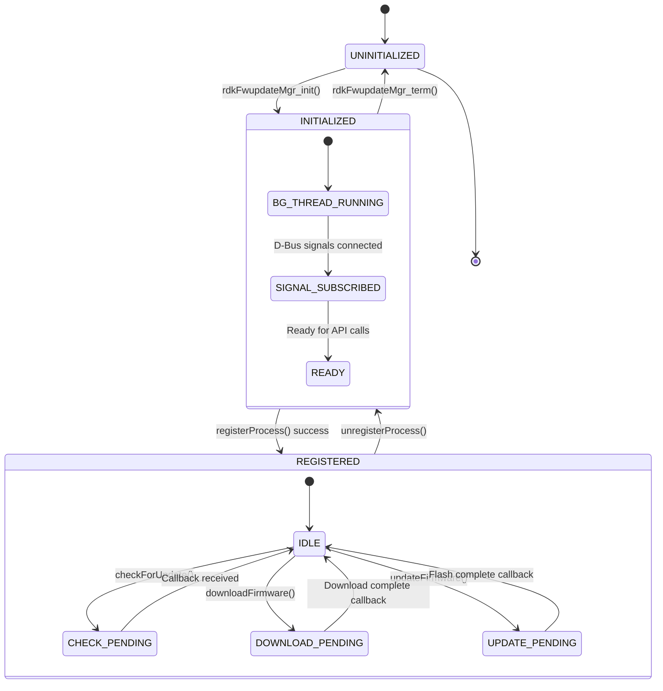
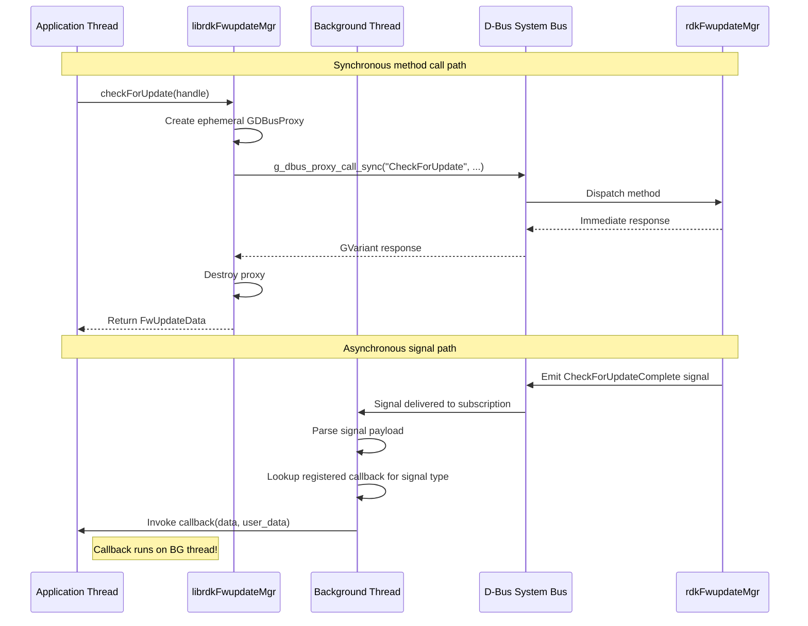
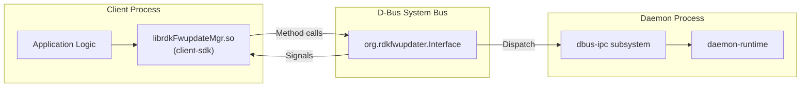
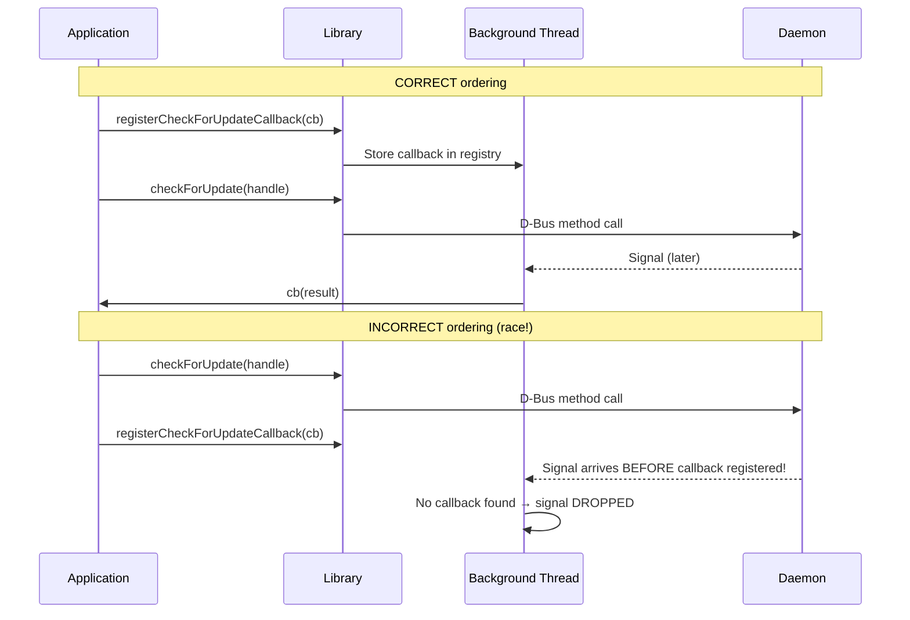

# Subsystem Specification: client-sdk

> **Subsystem:** Client Library SDK (`librdkFwupdateMgr.so`)  
> **Type:** IPC/Integration — Daemon Ecosystem  
> **Scope:** Consumer-facing shared library (interacts with daemon via D-Bus)  
> **Evidence Level:** Verified from `librdkFwupdateMgr/src/rdkFwupdateMgr_api.c`, `rdkFwupdateMgr_process.c`, `rdkFwupdateMgr_async.c`, `include/rdkFwupdateMgr_client.h`  
> **Cross-references:** [runtime/client-daemon-interaction.md](../../runtime/client-daemon-interaction.md), [subsystems/subsystem-inventory.md §4](../../subsystems/subsystem-inventory.md)

---

## 1. Purpose

The `client-sdk` subsystem provides the public C API for third-party applications to interact with the `rdkFwupdateMgr` daemon. It abstracts all D-Bus transport behind a lifecycle-oriented interface: initialize → register → operate → unregister → terminate.

This subsystem defines the consumer-facing contract that all client applications depend on for firmware update operations. It is the sole supported integration path for external applications.

---

## 2. What This Subsystem Owns

- Public C API surface (`rdkFwupdateMgr_client.h`)
- Background GLib thread for asynchronous signal dispatch
- D-Bus signal subscriptions (3 signal types)
- Callback registries (CheckForUpdate, Download, Update)
- Ephemeral D-Bus proxy creation per API call
- Connection lifecycle management (init/term)
- Thread synchronization between caller thread and background thread

## 3. What This Subsystem Does NOT Own

- D-Bus service implementation (owned by `dbus-ipc`)
- Firmware update logic (owned by daemon subsystems)
- D-Bus connection persistence (proxies are ephemeral)
- Daemon lifecycle or availability
- Firmware files or status files
- System-level error recovery

---

## 4. Responsibilities

| Responsibility | Behavioral Contract |
|----------------|-------------------|
| Library initialization | `rdkFwupdateMgr_init()` MUST spawn background thread and subscribe to D-Bus signals |
| Library termination | `rdkFwupdateMgr_term()` MUST stop background thread and clean up all resources |
| Process registration | `registerProcess()` MUST return a valid handler ID on success |
| Process unregistration | `unregisterProcess()` MUST release registration with daemon |
| Firmware check | `checkForUpdate()` MUST return immediately with in-progress indicator |
| Firmware download | `downloadFirmware()` MUST return immediately with acceptance status |
| Firmware update/flash | `updateFirmware()` MUST return immediately with acceptance status |
| Callback registration | `register*Callback()` MUST store callback for async invocation |
| Async result delivery | Background thread MUST invoke registered callbacks on signal receipt |
| Thread safety | API calls MUST be safe from any single thread; callbacks delivered on background thread |

---

## 5. Exposed Interfaces / APIs

### 5.1 Lifecycle API

```c
/**
 * @brief Initialize the firmware update client library
 * @return 0 on success, non-zero on failure
 * @post Background thread running, D-Bus signals subscribed
 * @note MUST be called before any other API function
 */
int rdkFwupdateMgr_init(void);

/**
 * @brief Terminate the firmware update client library
 * @return 0 on success
 * @pre All operations complete or abandoned
 * @post Background thread stopped, resources freed
 */
int rdkFwupdateMgr_term(void);
```

### 5.2 Registration API

```c
/**
 * @brief Register this process with the firmware update daemon
 * @param app_name      Application identifier string
 * @param app_version   Application version string
 * @return FirmwareInterfaceHandle (opaque handle) or NULL on failure
 * @note Creates ephemeral D-Bus proxy; blocks until daemon responds
 */
FirmwareInterfaceHandle registerProcess(const char *app_name, const char *app_version);

/**
 * @brief Unregister this process from the firmware update daemon
 * @param handle    Handle returned by registerProcess()
 * @return 0 on success, non-zero on failure
 */
int unregisterProcess(FirmwareInterfaceHandle handle);
```

### 5.3 Operation API

```c
/**
 * @brief Request firmware update check
 * @param handle    Registration handle
 * @return FwUpdateData with status (3 = check in progress)
 * @note Returns immediately; real result via registered callback
 */
FwUpdateData checkForUpdate(FirmwareInterfaceHandle handle);

/**
 * @brief Request firmware download
 * @param handle    Registration handle
 * @param fw_name   Firmware filename
 * @param fw_url    Download URL
 * @param fw_type   Firmware type (PCI/PDRI/PERIPHERAL)
 * @return Status (0=accepted, non-zero=rejected)
 * @note Returns immediately; progress via registered callback
 */
int downloadFirmware(FirmwareInterfaceHandle handle, 
                     const char *fw_name, const char *fw_url, int fw_type);

/**
 * @brief Request firmware flash/update
 * @param handle    Registration handle
 * @param fw_name   Firmware filename to flash
 * @return Status (0=accepted, non-zero=rejected)
 * @note Returns immediately; result via registered callback
 */
int updateFirmware(FirmwareInterfaceHandle handle, const char *fw_name);
```

### 5.4 Callback Registration API

```c
/**
 * @brief Register callback for CheckForUpdate results
 * @param handle    Registration handle
 * @param callback  Function pointer invoked when check completes
 * @return 0 on success
 * @note Callback invoked on library's background thread
 * @warning MUST register BEFORE calling checkForUpdate() to avoid race
 */
int registerCheckForUpdateCallback(FirmwareInterfaceHandle handle, 
                                    CheckForUpdateCb callback);

/**
 * @brief Register callback for download progress
 * @param handle    Registration handle
 * @param callback  Function pointer invoked on progress/completion
 * @return 0 on success
 */
int registerDownloadCallback(FirmwareInterfaceHandle handle, 
                             DownloadProgressCb callback);

/**
 * @brief Register callback for update/flash results
 * @param handle    Registration handle
 * @param callback  Function pointer invoked on flash completion
 * @return 0 on success
 */
int registerUpdateCallback(FirmwareInterfaceHandle handle, 
                           UpdateCompleteCb callback);
```

### 5.5 Data Structures

```c
typedef char* FirmwareInterfaceHandle;  // Opaque: string representation of handler_id

typedef struct {
    int status_code;     // Result code (0=update available, 1=up-to-date, 3=in-progress)
    char *fw_name;       // Firmware filename
    char *fw_version;    // Firmware version
    char *fw_url;        // Download URL
    char *message;       // Human-readable status message
} FwUpdateData;

typedef void (*CheckForUpdateCb)(FwUpdateData *data, void *user_data);
typedef void (*DownloadProgressCb)(int percent, const char *message, void *user_data);
typedef void (*UpdateCompleteCb)(int status, const char *message, void *user_data);
```

---

## 6. Runtime Lifecycle



---

## 7. Interaction Contracts

### 7.1 Client Application → Library

| API Call | Threading | Blocking | D-Bus Activity |
|----------|-----------|----------|---------------|
| `rdkFwupdateMgr_init()` | Caller's thread | Yes (thread spawn) | Signal subscription |
| `rdkFwupdateMgr_term()` | Caller's thread | Yes (thread join) | Signal unsubscription |
| `registerProcess()` | Caller's thread | Yes (D-Bus sync call, ~10-50ms) | Ephemeral proxy → method call |
| `unregisterProcess()` | Caller's thread | Yes (D-Bus sync call) | Ephemeral proxy → method call |
| `checkForUpdate()` | Caller's thread | Yes (D-Bus sync call, returns immediately after daemon ack) | Ephemeral proxy → method call |
| `downloadFirmware()` | Caller's thread | Yes (D-Bus sync call) | Ephemeral proxy → method call |
| `updateFirmware()` | Caller's thread | Yes (D-Bus sync call) | Ephemeral proxy → method call |
| `register*Callback()` | Caller's thread | No (in-process only) | None |

### 7.2 Library → Client Application (Callbacks)

| Callback | Invocation Thread | Triggered By |
|----------|------------------|--------------|
| `CheckForUpdateCb` | Background thread | D-Bus signal `CheckForUpdateComplete` |
| `DownloadProgressCb` | Background thread | D-Bus signal `DownloadProgress` |
| `UpdateCompleteCb` | Background thread | D-Bus signal `UpdateProgress` |

### 7.3 Library → Daemon (D-Bus)



---

## 8. Shared-Library Dependencies

| Library | Usage |
|---------|-------|
| GLib/GIO | GDBusProxy, GDBusConnection, GMainLoop, GThread |
| libpthread | Thread primitives (implicit via GLib) |
| D-Bus system bus | IPC transport (via GIO) |

---

## 9. Execution-Model-Specific Behavior

### 9.1 Relationship to Execution Models

This subsystem exists ONLY in the daemon ecosystem:

| Aspect | Detail |
|--------|--------|
| One-shot (`rdkvfwupgrader`) | Does NOT use client-sdk; performs operations directly |
| Daemon (`rdkFwupdateMgr`) | Is the SERVICE that client-sdk communicates with |
| Client applications | Use client-sdk as their ONLY integration path |

### 9.2 Client-SDK is NOT Part of Either Binary

The library runs in a **separate process** (the client application). It is the IPC bridge between client processes and the daemon process.



---

## 10. Threading / Event-Loop Expectations

### Thread Architecture

| Thread | Owner | Purpose | Lifetime |
|--------|-------|---------|----------|
| Caller thread | Application | API calls (blocking D-Bus) | Application-managed |
| Background thread | Library | GLib main loop for signal dispatch | `init()` to `term()` |

### Thread Safety Contract

| Guarantee | Detail |
|-----------|--------|
| API calls from caller thread | All public API functions are safe to call from a single application thread |
| Callbacks on background thread | ALL callbacks are invoked on the library's background thread, NOT the caller's thread |
| No concurrent API calls | Library does NOT guarantee safety for concurrent API calls from multiple threads |
| Callback must be non-blocking | Callback implementations SHOULD NOT block (blocks signal dispatch for other callbacks) |
| Register before invoke | Callbacks MUST be registered BEFORE invoking the corresponding operation |

### Critical Race Condition



---

## 11. Operational Invariants

| Invariant | Enforcement |
|-----------|-------------|
| `init()` before any operation | Undefined behavior if called without init |
| `registerProcess()` before operations | Daemon rejects requests from unregistered handlers |
| Callbacks registered before operations | Signal may arrive before callback stored (race) |
| Background thread alive during operation | Thread runs from `init()` to `term()` |
| Ephemeral proxies (no persistent connection) | New proxy per API call; no connection-state dependency |
| Single active library instance per process | Global state (registries) assumes single instance |

---

## 12. Safety Guarantees

| Guarantee | Mechanism |
|-----------|-----------|
| No daemon crash from bad client input | D-Bus validates types; daemon validates semantics |
| Clean thread shutdown | `term()` quits main loop, joins thread |
| No resource leaks on term | All subscriptions removed, proxies destroyed |
| Callback isolation | Each signal type has independent registry |
| No credential exposure | D-Bus authentication handled by system bus |

---

## 13. Failure Semantics

| Failure Mode | API Return | Callback Impact | Application Action |
|--------------|-----------|-----------------|-------------------|
| Daemon not running | D-Bus error (proxy call fails) | No signals emitted | Retry later |
| D-Bus bus unavailable | `init()` returns error | N/A | Cannot use library |
| Registration rejected | `registerProcess()` returns NULL | N/A | Cannot proceed |
| Operation rejected | Non-zero return from operation API | No callback for this request | Check preconditions |
| Daemon crashes during operation | No completion signal received | Callback never invoked | Application timeout needed |
| Library `term()` during active operation | Signals unsubscribed | Pending callbacks may be lost | Application must track |

---

## 14. Retry / Recovery Behavior

| Scenario | Library Behavior | Application Responsibility |
|----------|-----------------|---------------------------|
| Daemon unavailable | Return error from API call | Retry with backoff |
| Operation timeout (no callback) | Library has no timeout mechanism | Application must implement timeout |
| Daemon restart | Existing handler_ids invalidated | Re-register after daemon restart |
| Callback not received | No built-in retry | Application monitors and retries |
| D-Bus bus restart | Library subscription lost | Call `term()` + `init()` to re-establish |

**[CRITICAL]** The library provides NO built-in timeout or retry mechanisms. Applications MUST implement their own timeout logic for async operations.

---

## 15. Observability Expectations

| Observable | Mechanism | Consumer |
|------------|-----------|----------|
| Library initialized | `init()` return code | Application |
| Registration status | `registerProcess()` return value | Application |
| Operation acceptance | API return values | Application |
| Async results | Callback invocations | Application |
| Daemon availability | D-Bus name presence | Application (if monitoring) |

---

## 16. External Dependencies

| Dependency | Nature | Failure Impact |
|------------|--------|----------------|
| D-Bus system bus | IPC transport | Library cannot function |
| `rdkFwupdateMgr` daemon | Service provider | Operations fail |
| GLib/GIO runtime | Threading + D-Bus | Library cannot initialize |

---

## 17. Assumptions and Unknowns

### Verified Assumptions

- [VERIFIED] Proxies are ephemeral — created and destroyed per API call
- [VERIFIED] Background thread runs its own GLib main loop
- [VERIFIED] Callbacks are invoked on the background thread, not caller's thread
- [VERIFIED] Signal subscriptions are for all signals of each type (not filtered by handler_id)
- [VERIFIED] `FirmwareInterfaceHandle` is a string representation of the uint64 handler_id

### Inferred Behavior

- [INFERRED] All registered callbacks for a signal type receive ALL signals (not filtered per-client)
- [INFERRED] Multiple applications can use the library concurrently (each in own process)
- [INFERRED] No built-in timeout for daemon response on sync D-Bus calls (GLib default timeout applies)

### Unresolved Unknowns

- [UNKNOWN] GLib D-Bus proxy default timeout value (may be 25 seconds)
- [UNKNOWN] Whether signals are filtered by handler_id or all clients receive all signals
- [UNKNOWN] Memory ownership semantics of `FwUpdateData` fields (caller-freed? library-freed?)
- [UNKNOWN] Whether `init()` blocks until background thread is fully operational
- [UNKNOWN] Behavior on concurrent `init()` calls from same process
- [UNKNOWN] Maximum number of registered callbacks per signal type
