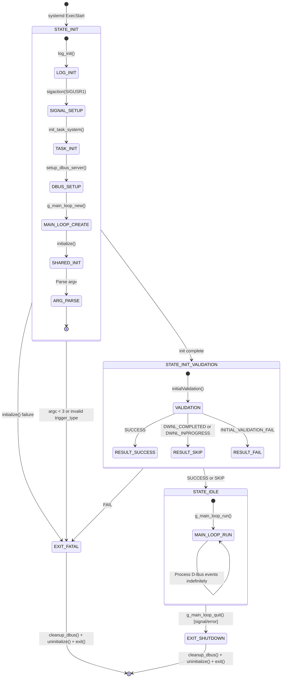
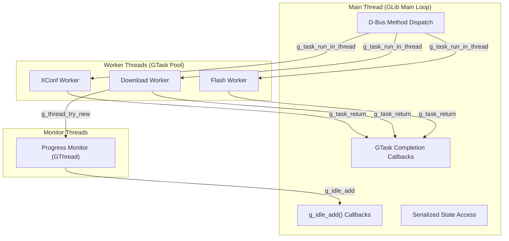

# Subsystem Specification: daemon-runtime

> **Subsystem:** Persistent Daemon Execution Model (`rdkFwupdateMgr`)  
> **Type:** Core Runtime — Execution Model Orchestrator  
> **Scope:** Daemon-specific (binary: `rdkFwupdateMgr`, systemd unit: `rdkFwupdateMgr.service`)  
> **Evidence Level:** Verified from `src/rdkFwupdateMgr.c`, `src/dbus/rdkv_dbus_server.c`  
> **Cross-references:** [runtime/rdkFwupdateMgr-sequence.md](../../runtime/rdkFwupdateMgr-sequence.md), [runtime/daemon-threading-model.md](../../runtime/daemon-threading-model.md), [subsystems/subsystem-inventory.md §11](../../subsystems/subsystem-inventory.md)

---

## 1. Purpose

The `daemon-runtime` subsystem defines the behavioral contract for the persistent, event-driven firmware update service. It owns the daemon lifecycle state machine, GLib main loop management, D-Bus service bootstrapping, and the coordination between initialization, steady-state serving, and orderly shutdown.

This subsystem is the authority for how the daemon starts, becomes reachable, processes concurrent client requests, and survives individual operation failures without terminating.

---

## 2. What This Subsystem Owns

- Daemon process lifecycle (systemd-managed: start → serve → stop)
- Startup state machine (`STATE_INIT` → `STATE_INIT_VALIDATION` → `STATE_IDLE`)
- GLib main loop creation and execution
- D-Bus server bootstrapping (before shared initialization)
- Shared initialization reuse (`initialize()`, `uninitialize()`)
- Orderly shutdown sequence
- Daemon-specific invariant: D-Bus service MUST be reachable during initialization

## 3. What This Subsystem Does NOT Own

- D-Bus method dispatch logic (owned by `dbus-ipc`)
- Client API surface (owned by `client-sdk`)
- Download execution mechanics (owned by `download-engine`)
- Flash operations (cross-subsystem)
- Concurrency control details (owned by `operational-safety`)
- One-shot orchestration (owned by `updater-execution`)

---

## 4. Responsibilities

| Responsibility | Behavioral Contract |
|----------------|-------------------|
| State machine management | MUST progress through STATE_INIT → STATE_INIT_VALIDATION → STATE_IDLE in order |
| D-Bus reachability during init | MUST call `setup_dbus_server()` BEFORE `initialize()` — daemon is reachable during init |
| Shared init reuse | MUST call the same `initialize()` / `initialValidation()` / `uninitialize()` as one-shot |
| Main loop lifecycle | MUST enter `g_main_loop_run()` in STATE_IDLE and never return under normal conditions |
| Error tolerance | MUST NOT exit on operation errors — log and continue serving |
| Clean shutdown | MUST call `cleanup_dbus()` → `uninitialize()` → `exit()` on shutdown signal |
| Task system initialization | MUST call `init_task_system()` before D-Bus setup for tracking structures |
| Global state initialization | MUST populate `device_info`, `rfc_list`, IARM connection during STATE_INIT |

---

## 5. Runtime Lifecycle



### Key Lifecycle Distinction from One-Shot

**[VERIFIED]** Unlike `rdkvfwupgrader`, the daemon:
- Always transitions to STATE_IDLE even when `initialValidation()` returns DWNL_INPROGRESS or DWNL_COMPLETED
- Only exits on INITIAL_VALIDATION_FAIL (build exclusion)
- NEVER exits on operation errors during steady-state

---

## 6. Interaction Contracts

### 6.1 Inbound Interactions

| Source | Mechanism | Contract |
|--------|-----------|----------|
| systemd | `ExecStart` with `<retry_count> <trigger_type>` | Same argument contract as one-shot |
| systemd | `SIGTERM` / `SIGKILL` | Orderly shutdown (SIGTERM) or forced kill (SIGKILL) |
| D-Bus clients | Method calls on `org.rdkfwupdater.Interface` | Handled by `dbus-ipc` subsystem via main loop |
| IARM Bus | `DwnlStopEventHandler` callback | Throttle/abort active downloads |

### 6.2 Outbound Interactions

| Target | Mechanism | Contract |
|--------|-----------|----------|
| D-Bus system bus | Signal emission | `CheckForUpdateComplete`, `DownloadProgress`, `UpdateProgress` |
| GTask thread pool | `g_task_run_in_thread()` | Async offload of blocking operations |
| IARM Bus | `eventManager()` | Fire-and-forget state broadcasts |
| Thunder JSON-RPC | `getJsonRpc()` | Maintenance mode query (init only) |
| Filesystem | Status files, PID file | Direct I/O |

---

## 7. Exposed Interfaces / APIs

The daemon does not expose a C API. Its external contract is the D-Bus interface (specified in `dbus-ipc`).

### Process Management Contract

| Signal | Response |
|--------|----------|
| `SIGTERM` | Begin orderly shutdown: quit main loop → cleanup |
| `SIGUSR1` | Set `force_exit=1`, abort active downloads |
| `SIGKILL` | Immediate termination (no cleanup) |

### systemd Integration

```ini
[Service]
Type=simple
ExecStart=/usr/bin/rdkFwupdateMgr 3 2
Restart=on-failure
```

---

## 8. Shared-Library Dependencies

| Library | Usage in Daemon |
|---------|----------------|
| `librdksw_upgrade.so` | Download workers (via GTask) |
| `librdksw_jsonparse.so` | XConf payload construction/parsing |
| `librdksw_flash.so` | Flash workers (via GTask) |
| `librdksw_rfcIntf.so` | RFC settings during init |
| `librdksw_iarmIntf.so` | IARM events |
| `librdksw_fwutils.so` | Device identity |
| GLib/GIO | Main loop, GDBus, GTask, threads |

---

## 9. Execution-Model-Specific Behavior

### 9.1 Daemon-Specific Architecture



### 9.2 Contrast with updater-execution

| Aspect | daemon-runtime | updater-execution |
|--------|---------------|-------------------|
| Lifetime | Indefinite | Single invocation |
| Error recovery | Continue serving | Exit process |
| D-Bus reachability | During initialization | N/A |
| Firmware sequencing | Client-driven (each individually) | Built-in pipeline (PCI→PDRI→Peripheral) |
| Threading | Multi-threaded (main loop + pool) | Single-threaded |
| State isolation | Per-request contexts | Global state for entire run |
| Multiple clients | Concurrent support | N/A (single process) |

---

## 10. Threading / Event-Loop Expectations

### Thread Architecture

| Thread | Affinity | Purpose |
|--------|----------|---------|
| Main thread | GLib main loop | D-Bus dispatch, state management, signal emission |
| XConf worker | GTask pool | Blocking XConf HTTP POST (one at a time) |
| Download worker | GTask pool | Blocking firmware download (one at a time) |
| Flash worker | GTask pool | Blocking flash I/O (one at a time) |
| Progress monitor | Dedicated GThread | Polls curl progress file every 100ms |

### Main Loop Guarantees

- All D-Bus method dispatch runs on main thread
- All GTask completion callbacks run on main thread (via main context)
- All `g_idle_add()` callbacks run on main thread
- State variables protected by main-loop serialization do NOT need mutexes
- Only worker threads interact with network/flash (blocking I/O never on main thread)

### Thread Safety Contract

- Main-loop-serialized state: `registered_processes`, `active_tasks`, `waiting_*`, `IsDownloadInProgress`, `IsFlashInProgress`
- Mutex-protected state: `XConfCommStatus` (GMutex), `DwnlState` (pthread_mutex), `app_mode` (pthread_mutex)
- Worker-to-main communication: exclusively via `g_task_return_*()` and `g_idle_add()`

---

## 11. Operational Invariants

| Invariant | Enforcement |
|-----------|-------------|
| D-Bus reachable before init completes | `setup_dbus_server()` called before `initialize()` |
| At most one active XConf fetch | `XConfCommStatus` mutex + boolean guard |
| At most one active download | `IsDownloadInProgress` boolean (main-loop-serialized) |
| At most one active flash | `IsFlashInProgress` boolean (main-loop-serialized) |
| Never exits on operation error | All handlers catch errors, report via signal, reset state |
| Main loop runs indefinitely | Only `g_main_loop_quit()` (from signal/shutdown) breaks the loop |
| Task cleanup on shutdown | `cleanup_dbus()` destroys all task contexts and hash tables |
| Client registration required | All operational methods validate `handler_id` against registry |

---

## 12. Safety Guarantees

| Guarantee | Mechanism |
|-----------|-----------|
| Service availability | systemd restart-on-failure + never-exit-on-error policy |
| Data isolation | Per-request task contexts prevent state leakage between clients |
| No blocking main loop | All I/O offloaded to GTask workers |
| Ordered shutdown | cleanup_dbus() → uninitialize() sequence ensures proper resource release |
| Signal broadcast atomicity | Signals emitted on main thread via g_idle_add (serialized) |

---

## 13. Failure Semantics

| Failure Mode | Behavior | Process Impact |
|--------------|----------|----------------|
| `initialize()` failure | Exit with cleanup | Process terminates |
| D-Bus connection failure | Exit with cleanup | Process terminates (systemd restarts) |
| XConf worker failure | Signal error to clients, reset XConfCommStatus | Continues serving |
| Download worker failure | Signal error, reset IsDownloadInProgress | Continues serving |
| Flash worker failure | Signal error, reset IsFlashInProgress | Continues serving |
| Client disconnect (without unregister) | Stale entry in registry until cleanup | Continues serving |
| IARM Bus failure | Logged, non-fatal | Continues serving (degraded) |

---

## 14. Retry / Recovery Behavior

| Scenario | Recovery |
|----------|----------|
| Operation failure | Client receives error signal; may re-invoke operation |
| Daemon crash | systemd restarts; state machine re-executes from STATE_INIT |
| D-Bus bus loss | Fatal — daemon exits, systemd restarts |
| Worker thread crash | GTask catches; completion callback reports error |
| Download abort (SIGUSR1) | Download reports error, daemon stays alive |

---

## 15. Observability Expectations

| Observable | Mechanism | Consumer |
|------------|-----------|----------|
| Daemon alive | systemd status + D-Bus name ownership | systemd, D-Bus clients |
| Current operation state | D-Bus signals (progress/completion) | Client applications |
| IARM state events | `eventManager()` broadcasts | System event bus |
| Telemetry metrics | T2 events | Cloud telemetry |
| Download progress | Periodic `DownloadProgress` D-Bus signals | Client applications |
| Process PID | systemd + PID file | Operators |

---

## 16. External Dependencies

| Dependency | Nature | Failure Impact |
|------------|--------|----------------|
| GLib/GIO runtime | Runtime linkage | Fatal: main loop, D-Bus, threads unavailable |
| D-Bus system bus (dbus-daemon) | IPC | Fatal: cannot register service |
| systemd | Process supervision | Restart-on-failure capability lost |
| IARM Bus | IPC | Degraded: no state events (non-fatal) |
| XConf cloud server | Network | Cannot check for updates (per-request failure) |
| CDN | Network | Cannot download firmware (per-request failure) |
| Thunder (localhost:9998) | HTTP | Cannot query maintenance mode (init degraded) |

---

## 17. Assumptions and Unknowns

### Verified Assumptions

- [VERIFIED] D-Bus server setup occurs BEFORE `initialize()`
- [VERIFIED] Daemon transitions to STATE_IDLE even with DWNL_INPROGRESS/COMPLETED
- [VERIFIED] Only INITIAL_VALIDATION_FAIL causes daemon exit during startup
- [VERIFIED] GTask thread pool is managed by GLib (default pool size)
- [VERIFIED] Main loop serialization guarantees protect daemon-only state

### Inferred Behavior

- [INFERRED] systemd `Restart=on-failure` ensures daemon availability
- [INFERRED] GLib default thread pool size is sufficient for 3 concurrent task types
- [INFERRED] Client registry entries are not automatically cleaned on D-Bus disconnect

### Unresolved Unknowns

- [UNKNOWN] Exact systemd unit configuration (restart delay, watchdog)
- [UNKNOWN] Maximum number of concurrent registered clients
- [UNKNOWN] Behavior if GLib thread pool is exhausted
- [UNKNOWN] Whether daemon supports graceful configuration reload (HUP signal)
- [UNKNOWN] Memory growth characteristics during long-running operation with many client registrations/unregistrations
