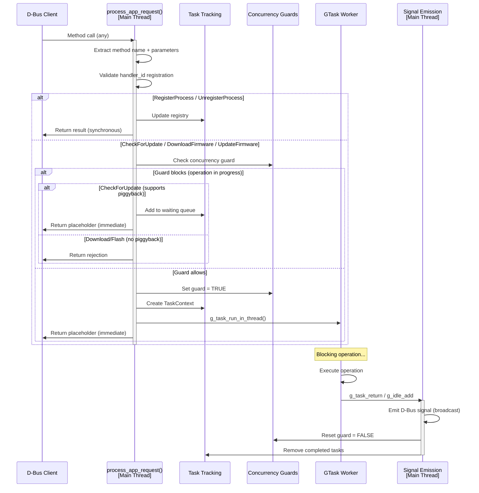
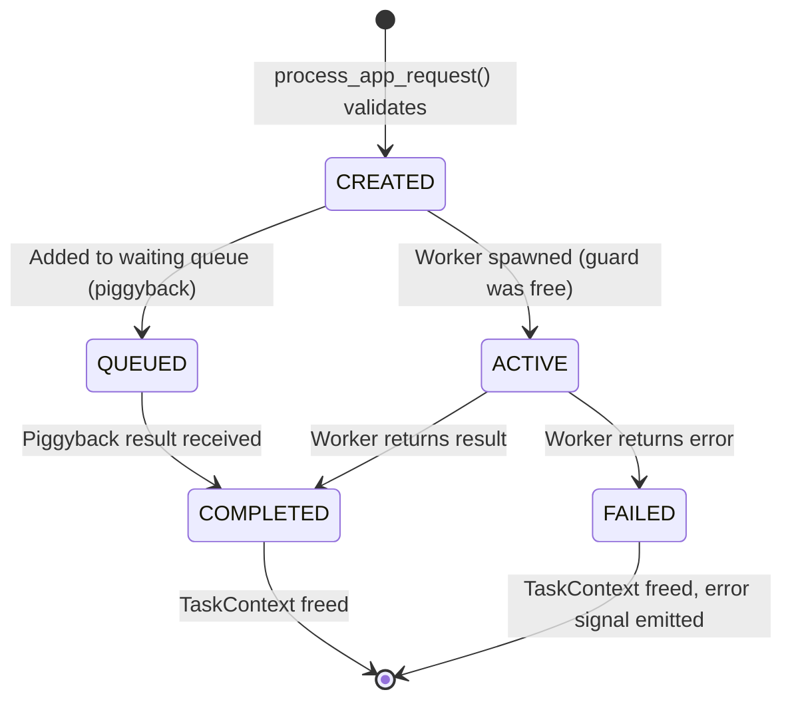
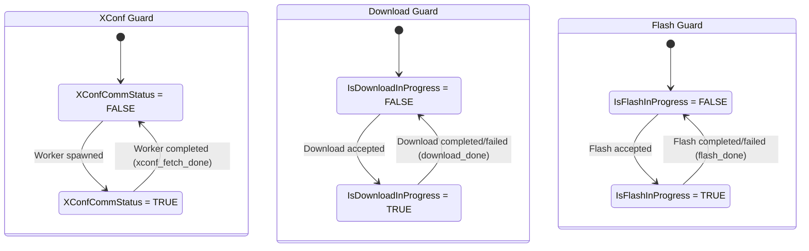
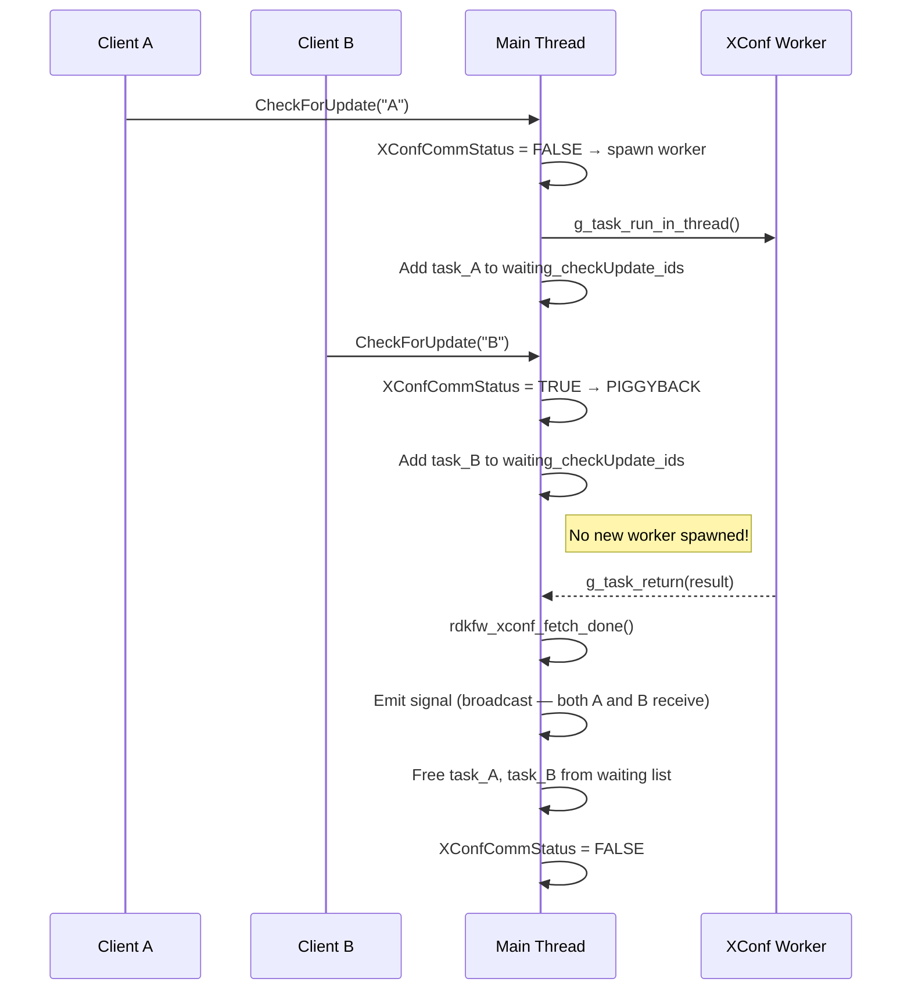

# Subsystem Specification: dbus-ipc

> **Subsystem:** D-Bus IPC Service Interface  
> **Type:** Core Runtime — Daemon-Specific  
> **Scope:** Daemon-only (`rdkFwupdateMgr`)  
> **Evidence Level:** Verified from `src/dbus/rdkv_dbus_server.c`, `src/dbus/rdkFwupdateMgr_handlers.c`, `src/dbus/xconf_comm_status.c`  
> **Cross-references:** [dbus/dbus-architecture.md](../../dbus/dbus-architecture.md), [runtime/client-daemon-interaction.md](../../runtime/client-daemon-interaction.md), [subsystems/subsystem-inventory.md §3](../../subsystems/subsystem-inventory.md)

---

## 1. Purpose

The `dbus-ipc` subsystem defines the complete D-Bus service contract exposed by the `rdkFwupdateMgr` daemon. It owns method dispatch, async task management, client process tracking, signal broadcasting, concurrency guards, and the piggyback queue mechanism for coalescing concurrent requests.

This is the authoritative specification for all interactions between client applications (via `client-sdk` or direct D-Bus) and the firmware update daemon.

---

## 2. What This Subsystem Owns

- D-Bus service identity (`org.rdkfwupdater.Interface` at `/org/rdkfwupdater/Service`)
- D-Bus object registration and introspection XML
- Method dispatch routing (`process_app_request()`)
- Client process registry (registration/unregistration lifecycle)
- Async task lifecycle (creation, tracking, completion, cleanup)
- Piggyback queues (coalescing concurrent identical requests)
- Signal broadcasting (multicast completion/progress to all subscribers)
- Concurrency guards (`IsDownloadInProgress`, `IsFlashInProgress`, `XConfCommStatus`)
- Worker thread spawning (GTask creation and thread-pool offloading)
- D-Bus input validation

## 3. What This Subsystem Does NOT Own

- Process lifecycle (owned by `daemon-runtime`)
- GLib main loop management (owned by `daemon-runtime`)
- HTTP download mechanics (owned by `download-engine`)
- XConf response parsing (owned by `firmware-validation`)
- Flash I/O (owned by `firmware-validation`)
- Client-side library implementation (owned by `client-sdk`)
- IARM event broadcasting (separate subsystem)

---

## 4. D-Bus Service Contract

### 4.1 Bus Identity

| Property | Value |
|----------|-------|
| Well-known name | `org.rdkfwupdater.Interface` |
| Object path | `/org/rdkfwupdater/Service` |
| Interface | `org.rdkfwupdater.Interface` |
| Bus type | System bus |

### 4.2 Methods

#### RegisterProcess

```
RegisterProcess(s: app_name, s: app_version) → (t: handler_id)
```

| Parameter | Type | Direction | Description |
|-----------|------|-----------|-------------|
| `app_name` | string | in | Client application identifier |
| `app_version` | string | in | Client application version |
| `handler_id` | uint64 | out | Unique registration handle |

**Behavioral Contract:**
- MUST validate non-empty `app_name` and `app_version`
- MUST generate unique `handler_id` (monotonically increasing)
- MUST store registration in process tracking table
- MUST be idempotent for same app_name (returns new handler_id each time)

#### UnregisterProcess

```
UnregisterProcess(t: handler_id) → ()
```

| Parameter | Type | Direction | Description |
|-----------|------|-----------|-------------|
| `handler_id` | uint64 | in | Previously registered handle |

**Behavioral Contract:**
- MUST validate `handler_id` exists in registry
- MUST remove all task associations for this handler
- MUST NOT affect other registered processes
- SHOULD be called before client disconnects (but not enforced)

#### CheckForUpdate

```
CheckForUpdate(s: handler_id_str) → (i: status, s: fw_name, s: fw_version, s: fw_url, s: message, i: result_code)
```

| Parameter | Type | Direction | Description |
|-----------|------|-----------|-------------|
| `handler_id_str` | string | in | Handler ID as string |
| `status` | int32 | out | Always 0 (placeholder) |
| `fw_name` | string | out | Always "" (placeholder) |
| `fw_version` | string | out | Always "" (placeholder) |
| `fw_url` | string | out | Always "" (placeholder) |
| `message` | string | out | "check in progress" |
| `result_code` | int32 | out | Always 3 (FIRMWARE_CHECK_ERROR — in-progress indicator) |

**Behavioral Contract:**
- Returns IMMEDIATELY with placeholder values (non-blocking)
- Actual result delivered asynchronously via `CheckForUpdateComplete` signal
- MUST validate handler registration before spawning worker
- If XConf fetch already in progress: piggyback (no new worker spawned)
- If no fetch running: set XConfCommStatus=TRUE, spawn GTask worker

#### DownloadFirmware

```
DownloadFirmware(s: handler_id_str, s: fw_name, s: fw_url, i: fw_type) → (i: status, s: message)
```

| Parameter | Type | Direction | Description |
|-----------|------|-----------|-------------|
| `handler_id_str` | string | in | Handler ID as string |
| `fw_name` | string | in | Firmware filename to download |
| `fw_url` | string | in | Download URL |
| `fw_type` | int32 | in | Upgrade type (PCI/PDRI/PERIPHERAL) |
| `status` | int32 | out | 0=accepted, non-zero=rejected |
| `message` | string | out | Status description |

**Behavioral Contract:**
- Returns IMMEDIATELY (non-blocking)
- Progress delivered via `DownloadProgress` signals
- MUST reject if `IsDownloadInProgress == TRUE`
- MUST validate handler registration
- If accepted: set `IsDownloadInProgress=TRUE`, spawn GTask download worker
- Worker spawns progress monitor GThread

#### UpdateFirmware

```
UpdateFirmware(s: handler_id_str, s: fw_name) → (i: status, s: message)
```

| Parameter | Type | Direction | Description |
|-----------|------|-----------|-------------|
| `handler_id_str` | string | in | Handler ID as string |
| `fw_name` | string | in | Firmware filename to flash |
| `status` | int32 | out | 0=accepted, non-zero=rejected |
| `message` | string | out | Status description |

**Behavioral Contract:**
- Returns IMMEDIATELY (non-blocking)
- Progress delivered via `UpdateProgress` signals
- MUST reject if `IsFlashInProgress == TRUE`
- MUST reject if firmware file does not exist
- If accepted: set `IsFlashInProgress=TRUE`, spawn GTask flash worker

### 4.3 Signals

#### CheckForUpdateComplete

```
signal CheckForUpdateComplete(i: status, s: fw_name, s: fw_version, s: fw_url, s: message, i: result_code)
```

**Emission Contract:**
- Emitted on main thread after XConf worker completes
- Broadcast to ALL signal subscribers (not targeted)
- Contains full XConf query result
- `result_code`: 0=update available, 1=up-to-date, 2=error

#### DownloadProgress

```
signal DownloadProgress(i: percent, s: status_message)
```

**Emission Contract:**
- Emitted periodically during download (via progress monitor → `g_idle_add`)
- Broadcast to ALL subscribers
- `percent`: 0-100 progress value
- Final signal indicates completion or error

#### UpdateProgress

```
signal UpdateProgress(i: status, s: message)
```

**Emission Contract:**
- Emitted when flash operation completes or fails
- Broadcast to ALL subscribers
- `status`: 0=success, non-zero=failure

---

## 5. Runtime Lifecycle



---

## 6. Task Lifecycle



### Task Context Structure

```c
typedef struct {
    guint task_id;              // Monotonic task identifier
    TaskType type;             // CHECK_UPDATE | DOWNLOAD | FLASH
    char *handler_id;          // Requesting client's handler
    char *sender;              // D-Bus sender address
    GCancellable *cancellable; // Cancellation token (future use)
    // ... type-specific fields
} TaskContext;
```

---

## 7. Concurrency Control (Cross-Cutting)

### Guard State Machine



### Guard Protection Mechanisms

| Guard | Protection Level | Mechanism |
|-------|-----------------|-----------|
| `XConfCommStatus` | Thread-safe (cross-thread) | `GMutex` in `xconf_comm_status.c` |
| `IsDownloadInProgress` | Main-loop-serialized | Boolean checked only on main thread |
| `IsFlashInProgress` | Main-loop-serialized | Boolean checked only on main thread |
| `g_cached_xconf_data` | Thread-safe | `G_LOCK` macro |

### Piggyback Queue Semantics



---

## 8. Execution-Model-Specific Behavior

### 8.1 Daemon-Only (This Subsystem Exists Only in Daemon)

The D-Bus IPC subsystem has no counterpart in `rdkvfwupgrader`. The one-shot binary performs the same operations directly without any IPC layer.

### 8.2 How One-Shot Achieves Equivalent Behavior

| D-Bus Method | One-Shot Equivalent |
|--------------|-------------------|
| RegisterProcess | N/A (no client registration) |
| CheckForUpdate | Direct `MakeXconfComms()` call in main() |
| DownloadFirmware | Direct `rdkv_upgrade_request()` call in main() |
| UpdateFirmware | Direct `flashImage()` call in main() |
| Signal emission | N/A (caller is same process) |

---

## 9. Threading / Event-Loop Expectations

### Thread Affinity Rules

| Operation | Thread | Rationale |
|-----------|--------|-----------|
| `process_app_request()` dispatch | Main thread | D-Bus callbacks run on main loop |
| Input validation | Main thread | Part of dispatch |
| Guard checks/sets (Download, Flash) | Main thread | Main-loop serialization |
| Guard checks/sets (XConf) | Any thread | GMutex protected |
| Worker execution | GTask pool thread | Blocking I/O off main loop |
| GTask completion callback | Main thread | Scheduled via main context |
| Signal emission | Main thread | Via `g_idle_add` or task completion |
| Task context creation/destruction | Main thread | Part of dispatch/completion |

### Main-Loop Serialization Guarantee

All operations that touch `registered_processes`, `active_tasks`, `waiting_*` lists, `IsDownloadInProgress`, `IsFlashInProgress`, or `current_download/flash` state are guaranteed to execute on the main thread. This eliminates the need for mutexes on these structures.

---

## 10. Operational Invariants

| Invariant | Enforcement |
|-----------|-------------|
| All methods validate handler registration | `process_app_request()` checks registry before processing |
| At most one XConf fetch concurrently | `XConfCommStatus` GMutex-protected boolean |
| At most one download concurrently | `IsDownloadInProgress` main-loop-serialized |
| At most one flash concurrently | `IsFlashInProgress` main-loop-serialized |
| Signals broadcast to all subscribers | `g_dbus_connection_emit_signal()` without target |
| Piggyback only for CheckForUpdate | Download and Flash do not support piggyback (rejected) |
| Immediate method return | All operational methods return without waiting for result |
| Worker errors do not crash daemon | All completion callbacks handle error case |

---

## 11. Safety Guarantees

| Guarantee | Mechanism |
|-----------|-----------|
| No concurrent firmware operations | Concurrency guards prevent overlap |
| Input validation before execution | All parameters validated before worker spawn |
| Client isolation | Each client has separate handler_id; no state leakage |
| Signal integrity | Signals emitted on main thread (serialized with state updates) |
| Resource cleanup | Task contexts freed on completion; hash tables destroyed on shutdown |
| No D-Bus method blocks indefinitely | All methods return immediately; results via signals |

---

## 12. Failure Semantics

| Failure Mode | D-Bus Response | Signal | Daemon Impact |
|--------------|---------------|--------|---------------|
| Invalid handler_id | Error response | None | None |
| Unregistered client | Error response | None | None |
| Download already in progress | Rejection (status ≠ 0) | None | None |
| Flash already in progress | Rejection (status ≠ 0) | None | None |
| XConf worker network error | N/A (immediate placeholder) | CheckForUpdateComplete with error | Guards reset |
| Download worker failure | N/A (immediate acceptance) | DownloadProgress with error | Guards reset |
| Flash worker failure | N/A (immediate acceptance) | UpdateProgress with error | Guards reset |
| D-Bus connection lost | Fatal | N/A | Daemon exits |

---

## 13. Retry / Recovery Behavior

| Scenario | D-Bus Layer Behavior |
|----------|---------------------|
| Operation fails | Signal broadcasts error; client may re-invoke method |
| Client crashes without unregister | Stale registry entry; no cleanup triggered |
| Worker thread crash | GTask reports error via completion; guard reset |
| Multiple rapid CheckForUpdate | Piggyback — all receive same result |
| Rapid Download after failure | Allowed once guard resets (IsDownloadInProgress = FALSE) |

---

## 14. Observability Expectations

| Observable | Mechanism | Consumer |
|------------|-----------|----------|
| Service alive | D-Bus name ownership | `client-sdk`, D-Bus tools |
| Operation in progress | Signal emission | Subscribed clients |
| Registered clients | Internal hash table (debug logging) | Daemon logs |
| Task lifecycle | Internal tracking (debug logging) | Daemon logs |
| Method call rate | D-Bus monitoring | Debugging |

---

## 15. External Dependencies

| Dependency | Nature | Failure Impact |
|------------|--------|----------------|
| D-Bus system bus | IPC transport | Fatal: service unreachable |
| GLib/GIO | Runtime | Fatal: dispatch/tasks unavailable |
| `download-engine` | Worker dependency | Per-request failure (non-fatal to daemon) |
| `firmware-validation` | Worker dependency | Per-request failure (non-fatal to daemon) |

---

## 16. Assumptions and Unknowns

### Verified Assumptions

- [VERIFIED] All D-Bus methods return immediately (non-blocking to caller)
- [VERIFIED] Signals are broadcast (not targeted to specific clients)
- [VERIFIED] Piggyback only applies to CheckForUpdate
- [VERIFIED] `XConfCommStatus` uses GMutex (cross-thread safe)
- [VERIFIED] Download/Flash guards are main-loop-serialized (no mutex needed)
- [VERIFIED] `process_app_request()` is the single entry point for all D-Bus methods

### Inferred Behavior

- [INFERRED] D-Bus introspection XML defines the exact method signatures
- [INFERRED] Handler IDs are uint64 monotonically increasing (never recycled)
- [INFERRED] Stale client registrations accumulate until daemon restart

### Unresolved Unknowns

- [UNKNOWN] Exact D-Bus introspection XML content (method signatures in XML format)
- [UNKNOWN] Whether D-Bus method timeouts are configured on the service side
- [UNKNOWN] Maximum number of piggybacked CheckForUpdate requests
- [UNKNOWN] Whether NameOwnerChanged signal is monitored for automatic client cleanup
- [UNKNOWN] D-Bus access control policy (which processes may call methods)
