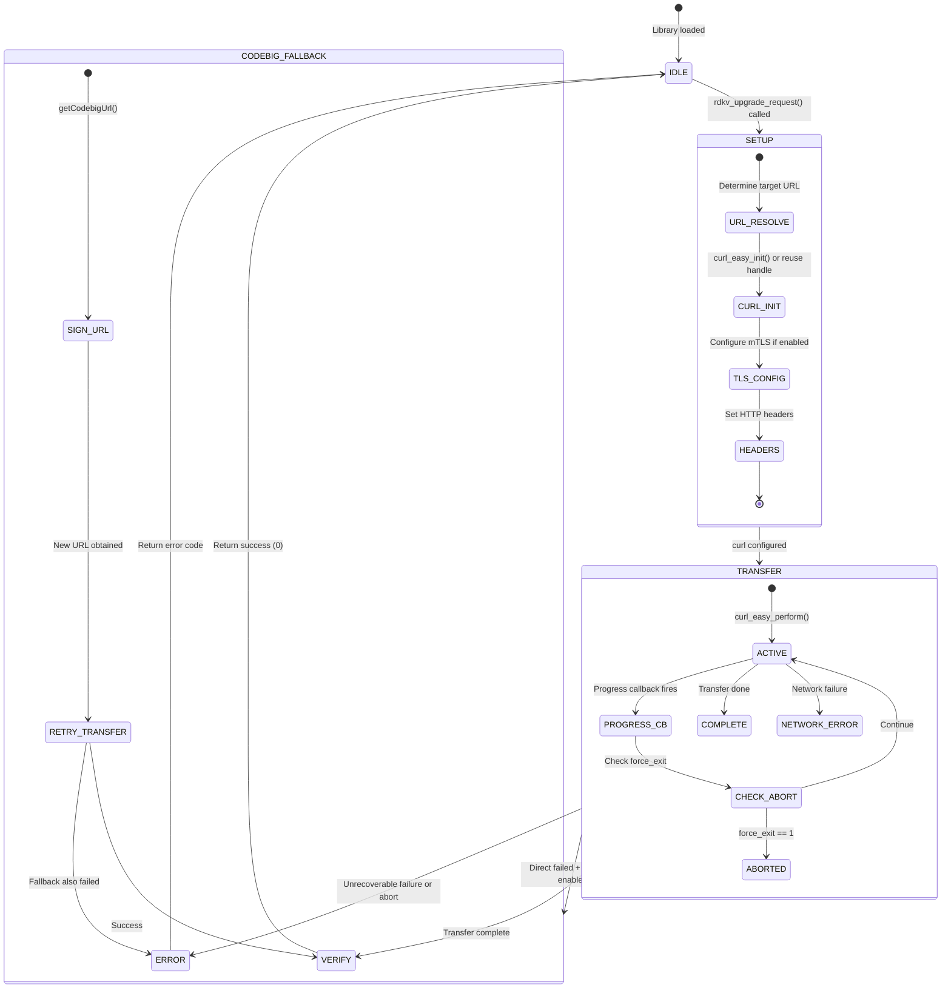
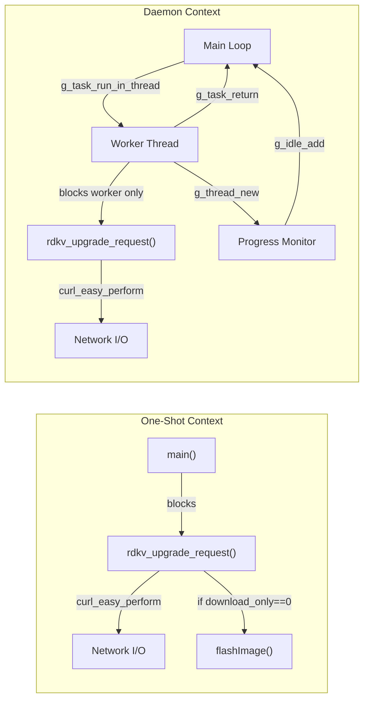
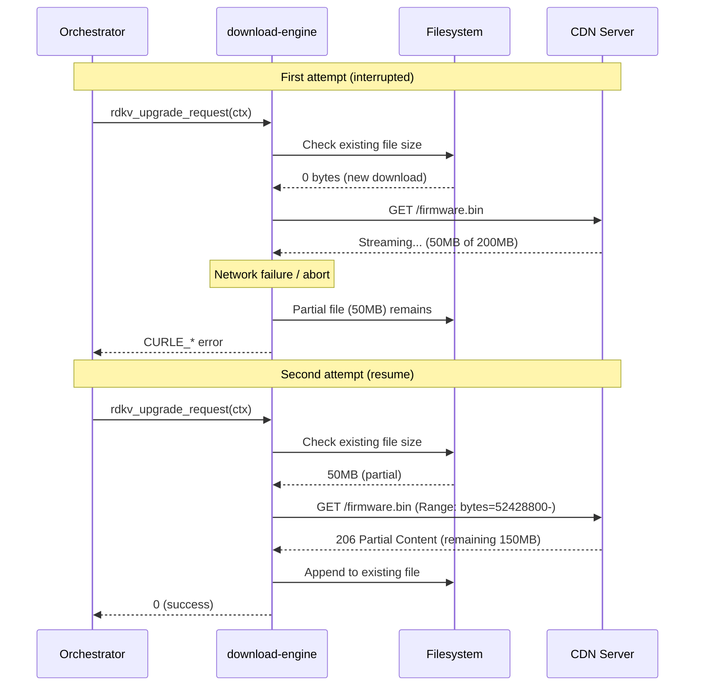

# Subsystem Specification: download-engine

> **Subsystem:** Firmware Download Engine (`librdksw_upgrade`)  
> **Type:** Core Runtime — Shared Infrastructure  
> **Scope:** Shared across both execution models  
> **Evidence Level:** Verified from `src/rdkv_upgrade.c`, `src/chunk.c`, `src/cedmInterface/`, `src/include/rdkv_upgrade.h`  
> **Cross-references:** [subsystems/subsystem-inventory.md §1](../../subsystems/subsystem-inventory.md), [diagrams/subsystem-architecture.md](../../diagrams/subsystem-architecture.md)

---

## 1. Purpose

The `download-engine` subsystem owns the blocking HTTP/HTTPS download lifecycle for all firmware artifact types. It encapsulates URL construction, curl-based download with throttling and resume, mTLS certificate authentication, Codebig endpoint fallback, chunk-based transfer, and progress reporting.

This is the foundational shared infrastructure that both execution models depend on for all network-based firmware retrieval operations, including XConf queries and firmware binary downloads.

---

## 2. What This Subsystem Owns

- HTTP/HTTPS session lifecycle (curl handle creation, configuration, execution, cleanup)
- Chunked/resumable download mechanism
- Download throttling (speed limiting, pause/unpause)
- mTLS certificate selection and configuration
- Codebig endpoint signing and fallback
- TLS error classification
- Download progress tracking and reporting
- PID file management during active downloads
- Error code generation and propagation

## 3. What This Subsystem Does NOT Own

- Decision of whether to download (owned by orchestrators)
- XConf response interpretation (owned by `firmware-validation`)
- Flash operations (owned by flash subsystem)
- D-Bus signal emission for progress (daemon-only, owned by `dbus-ipc`)
- Retry policy (caller decides)
- Download throttle decisions (IARM callback from external source)
- URL generation for XConf (owned by device identity subsystem)

---

## 4. Responsibilities

| Responsibility | Behavioral Contract |
|----------------|-------------------|
| Execute download | `rdkv_upgrade_request()` MUST perform a complete blocking HTTP transfer |
| Support multiple upgrade types | MUST handle XCONF_UPGRADE, PCI_UPGRADE, PDRI_UPGRADE, PERIPHERAL_UPGRADE |
| Chunk resume | MUST support resumable downloads using HTTP Range headers when partial file exists |
| Throttle response | MUST honor speed limit changes delivered via `doInteruptDwnl()` callback |
| mTLS authentication | MUST attempt mTLS when RFC setting enables it; fall back on failure |
| Codebig fallback | MUST attempt Codebig-signed URL when direct download fails (if enabled) |
| Progress reporting | MUST update curl progress file at regular intervals during download |
| Error propagation | MUST return curl error codes and HTTP status codes to caller |
| TLS error classification | MUST categorize TLS failures for telemetry reporting |
| Abort support | MUST respond to `force_exit` flag by aborting active transfer |

---

## 5. Exposed Interfaces / APIs

### Primary API

```c
/**
 * @brief Execute a firmware download/upload request
 * @param ctx       Populated upgrade context (URL, paths, type, options)
 * @param curl      Pointer to curl handle (may be reused across calls)
 * @param http_code Output: HTTP response code
 * @return 0 on success, curl error code on failure, RDKV_UPGRADE_ERROR_* on internal error
 */
int rdkv_upgrade_request(RdkUpgradeContext_t *ctx, void **curl, int *http_code);
```

### Context Structure

```c
typedef struct {
    char *url;              // Target URL (XConf or CDN)
    char *filepath;         // Local path for downloaded file
    int upgrade_type;       // XCONF_UPGRADE | PCI_UPGRADE | PDRI_UPGRADE | PERIPHERAL_UPGRADE
    int download_only;      // 1=download only, 0=download+flash (one-shot legacy)
    int retry_count;        // XConf query retry attempts
    char *server_url;       // XConf server URL
    char *json_payload;     // XConf POST body (for XCONF_UPGRADE)
    int proto;              // Protocol selection
    int maint_mode;         // Maintenance mode active
    int trigger_type;       // Trigger classification
    // ... additional fields for certificate paths, throttle settings
} RdkUpgradeContext_t;
```

### Error Codes

| Code | Constant | Meaning |
|------|----------|---------|
| 0 | Success | Transfer completed successfully |
| 1-99 | CURLE_* | Standard curl error codes |
| 100 | `RDKV_UPGRADE_ERROR_THROTTLE_ZERO` | Speed throttled to zero (abort) |
| 101 | `RDKV_UPGRADE_ERROR_INTERNAL` | Internal processing error |

### Supporting Functions

| Function | Purpose |
|----------|---------|
| `rdkv_upgrade_strerror(int error)` | Convert error code to human-readable string |
| `chunkDownload(...)` | Chunked download with resume support |
| `doInteruptDwnl(int speed)` | Set download speed limit (0=abort) |
| `savePID()` / `getPidStore()` | PID file management during download |

---

## 6. Runtime Lifecycle



---

## 7. Interaction Contracts

### 7.1 Callers (Who Invokes This Subsystem)

| Caller | Context | Threading |
|--------|---------|-----------|
| `rdkvfwupgrader` (one-shot) | Direct call from `main()` | Main thread (blocks entire process) |
| `rdkFwupdateMgr` (daemon) | Called from GTask worker thread | Worker thread (main loop free) |

### 7.2 Dependencies (What This Subsystem Calls)

| Target | Function | Purpose |
|--------|----------|---------|
| libcurl | `curl_easy_*()` | HTTP/HTTPS transfer engine |
| librdksw_fwutils | `getDeviceProperties()` | Device MAC for URL construction |
| librdksw_rfcIntf | RFC settings | mTLS flag, throttle speed, Codebig flag |
| CEDM (codebigUtils) | `getCodebigUrl()` | Codebig-signed URL generation |
| CEDM (mtlsUtils) | `getMtlsCertPath()` | mTLS certificate path resolution |
| libdwnlutil | Download utility functions | Platform download helpers |
| Filesystem | Progress file write | `/opt/curl_progress` for monitoring |

---

## 8. Shared-Library Dependencies

| Library | Linked At |
|---------|-----------|
| `libcurl` | Runtime (shared) |
| `libdwnlutil` | Runtime (shared) |
| `libsecure_wrapper` | Runtime (shared) |
| `libfwutils` | Runtime (shared, external) |
| `librdksw_fwutils` | Build-time (internal) |
| `librdksw_rfcIntf` | Build-time (internal) |

---

## 9. Execution-Model-Specific Behavior

### 9.1 Behavior Shared by Both Binaries

| Behavior | Contract |
|----------|----------|
| Blocking execution | `rdkv_upgrade_request()` blocks the calling thread until transfer completes |
| Curl error propagation | Same error codes returned regardless of caller |
| Chunk resume | Same resume-from-offset logic |
| mTLS fallback | Same fallback chain (mTLS → direct → Codebig) |
| Progress file writes | Same `/opt/curl_progress` file updated |
| `force_exit` check | Same abort mechanism via progress callback |
| Throttle speed enforcement | Same `CURLOPT_MAX_RECV_SPEED_LARGE` application |

### 9.2 One-Shot-Specific Behavior

| Behavior | Detail |
|----------|--------|
| Called from main thread | Blocks entire process; no other operations possible |
| `download_only == 0` | After download, may chain into `flashImage()` |
| Throttle-to-zero is fatal | Caller sets `force_exit=1` and exits process |
| Curl handle lifecycle | Created once, reused for XConf + download(s), destroyed at exit |
| Global curl pointer | `void *curl` global — single handle for process lifetime |

### 9.3 Daemon-Specific Behavior

| Behavior | Detail |
|----------|--------|
| Called from GTask worker | Blocks only worker thread; main loop remains responsive |
| `download_only == 1` | Download completes without chaining to flash |
| Throttle-to-zero is non-fatal | Worker reports error via GTask; daemon stays alive |
| Curl handle lifecycle | Created per-request in worker context, destroyed after completion |
| Progress monitoring | Daemon spawns dedicated GThread to poll progress file |
| Stop mechanism | `stop_flag` per-download context allows targeted abort |
| Multiple concurrent types | Possible to have different firmware types in different states |



---

## 10. Threading / Event-Loop Expectations

### Thread Safety Contract

| Aspect | Guarantee |
|--------|-----------|
| `rdkv_upgrade_request()` | Thread-safe to call from any single thread; NOT safe for concurrent calls sharing the same curl handle |
| `doInteruptDwnl()` | MAY be called from IARM callback thread while download is in progress |
| `force_exit` flag | Written by signal/callback thread, read by curl progress callback — must be atomic or volatile |
| `DwnlState` | Protected by `pthread_mutex_t mutuex_dwnl_state` — thread-safe across caller/callback threads |
| Progress file writes | Not mutex-protected; relies on single-writer assumption |

### Reentrance

- `rdkv_upgrade_request()` is NOT reentrant — must not be called concurrently with the same context
- The daemon ensures single-download-at-a-time via `IsDownloadInProgress` (main-loop-serialized)
- The one-shot ensures single-download by being single-threaded

---

## 11. Operational Invariants

| Invariant | Enforcement |
|-----------|-------------|
| At most one active curl transfer per curl handle | Caller responsibility (one-shot: single thread; daemon: single worker) |
| mTLS attempted before direct when RFC enabled | Code path ordering in `rdkv_upgrade_request()` |
| Codebig only on direct failure | Fallback chain coded sequentially |
| Progress file reflects active download | Written during curl progress callback |
| Downloaded file validated by size | Content-Length check against received bytes |
| Partial files indicate interrupted download | Used for chunk resume on next invocation |

---

## 12. Safety Guarantees

| Guarantee | Mechanism |
|-----------|-----------|
| No incomplete file treated as complete | Size validation against Content-Length |
| Abort doesn't corrupt state | `force_exit` causes curl_easy_cleanup(); partial file remains for resume |
| Certificate validation | curl VERIFYPEER + VERIFYHOST by default |
| No credential leakage | Certificate paths resolved at runtime; not logged |
| Throttle enforcement | Speed limit applied via curl option; immediate effect |

---

## 13. Failure Semantics

| Failure Mode | Return Value | State After |
|--------------|-------------|-------------|
| DNS resolution failure | CURLE_COULDNT_RESOLVE_HOST | Curl handle valid for reuse |
| Connection timeout | CURLE_OPERATION_TIMEDOUT | Curl handle valid for reuse |
| TLS handshake failure | CURLE_SSL_* | Attempted fallback; if all fail, return TLS error |
| HTTP 4xx/5xx | 0 (curl success) + `http_code` set | Caller checks HTTP code |
| Write error (disk full) | CURLE_WRITE_ERROR | Partial file on disk |
| Throttle to zero | RDKV_UPGRADE_ERROR_THROTTLE_ZERO | Download aborted, partial file may exist |
| `force_exit` abort | Curl error from interrupted transfer | Partial file exists for resume |
| Codebig signing failure | Falls through to error return | No download attempted via Codebig |
| mTLS certificate not found | Falls back to direct (non-mTLS) download | Continues without mTLS |

---

## 14. Retry / Recovery Behavior

**[VERIFIED]** The download engine does NOT retry internally. Retry semantics:

| Mechanism | Behavior |
|-----------|----------|
| No internal retry | `rdkv_upgrade_request()` fails once and returns; caller retries |
| Chunk resume support | On re-invocation, detects partial file and resumes from offset |
| XConf query retry | Handled by caller loop (up to `retry_count` attempts) |
| Codebig fallback | Single fallback attempt (not a retry of same path) |
| mTLS fallback | Single fallback to non-mTLS (not a retry) |

### Resume Protocol



---

## 15. Observability Expectations

| Observable | Mechanism | Consumer |
|------------|-----------|----------|
| Download progress (%) | `/opt/curl_progress` file | Progress monitor thread (daemon), external tools |
| Transfer speed | curl progress callback | T2 metrics |
| TLS error classification | Return value categorization | T2 telemetry |
| Download start/complete | T2 events | Cloud analytics |
| HTTP response code | Output parameter | Caller logic |
| Curl error code | Return value | Caller error handling |

---

## 16. External Dependencies

| Dependency | Nature | Failure Impact |
|------------|--------|----------------|
| libcurl | Runtime linkage | Fatal: no HTTP capability |
| CDN / HTTP server | Network | Cannot download firmware |
| XConf server | Network | Cannot check for updates |
| DNS resolver | Network | Cannot resolve hostnames |
| TLS certificates | Filesystem | mTLS authentication fails (non-fatal: falls back) |
| Codebig signing service | Network/stub | Codebig fallback unavailable (non-fatal) |
| `/opt/curl_progress` | Filesystem | Progress monitoring unavailable |

---

## 17. Assumptions and Unknowns

### Verified Assumptions

- [VERIFIED] All operations are blocking — caller must provide appropriate threading context
- [VERIFIED] Curl handle can be reused across multiple calls in one-shot mode
- [VERIFIED] Chunk resume uses HTTP Range header with byte offset from existing file size
- [VERIFIED] `force_exit` is checked in curl progress callback (called every few seconds by curl)
- [VERIFIED] mTLS and Codebig are RFC-controlled (can be disabled per-device)

### Inferred Behavior

- [INFERRED] Content-Length from HTTP response is used to validate complete download
- [INFERRED] Codebig URL signing is currently a stub (returns 1 = failure)
- [INFERRED] Progress callback frequency depends on curl's internal timing (~1 second intervals)

### Unresolved Unknowns

- [UNKNOWN] Maximum supported firmware image size
- [UNKNOWN] Exact throttle speed enforcement granularity (instantaneous vs average)
- [UNKNOWN] Whether partial file integrity is validated before resume (checksum?)
- [UNKNOWN] Timeout values for curl operations (connect timeout, transfer timeout)
- [UNKNOWN] Whether concurrent downloads of different types are ever attempted in daemon mode

---

## ADDED Requirements (from direct-cdn-parity-guards)

### Requirement: Codebig entry-point guard for Direct CDN mode
The `codebigdownloadFile()` function SHALL reject requests where `context->direct_cdn == true` by returning immediately before any Codebig signing or download logic executes. This provides defense-in-depth against `isDwnlBlock()` server_type flips that could redirect a Direct CDN download into the Codebig path.

#### Scenario: Direct CDN request blocked at Codebig entry point
- **WHEN** `codebigdownloadFile()` is called with `context->direct_cdn == true`
- **THEN** the function SHALL log an informational message and return -1 without performing any Codebig URL signing or download attempt

#### Scenario: Non-Direct-CDN request proceeds normally
- **WHEN** `codebigdownloadFile()` is called with `context->direct_cdn == false`
- **THEN** the function SHALL proceed with its existing Codebig signing and download logic unchanged

#### Scenario: isDwnlBlock flip does not bypass guard
- **WHEN** `isDwnlBlock()` flips `server_type` from `HTTP_SSR_DIRECT` to `HTTP_SSR_CODEBIG` AND `context->direct_cdn == true`
- **THEN** the resulting call to `codebigdownloadFile()` SHALL still be blocked by the entry-point guard

---

## ADDED Requirements (from direct-cdn-adoption)

### Requirement: Direct CDN download mode skips Codebig fallback
When the `direct_cdn` flag is set in `RdkUpgradeContext_t`, the download engine SHALL attempt only the direct URL download without the mTLS → direct → Codebig fallback chain.

#### Scenario: direct_cdn true bypasses Codebig
- **WHEN** `rdkv_upgrade_request()` is called with `context->direct_cdn == true`
- **THEN** the engine SHALL perform a single direct HTTPS download attempt using `context->artifactLocationUrl` without Codebig signing or fallback

#### Scenario: direct_cdn false preserves existing fallback
- **WHEN** `rdkv_upgrade_request()` is called with `context->direct_cdn == false`
- **THEN** the engine SHALL execute the existing fallback chain: mTLS → direct → Codebig (unchanged behavior)

### Requirement: RdkUpgradeContext_t includes direct_cdn field
The `RdkUpgradeContext_t` structure SHALL include a `bool direct_cdn` field. Callers that zero-initialize the struct SHALL get `false` (legacy behavior) by default.

#### Scenario: Zero-initialized context defaults to legacy
- **WHEN** a caller creates `RdkUpgradeContext_t ctx = {0}` without setting `direct_cdn`
- **THEN** `ctx.direct_cdn` SHALL be false, preserving the full fallback chain behavior
