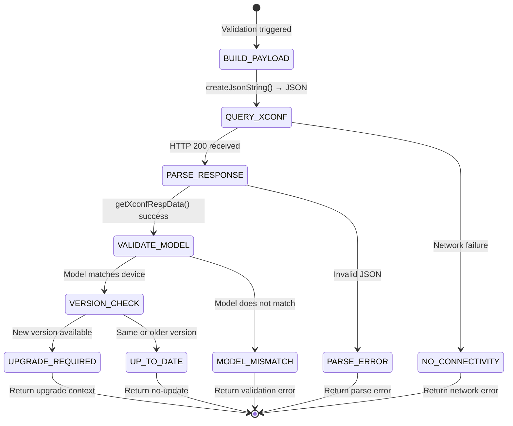
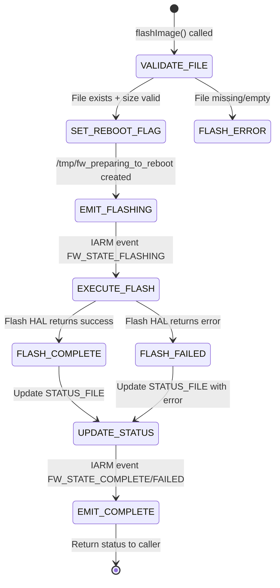

# Subsystem Specification: firmware-validation

> **Subsystem:** Firmware Validation & Update Decision  
> **Type:** Core Runtime — Shared Infrastructure  
> **Scope:** Shared across both execution models (divergent integration paths)  
> **Evidence Level:** Verified from `src/json_process.c`, `src/flash.c`, `src/download_status_helper.c`, `src/dbus/rdkFwupdateMgr_handlers.c`  
> **Cross-references:** [subsystems/subsystem-inventory.md §2, §5, §8](../../subsystems/subsystem-inventory.md), [runtime/firmware-update-flows.md](../../runtime/firmware-update-flows.md)

---

## 1. Purpose

The `firmware-validation` subsystem owns the determination of whether a firmware update is required, the validation of firmware response data against device identity, and the execution of flash operations. It encompasses:

- XConf request construction and response parsing
- Firmware version comparison and upgrade eligibility determination
- Flash execution and post-flash verification
- Update status tracking and persistence

This subsystem sits between the download-engine (which retrieves data) and the orchestrators (which decide sequencing). It provides the **decision logic** for firmware updates.

---

## 2. What This Subsystem Owns

- XConf payload construction from device identity
- XConf JSON response parsing into structured data (`XCONFRES`)
- Firmware version comparison (current vs available)
- Upgrade eligibility determination (model match, version difference)
- Flash image execution (`flashImage()`)
- Post-flash status reporting and reboot decision
- Download status file persistence (`/opt/fwdnldstatus.txt`)
- Daemon-specific: XConf response caching (memory + file)

## 3. What This Subsystem Does NOT Own

- HTTP transport (owned by `download-engine`)
- D-Bus method dispatch (owned by `dbus-ipc`)
- Retry decisions (owned by `retry-recovery`)
- Process lifecycle (owned by `updater-execution` / `daemon-runtime`)
- Download throttling and speed control (owned by `download-engine`)

---

## 4. Responsibilities

| Responsibility | Behavioral Contract |
|----------------|-------------------|
| XConf payload construction | MUST build valid JSON containing: model, MAC, firmware version, partner ID, account ID |
| XConf response parsing | MUST extract: firmware URL, filename, version, reboot flag, upgrade type from JSON response |
| Version comparison | MUST compare current firmware name against XConf-reported available version |
| Model validation | MUST verify XConf response targets the correct device model |
| Flash execution | MUST invoke platform flash mechanism with correct firmware path and type |
| Flash state events | MUST emit IARM state events during flash lifecycle (FLASHING → COMPLETE/FAILED) |
| Status file maintenance | MUST update `/opt/fwdnldstatus.txt` at each stage of the update lifecycle |
| Reboot flag management | MUST set reboot preparation indicators before flash for crash recovery |
| Cache management (daemon) | MUST cache XConf responses for deduplication of concurrent check requests |
| Cache invalidation (daemon) | MUST invalidate cache when cached firmware has been downloaded |

---

## 5. Exposed Interfaces / APIs

### XConf Payload Construction

```c
/**
 * @brief Build XConf POST request payload from device identity
 * @return JSON string (caller-freed) or NULL on error
 */
char* createJsonString(void);
```

### XConf Response Parsing

```c
/**
 * @brief Parse raw XConf JSON response into XCONFRES structure
 * @param response_data   Raw HTTP response body
 * @param response_len    Length of response data
 * @param xconf_response  Output structure to populate
 * @return 0 on success, error code on parse failure
 */
int getXconfRespData(const char *response_data, int response_len, XCONFRES *xconf_response);

/**
 * @brief Validate parsed XConf response against device identity
 * @param xconf_response  Parsed response
 * @return 0 = valid upgrade, non-zero = skip (no update/model mismatch)
 */
int processJsonResponse(XCONFRES *xconf_response);
```

### Flash Execution

```c
/**
 * @brief Flash firmware image to device
 * @param server_url    Origin server URL (for status reporting)
 * @param upgrade_file  Local path to firmware image
 * @param reboot_flag   Whether to set reboot indicators
 * @param proto         Protocol used for download
 * @param upgrade_type  PCI/PDRI/PERIPHERAL
 * @param maint         Maintenance mode active
 * @param trigger_type  Trigger classification
 * @return 0 on success, non-zero on failure
 */
int flashImage(const char *server_url, const char *upgrade_file, 
               int reboot_flag, int proto, int upgrade_type, 
               int maint, int trigger_type);
```

### Download Status Tracking

```c
/**
 * @brief Persist firmware download status to STATUS_FILE
 * @param status  Status string to write
 * @param url     Download URL (for context)
 * @param file    Firmware filename
 */
void updateFWDownloadStatus(const char *status, const char *url, const char *file);

/**
 * @brief Notify RFC subsystem of download status change
 * @param status  Status code
 */
void notifyDwnlStatus(int status);
```

### XCONFRES Data Structure

```c
typedef struct {
    char firmwareDownloadProtocol[64];   // "http" or "https"
    char firmwareFilename[256];          // Image filename
    char firmwareLocation[512];          // Base download URL
    char firmwareVersion[128];           // Target firmware version string
    int  rebootImmediately;             // 1 = reboot after flash
    int  upgradeDelay;                   // Delay before download (seconds)
    char ipv6FirmwareLocation[512];     // IPv6 alternate URL
    // ... PDRI fields, peripheral firmware list
} XCONFRES;
```

---

## 6. Runtime Lifecycle

### 6.1 XConf Validation Flow



### 6.2 Flash Lifecycle



---

## 7. Interaction Contracts

### 7.1 Inbound (Who Calls This Subsystem)

| Caller | Function Called | Context |
|--------|----------------|---------|
| One-shot orchestrator | `createJsonString()`, `processJsonResponse()`, `flashImage()` | Main thread, synchronous |
| Daemon XConf handler | `createJsonString()`, `getXconfRespData()` | GTask worker thread |
| Daemon flash handler | `flashImage()` | GTask worker thread |
| Download engine | `updateFWDownloadStatus()` | Calling thread (worker or main) |

### 7.2 Outbound (What This Subsystem Calls)

| Target | Function | Purpose |
|--------|----------|---------|
| Device Identity (librdksw_fwutils) | `getDeviceProperties()`, `GetModelNum()` | Device info for XConf payload |
| IARM Events (librdksw_iarmIntf) | `eventManager()` | Flash state transitions |
| RFC (librdksw_rfcIntf) | `write_RFCProperty()` | Status notification to RFC |
| Filesystem | File read/write | STATUS_FILE, reboot flag file |
| Flash HAL (external) | Platform-specific flash invocation | Actual flash I/O |
| Telemetry (T2) | `flashT2CountNotify()` | Flash metrics |

---

## 8. Shared-Library Dependencies

| Library | Components Used |
|---------|----------------|
| `librdksw_jsonparse.so` | `createJsonString()`, `processJsonResponse()`, `getXconfRespData()` |
| `librdksw_flash.so` | `flashImage()`, `updateFWDownloadStatus()` |
| `librdksw_fwutils.so` | Device properties for payload construction |
| `librdksw_iarmIntf.so` | Flash state event broadcasting |
| `librdksw_rfcIntf.so` | RFC status notifications |
| `libcjson` (external) | JSON construction and parsing |
| `libparsejson` (external) | JSON field extraction |

---

## 9. Execution-Model-Specific Behavior

### 9.1 Behavior Shared by Both Binaries

| Behavior | Contract |
|----------|----------|
| XConf payload construction | Same `createJsonString()` function, same device identity source |
| JSON parsing | Same `getXconfRespData()` logic |
| Version comparison | Same `processJsonResponse()` / `checkForValidPCIUpgrade()` logic |
| Flash execution | Same `flashImage()` function |
| Status file writes | Same `updateFWDownloadStatus()` function |
| IARM flash events | Same event names and payloads |

### 9.2 One-Shot-Specific Behavior

| Behavior | Detail |
|----------|--------|
| XConf query function | `MakeXconfComms()` in `rdkv_main.c` — direct, no caching |
| Flash chaining | Automatic after download when `download_only == 0` |
| Multi-firmware validation | Checks PCI, then PDRI, then Peripheral sequentially |
| Response lifetime | XCONFRES lives for process duration (global struct) |
| No cache | Every invocation queries XConf fresh |

### 9.3 Daemon-Specific Behavior

| Behavior | Detail |
|----------|--------|
| XConf query function | `rdkFwupdateMgr_checkForUpdate()` in handlers — with caching |
| Cache strategy | Memory cache (`g_cached_xconf_data`) + file cache |
| Cache protection | `G_LOCK` macro for thread-safe access |
| Flash decoupled | Flash only when client explicitly calls `UpdateFirmware` |
| Response lifetime | Cached until invalidated (download completed or TTL) |
| Concurrent deduplication | Piggyback queue prevents redundant XConf queries |

```mermaid
flowchart TD
    subgraph "One-Shot Path"
        OS1["MakeXconfComms()"] --> OS2["createJsonString()"]
        OS2 --> OS3["rdkv_upgrade_request(XCONF)"]
        OS3 --> OS4["getXconfRespData()"]
        OS4 --> OS5["processJsonResponse()"]
        OS5 --> OS6["flashImage() if download_only==0"]
    end
    
    subgraph "Daemon Path"
        D1["rdkFwupdateMgr_checkForUpdate()"] --> D2["Check cache"]
        D2 -->|"miss"| D3["createJsonString()"]
        D3 --> D4["rdkv_upgrade_request(XCONF)"]
        D4 --> D5["getXconfRespData()"]
        D5 --> D6["save_xconf_to_cache()"]
        D6 --> D7["Return to client via signal"]
        D2 -->|"hit"| D7
        
        D8["Client calls UpdateFirmware"] --> D9["flashImage()"]
    end
```



---

## 10. Threading / Event-Loop Expectations

| Operation | One-Shot Thread Context | Daemon Thread Context |
|-----------|------------------------|----------------------|
| `createJsonString()` | Main thread | GTask XConf worker |
| `getXconfRespData()` | Main thread | GTask XConf worker |
| `processJsonResponse()` | Main thread | GTask XConf worker |
| `flashImage()` | Main thread | GTask flash worker |
| `updateFWDownloadStatus()` | Main thread | Any worker thread |
| Cache read/write | N/A | XConf worker (G_LOCK protected) |

### Thread Safety

- `createJsonString()`: Reads `device_info` global — safe if initialized before call
- `getXconfRespData()`: Pure function on input data — thread-safe
- `flashImage()`: Reads globals, writes STATUS_FILE — safe with single-flash invariant
- `updateFWDownloadStatus()`: Writes file — safe with single-writer assumption
- Cache functions: Protected by `G_LOCK(xconf_cache)` — thread-safe

---

## 11. Operational Invariants

| Invariant | Enforcement |
|-----------|-------------|
| XConf payload requires device identity | `createJsonString()` reads `device_info` populated by `initialize()` |
| Flash requires valid firmware file | `flashImage()` validates file existence and size > 0 |
| At most one flash at a time | Daemon: `IsFlashInProgress` guard; One-shot: single-threaded |
| Status file reflects current state | Updated at download start, progress, complete, and flash stages |
| Reboot flag set before flash | `/tmp/fw_preparing_to_reboot` created before flash HAL invocation |
| Cache coherence (daemon) | Cache invalidated after firmware is downloaded |

---

## 12. Safety Guarantees

| Guarantee | Mechanism |
|-----------|-----------|
| No flash without valid firmware | File existence + size validation before flash |
| Crash recovery indication | `/tmp/fw_preparing_to_reboot` persists across crashes |
| No model-mismatched flash | `processJsonResponse()` validates model in XConf response |
| No downgrade (by default) | Version comparison rejects same-or-older firmware |
| Status persistence | STATUS_FILE written synchronously — survives power loss |
| Reboot coordination | `rebootImmediately` flag from XConf controls post-flash behavior |

---

## 13. Failure Semantics

| Failure Mode | Behavior | Impact |
|--------------|----------|--------|
| XConf network failure | Return network error to caller | No firmware decision made |
| XConf parse error | Return parse error | Invalid response discarded |
| Model mismatch | Return validation error | Firmware skipped (safe) |
| Version comparison: no update | Return "up to date" | No download triggered |
| Flash file missing | Return error before flash attempt | No flash executed |
| Flash HAL failure | Return non-zero, emit IARM failure event | Firmware not applied; device on current version |
| STATUS_FILE write failure | Logged but non-fatal | External monitoring degraded |
| Cache corruption (daemon) | Fallback to fresh XConf query | Self-healing behavior |

---

## 14. Retry / Recovery Behavior

| Scenario | Behavior |
|----------|----------|
| XConf query failure | Caller retries (not this subsystem's responsibility) |
| Flash failure | Caller decides retry policy; firmware file remains on disk |
| Partial STATUS_FILE | Overwritten on next status update |
| Stale cache (daemon) | Invalidated on download completion; fresh query on next check |
| `fw_preparing_to_reboot` after crash | Next startup detects and reports DWNL_COMPLETED |

---

## 15. Observability Expectations

| Observable | Mechanism | Consumer |
|------------|-----------|----------|
| Update available/not | XConf response parsing result | Orchestrators |
| Flash progress | IARM state events | System event bus |
| Download/flash status | STATUS_FILE (`/opt/fwdnldstatus.txt`) | External monitoring |
| Firmware version comparison | T2 metrics | Cloud telemetry |
| Cache hit/miss (daemon) | Internal logging | Debugging |
| Reboot pending | `/tmp/fw_preparing_to_reboot` existence | Crash recovery logic |

---

## 16. External Dependencies

| Dependency | Nature | Failure Impact |
|------------|--------|----------------|
| XConf cloud server | Network (response data) | Cannot validate update availability |
| Device property files | Filesystem | Cannot construct XConf payload |
| Flash HAL (platform) | Platform-specific | Cannot apply firmware |
| libcjson | Runtime linkage | Cannot parse/construct JSON |
| IARM Bus | IPC | Flash state events not broadcast (non-fatal) |

---

## 17. Assumptions and Unknowns

### Verified Assumptions

- [VERIFIED] `XCONFRES` structure is the canonical parsed XConf response format
- [VERIFIED] `processJsonResponse()` compares firmware filename, not version semantically
- [VERIFIED] Flash is invoked via same `flashImage()` regardless of execution model
- [VERIFIED] Daemon caches XConf response in both memory and file
- [VERIFIED] `disableStatsUpdate` flag suppresses STATUS_FILE writes for PDRI/Peripheral

### Inferred Behavior

- [INFERRED] XConf server returns HTTP 200 with empty/null firmware fields when no update exists
- [INFERRED] Cache TTL is implicit (invalidated by download, not by time)
- [INFERRED] `rebootImmediately` from XConf is advisory; flash subsystem sets flag but may not reboot

### Unresolved Unknowns

- [UNKNOWN] Exact XConf JSON schema (request and response) — field-level documentation
- [UNKNOWN] Whether firmware version comparison is string-equality or semantic versioning
- [UNKNOWN] Flash HAL interface specification (platform-specific abstraction)
- [UNKNOWN] Cache file location and format for daemon XConf cache
- [UNKNOWN] Whether XConf can return multiple firmware types in a single response or requires separate queries
