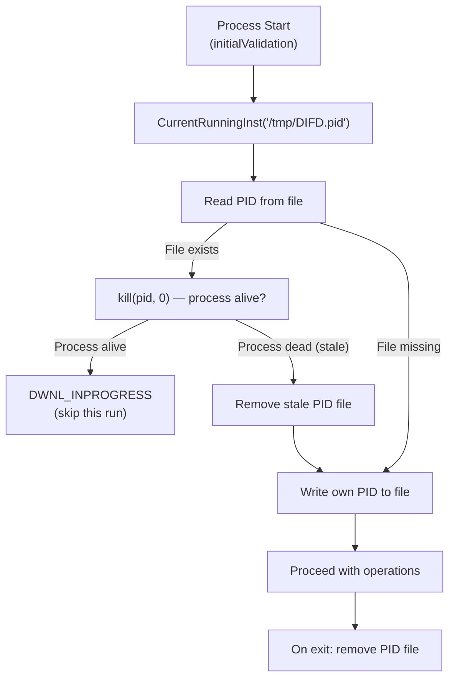
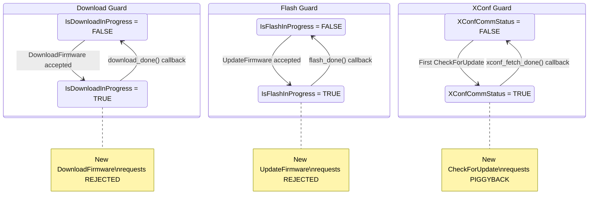
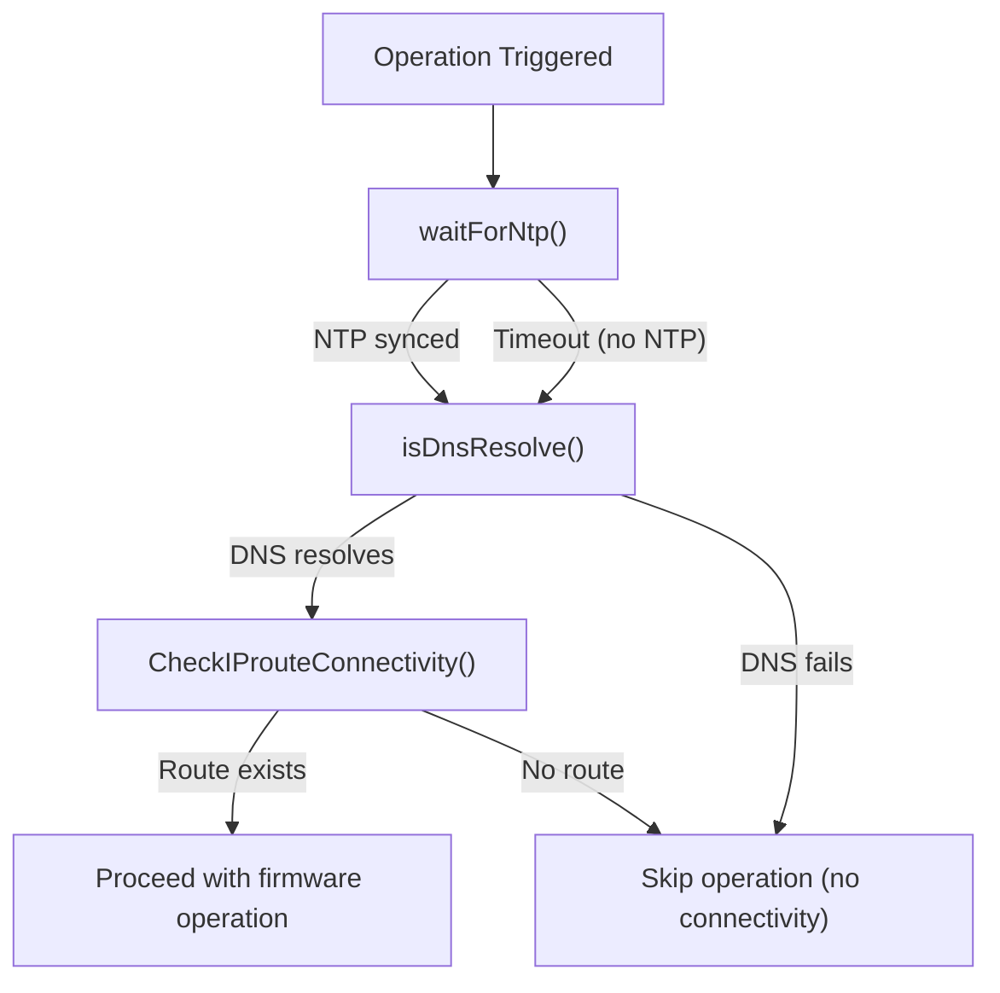
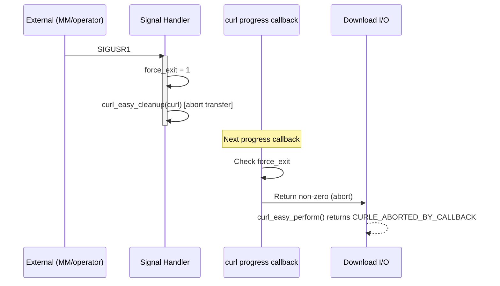

# Subsystem Specification: operational-safety

> **Subsystem:** Operational Safety & Concurrency Control  
> **Type:** Cross-Cutting Operational Concern  
> **Scope:** Shared guards + daemon-specific concurrency control  
> **Evidence Level:** Verified from `src/device_status_helper.c`, `src/dbus/xconf_comm_status.c`, `src/dbus/rdkv_dbus_server.c`, `src/rdkv_main.c`, `src/rdkFwupdateMgr.c`  
> **Cross-references:** [subsystems/subsystem-inventory.md §16, §17](../../subsystems/subsystem-inventory.md), [runtime/daemon-threading-model.md](../../runtime/daemon-threading-model.md)

---

## 1. Purpose

The `operational-safety` subsystem defines the behavioral contracts for all mechanisms that prevent unsafe concurrent execution, protect shared state, enforce single-operation invariants, and ensure system stability during firmware operations.

This encompasses:
- Process-level single-instance enforcement (shared)
- Daemon concurrency guards (daemon-specific)
- Thread synchronization primitives (daemon-specific)
- Pre-operation validation gates (shared)
- Safe abort mechanisms (shared)

---

## 2. What This Subsystem Owns

- PID file lifecycle and single-instance enforcement
- Process existence validation (`CurrentRunningInst()`)
- Upgrade flag file management
- Daemon concurrency guards (`IsDownloadInProgress`, `IsFlashInProgress`, `XConfCommStatus`)
- Mutex-protected state access (`DwnlState`, `app_mode`)
- Main-loop serialization guarantees (daemon)
- Pre-operation connectivity and readiness checks
- Signal-based abort mechanism (`SIGUSR1` → `force_exit`)
- NTP synchronization wait
- DNS resolution verification

## 3. What This Subsystem Does NOT Own

- Retry decisions (owned by `retry-recovery`)
- D-Bus method validation (owned by `dbus-ipc`)
- Download abort execution (owned by `download-engine`)
- Flash safety verification (owned by `firmware-validation`)
- Process lifecycle management (owned by orchestrators)
- IARM event semantics (owned by IARM subsystem)

---

## 4. Responsibilities

| Responsibility | Behavioral Contract |
|----------------|-------------------|
| Single-instance enforcement | MUST prevent concurrent execution of firmware update processes |
| PID file management | MUST create PID file at operation start, remove at operation end |
| Upgrade flag management | MUST set flag during download, clear on completion |
| Daemon concurrency guards | MUST reject concurrent Download or Flash requests |
| XConf deduplication | MUST coalesce concurrent XConf requests (daemon piggyback) |
| State mutex protection | MUST protect cross-thread state with appropriate primitives |
| Main-loop serialization | MUST ensure daemon-only state accessed only on main thread |
| Pre-operation validation | MUST verify NTP sync, DNS resolution, and network before operations |
| Abort mechanism | MUST provide graceful abort via signal that doesn't corrupt state |
| Build exclusion | MUST exclude non-production devices when RFC auto-exclusion is set |

---

## 5. Safety Mechanisms

### 5.1 Process-Level Single-Instance (Shared)



**Implementation Details:**

| Property | Value |
|----------|-------|
| PID file path | `/tmp/DIFD.pid` |
| Check function | `CurrentRunningInst(const char *path)` |
| Validation method | `kill(pid, 0)` — checks if process exists |
| Stale detection | Process not running → PID file is stale |
| Cleanup guarantee | `uninitialize()` removes PID file on all exit paths |

**Behavioral Contract:**
- MUST check PID file BEFORE any firmware operations
- MUST validate PID file content against running processes
- MUST treat stale PID file as removable (process crashed)
- MUST create PID file before starting operations
- MUST remove PID file on all exit paths (normal and error)

### 5.2 Upgrade Flag File (Shared)

| Property | Value |
|----------|-------|
| Flag file | `/tmp/.imageDnldInProgress` (or `HTTP_CDL_FLAG`) |
| Created by | Orchestrator before download starts |
| Removed by | Orchestrator after download completes or fails |
| Purpose | External visibility that download is active |

**Behavioral Contract:**
- MUST be set before download operation begins
- MUST be cleared on download completion (success or failure)
- External tools MAY check this file to determine if download is active
- `isUpgradeInProgress()` reads this flag to prevent re-entry

### 5.3 Daemon Concurrency Guards (Daemon-Specific)



#### Guard Comparison

| Guard | Scope | Protection Mechanism | Rejection Behavior | Reset Trigger |
|-------|-------|---------------------|-------------------|---------------|
| `IsDownloadInProgress` | One download at a time | Main-loop serialization | Method returns rejection | `download_done()` on main thread |
| `IsFlashInProgress` | One flash at a time | Main-loop serialization | Method returns rejection | `flash_done()` on main thread |
| `XConfCommStatus` | One XConf fetch at a time | `GMutex` (cross-thread) | Piggyback (not rejection) | `xconf_fetch_done()` on main thread |

### 5.4 Thread Synchronization Primitives (Daemon-Specific)

| Primitive | Protects | Threads Involved | Type |
|-----------|----------|-----------------|------|
| `GMutex` (xconf_comm_status) | `XConfCommStatus` boolean | Main thread + Worker thread | GLib mutex |
| `G_LOCK(xconf_cache)` | `g_cached_xconf_data` | Main thread + XConf worker | GLib lock macro |
| `pthread_mutex_t mutuex_dwnl_state` | `DwnlState` global | Any thread writing download state | POSIX mutex |
| `pthread_mutex_t app_mode_status` | `app_mode` global | Main thread + IARM callback | POSIX mutex |
| `GMutex` (per-download stop_flag) | Download stop flag | Download worker + Progress monitor | GLib mutex |
| Main-loop serialization | `registered_processes`, `active_tasks`, `waiting_*`, `IsDownload/FlashInProgress` | Main thread only (guaranteed) | GLib main loop scheduling |

### 5.5 Pre-Operation Validation Gates (Shared)



**Validation Functions:**

| Function | Purpose | Blocking? | Timeout |
|----------|---------|-----------|---------|
| `waitForNtp()` | Wait for NTP time synchronization | Yes | [UNKNOWN] |
| `isDnsResolve()` | Verify DNS resolution capability | Yes | Short |
| `CheckIProuteConnectivity()` | Verify IP route to CDN | Yes | Short |
| `CurrentRunningInst()` | Check for another running instance | Yes (file I/O) | None |
| `isUpgradeInProgress()` | Check upgrade flag file | Yes (file I/O) | None |
| `GetBuildType()` + RFC exclusion | Verify production eligibility | Yes (file I/O) | None |

### 5.6 Signal-Based Abort (Shared)



**Behavioral Contract:**
- Signal handler MUST only set flags and cleanup curl (reentrant-safe operations)
- Signal handler MUST NOT allocate heap memory or call non-async-signal-safe functions
- `force_exit` flag MUST be checked by curl progress callback
- Abort MUST NOT corrupt downloaded data (partial file remains valid for resume)

---

## 6. Execution-Model-Specific Behavior

### 6.1 Behavior Shared by Both Binaries

| Mechanism | Shared Contract |
|-----------|----------------|
| PID file check | Same `CurrentRunningInst()` function, same file path |
| Upgrade flag management | Same `isUpgradeInProgress()` / `updateUpgradeFlag()` |
| NTP/DNS/Route validation | Same functions from `device_status_helper.c` |
| SIGUSR1 handling | Same signal → `force_exit` mechanism |
| Build exclusion | Same RFC auto-exclusion check |
| `DwnlState` mutex | Same pthread_mutex protecting download state |
| `app_mode` mutex | Same pthread_mutex protecting app mode |

### 6.2 One-Shot-Specific Safety

| Mechanism | One-Shot Behavior |
|-----------|-------------------|
| Concurrency prevention | PID file is the ONLY guard (single-threaded; no daemon guards needed) |
| Abort response | `force_exit` → curl abort → `uninitialize()` → `exit()` |
| Throttle-to-zero | Treated as abort signal → sets `force_exit` → exit |
| No concurrent operations | Single-threaded guarantee makes daemon guards unnecessary |
| Exit on all conflicts | If PID conflict detected → exit(0); if upgrade in progress → exit(1) |

### 6.3 Daemon-Specific Safety

| Mechanism | Daemon Behavior |
|-----------|-----------------|
| Concurrency guards | `IsDownloadInProgress`, `IsFlashInProgress`, `XConfCommStatus` |
| Piggyback deduplication | Concurrent CheckForUpdate requests share one worker |
| Main-loop serialization | State access serialized by GLib main loop scheduling |
| Multi-client isolation | Each client has independent handler_id; operations tracked per-task |
| Error → continue | Guards reset on failure; daemon stays alive |
| Worker abort | `stop_flag` per-download allows targeted abort without daemon impact |
| No exit on operation failure | Daemon NEVER exits due to operation errors |

---

## 7. Threading / Event-Loop Expectations

### One-Shot Threading Model

```
Single Thread:
    main() → initialize() → validate() → download() → flash() → exit()
    
    Only concurrent access:
    - SIGUSR1 handler (sets force_exit)
    - IARM callback (DwnlStopEventHandler — delivered on IARM internal thread)
    
    Mutex usage:
    - mutuex_dwnl_state: protects DwnlState (signal handler / IARM vs main)
    - app_mode_status: protects app_mode (IARM callback vs main)
```

### Daemon Threading Model

```
Main Thread (GLib Main Loop):
    - D-Bus dispatch (process_app_request)
    - Guard checks/sets (IsDownload/FlashInProgress)
    - Task context management
    - Signal emission (g_idle_add callbacks)
    - GTask completion callbacks

Worker Threads (GTask Pool):
    - XConf HTTP request (blocks 5-60s)
    - Firmware download (blocks minutes)
    - Flash I/O (blocks seconds)
    - Access shared state ONLY via mutex or g_idle_add

Progress Monitor (Dedicated GThread):
    - Polls /opt/curl_progress every 100ms
    - Emits progress via g_idle_add (main loop)
    - Stopped via atomic stop_flag

Thread Safety Rule:
    If data is accessed by worker AND main thread → MUST use mutex or g_idle_add
    If data is accessed ONLY by main thread → main-loop serialization suffices
```

---

## 8. Interaction Contracts

### 8.1 Inbound (What Triggers Safety Checks)

| Source | Trigger | Safety Response |
|--------|---------|-----------------|
| Process startup | `initialValidation()` | PID check, upgrade flag check, build exclusion |
| D-Bus method call (daemon) | `process_app_request()` | Guard check, registration validation |
| SIGUSR1 signal | Signal handler | Set `force_exit`, abort curl |
| IARM throttle callback | `DwnlStopEventHandler()` | Set download speed (0 = abort) |
| systemd stop | SIGTERM | Orderly shutdown |

### 8.2 Outbound (Safety Subsystem Effects)

| Target | Effect | Mechanism |
|--------|--------|-----------|
| Download engine | Abort via `force_exit` | Curl progress callback checks flag |
| D-Bus clients | Operation rejection | Method returns non-zero status |
| Filesystem | PID file, upgrade flag | File create/remove |
| Process | Exit (one-shot on conflict) | `exit(0)` or `exit(1)` |
| IARM Bus | State events on conflict detection | `eventManager()` |

---

## 9. Operational Invariants

| Invariant | Enforcement | Scope |
|-----------|-------------|-------|
| At most one firmware update process per device | PID file + `CurrentRunningInst()` | Both |
| At most one download at a time (daemon) | `IsDownloadInProgress` guard | Daemon |
| At most one flash at a time (daemon) | `IsFlashInProgress` guard | Daemon |
| At most one XConf fetch at a time (daemon) | `XConfCommStatus` mutex-protected guard | Daemon |
| Signal handler is reentrant-safe | Only sets flag + calls curl_easy_cleanup | Both |
| PID file cleaned on all exit paths | `uninitialize()` always called | Both |
| Mutexes initialized before use | Initialization in `initialize()` / `init_task_system()` | Both |
| Mutexes destroyed on shutdown | Destruction in `uninitialize()` / `cleanup_dbus()` | Both |
| Worker threads never touch main-loop state directly | `g_idle_add` for all worker→main communication | Daemon |
| Guards reset on operation completion/failure | Completion callbacks always reset guards | Daemon |

---

## 10. Safety Guarantees

| Guarantee | Mechanism |
|-----------|-----------|
| No concurrent firmware flashing | PID file (cross-binary) + IsFlashInProgress (daemon) |
| No concurrent firmware downloading | PID file (cross-binary) + IsDownloadInProgress (daemon) |
| Graceful abort without state corruption | force_exit + curl cleanup leaves partial file intact |
| No deadlocks in daemon | Main-loop serialization avoids lock ordering issues; only GMutex for cross-thread |
| No main-loop blocking | All I/O in worker threads; main thread only dispatches/emits |
| Orderly shutdown | cleanup_dbus() → uninitialize() → exit() sequence |
| No stale lock on crash | File-based locks (PID) validated against live processes |

---

## 11. Failure Semantics

| Failure Mode | Safety Behavior | Impact |
|--------------|----------------|--------|
| PID file write fails | Cannot enforce single-instance | Potential concurrent execution (degraded safety) |
| Mutex initialization fails | Undefined behavior if contended | Process should exit during init |
| Guard stuck TRUE (daemon) | Operations permanently blocked | Daemon must be restarted |
| SIGUSR1 during non-download | force_exit set but no effect until next download | Benign in non-download state |
| Stale PID file (crashed process) | Detected by `kill(pid, 0)` failure → file removed | Self-healing on next invocation |
| Main loop blocked (shouldn't happen) | D-Bus unresponsive; clients timeout | Daemon appears hung |

---

## 12. Retry / Recovery for Safety Mechanisms

| Scenario | Recovery |
|----------|----------|
| Guard stuck (daemon bug) | Daemon restart via systemd clears all in-memory guards |
| Stale PID file | Next invocation detects stale file and removes it |
| Orphaned upgrade flag | Next successful operation clears it |
| Mutex deadlock | Daemon restart (systemd watchdog could detect) |
| Abort during critical section | force_exit + curl cleanup designed to be interrupt-safe |

---

## 13. Observability Expectations

| Observable | Mechanism | Consumer |
|------------|-----------|----------|
| Instance conflict detected | Logging + IARM event | System logs, MM |
| Guard state (daemon) | Internal logging | Daemon debug logs |
| SIGUSR1 received | Logging | System logs |
| Throttle callback received | Logging | System logs |
| Pre-operation validation results | Logging + T2 metrics | Cloud telemetry |
| PID file existence | Filesystem | External monitoring, operators |
| Upgrade flag existence | Filesystem | External monitoring |

---

## 14. External Dependencies

| Dependency | Nature | Safety Impact |
|------------|--------|---------------|
| Filesystem (tmpfs /tmp/) | PID file, flags | Single-instance enforcement depends on this |
| POSIX signals | SIGUSR1 delivery | Abort mechanism depends on signal delivery |
| pthreads | Mutex primitives | Thread safety depends on correct mutex behavior |
| GLib | GMutex, main loop serialization | Daemon concurrency depends on GLib guarantees |
| IARM Bus (internal thread) | Callback delivery | IARM callback arrives on unexpected thread |
| NTP service | Time synchronization | Pre-operation gate may block indefinitely |

---

## 15. Assumptions and Unknowns

### Verified Assumptions

- [VERIFIED] PID file at `/tmp/DIFD.pid` is used for cross-binary instance detection
- [VERIFIED] `kill(pid, 0)` validates whether PID from file is still alive
- [VERIFIED] Daemon concurrency guards are booleans checked on main loop thread
- [VERIFIED] `XConfCommStatus` is the only guard using GMutex (cross-thread access)
- [VERIFIED] `force_exit` is set by signal handler and read by curl progress callback
- [VERIFIED] Daemon never exits on operation failure — guards reset and continue

### Inferred Behavior

- [INFERRED] PID file on tmpfs (/tmp/) is cleared on system reboot — no stale files after reboot
- [INFERRED] `waitForNtp()` has a bounded timeout (doesn't block indefinitely)
- [INFERRED] Guard-stuck condition requires daemon restart (no self-healing mechanism)
- [INFERRED] IARM `DwnlStopEventHandler` can arrive during any operation phase

### Unresolved Unknowns

- [UNKNOWN] `waitForNtp()` timeout duration — could potentially block startup indefinitely
- [UNKNOWN] Whether daemon implements a watchdog mechanism for systemd
- [UNKNOWN] Whether `IsDownloadInProgress` guard accounts for download worker thread crash
- [UNKNOWN] Maximum time a guard can remain TRUE before external intervention is needed
- [UNKNOWN] Whether concurrent `rdkvfwupgrader` and `rdkFwupdateMgr` execution is prevented
- [UNKNOWN] D-Bus activation policy — can D-Bus auto-start the daemon?
- [UNKNOWN] Whether IARM callback thread priority can cause priority inversion with main thread
