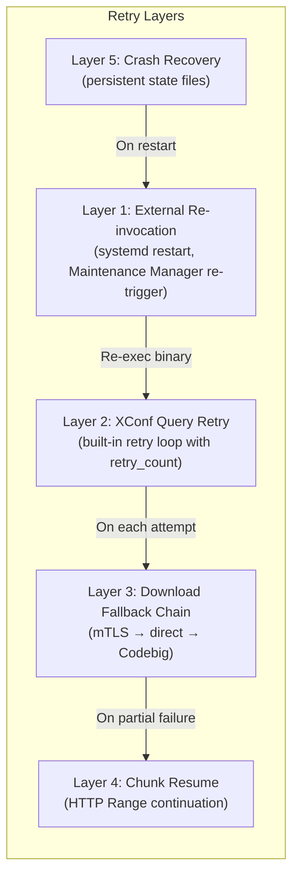
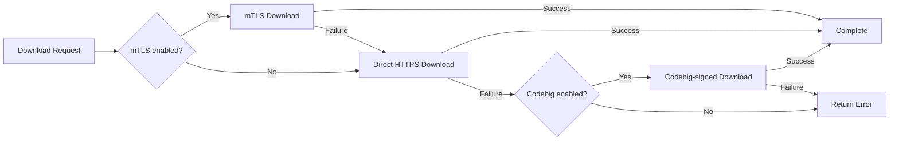
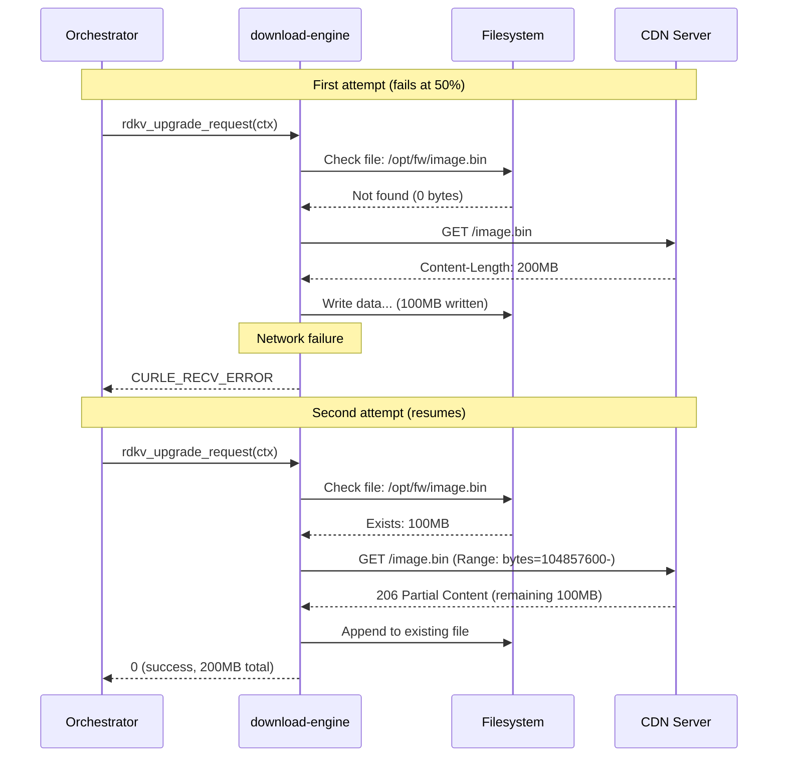
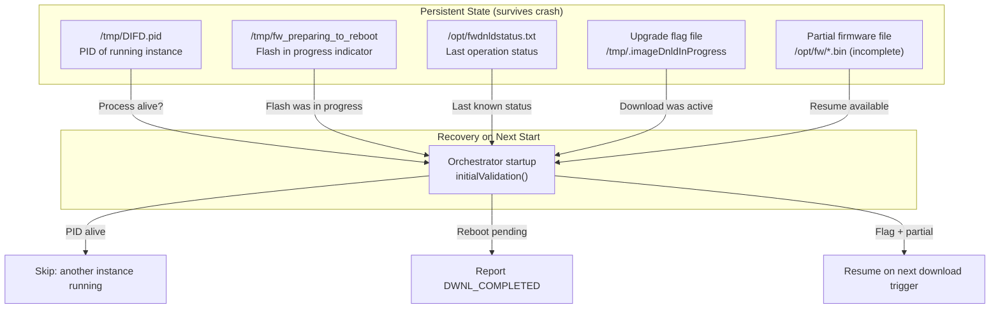

# Subsystem Specification: retry-recovery

> **Subsystem:** Retry & Recovery Behavior  
> **Type:** Cross-Cutting Operational Concern  
> **Scope:** Shared across both execution models (with model-specific manifestation)  
> **Evidence Level:** Verified from `src/rdkv_main.c`, `src/rdkv_upgrade.c`, `src/chunk.c`, `src/flash.c`, `src/device_status_helper.c`, `src/dbus/rdkv_dbus_server.c`  
> **Cross-references:** [subsystems/subsystem-map.md §3](../../subsystems/subsystem-map.md), [runtime/rdkvfwupgrader-sequence.md §4](../../runtime/rdkvfwupgrader-sequence.md)

---

## 1. Purpose

The `retry-recovery` subsystem defines the behavioral contracts for retry logic, crash recovery, resume capability, and failure mitigation across the firmware update platform. This is a cross-cutting concern that manifests differently in each execution model and across multiple subsystems.

This specification documents WHERE retry/recovery decisions are made, WHO owns them, and WHAT guarantees are provided — as opposed to individual subsystem failure semantics (which document what happens on error at a component level).

---

## 2. What This Subsystem Owns

- XConf query retry policy (built-in retry loop)
- Chunk-based download resume mechanism
- Crash recovery detection and handling
- Download abort and re-invocation semantics
- Status file persistence for external recovery monitoring
- State Red recovery path (boot-time recovery mode)

## 3. What This Subsystem Does NOT Own

- Individual error detection (owned by each subsystem)
- Process re-invocation (owned by external caller: systemd, Maintenance Manager)
- D-Bus service restart (owned by systemd)
- Network reconnection (owned by libcurl)
- Flash corruption repair (out of scope — platform-specific)

---

## 4. Retry Architecture Overview

---

## 5. Retry Mechanisms

### 5.1 XConf Query Retry (Layer 2)

**Owner:** One-shot orchestrator (inline) / Daemon handler (per-request)

| Property | One-Shot | Daemon |
|----------|----------|--------|
| Retry count | `argv[1]` (typically 3) | Per-request parameter |
| Retry location | Loop in `MakeXconfComms()` | Worker re-attempt logic |
| Backoff strategy | [UNKNOWN] Fixed or exponential | [UNKNOWN] |
| Failure after retries | Exit with error code | Signal error to clients |
| State between retries | Same curl handle, same payload | Fresh context per attempt |

**Behavioral Contract:**
- MUST retry up to `retry_count` times on transient XConf failures
- MUST NOT retry on permanent failures (e.g., invalid device identity)
- SHOULD implement backoff between retry attempts
- [UNKNOWN] Whether HTTP 4xx/5xx codes are treated as retryable

### 5.2 Download Fallback Chain (Layer 3)

**Owner:** `download-engine` (`rdkv_upgrade_request()`)

**Behavioral Contract:**
- This is a FALLBACK chain, NOT a retry of the same path
- Each step uses a different authentication/routing mechanism
- Order is fixed: mTLS → direct → Codebig
- Each step is attempted exactly ONCE
- Failure propagates to caller after all fallbacks exhausted

### 5.3 Chunk Resume (Layer 4)

**Owner:** `download-engine` (`chunkDownload()` in `src/chunk.c`)

**Behavioral Contract:**
- On re-invocation, MUST detect existing partial file at download path
- MUST determine file size of partial download
- MUST issue HTTP GET with `Range: bytes=<offset>-` header
- MUST append received data to existing file (not overwrite)
- MUST validate total received size against Content-Length
- Does NOT validate integrity of existing partial data (no checksum)

### 5.4 Crash Recovery (Layer 5)

**Owner:** Orchestrators (`device_status_helper.c`, `rdkv_main.c`, `rdkFwupdateMgr.c`)

#### Recovery Indicators

| File | Created By | Detected By | Meaning |
|------|-----------|-------------|---------|
| `/tmp/fw_preparing_to_reboot` | Flash subsystem (before flash) | Orchestrator on startup | Flash was in progress; likely succeeded |
| `/tmp/DIFD.pid` | Orchestrator (during operation) | Orchestrator on startup | Previous instance was running |
| `/opt/fwdnldstatus.txt` | Download/flash subsystems | External monitoring | Last known operation status |
| Upgrade flag file | Orchestrator (during download) | Orchestrator on startup | Download was in progress |

#### Recovery Decision Matrix

| Indicator Found | One-Shot Behavior | Daemon Behavior |
|-----------------|-------------------|-----------------|
| `fw_preparing_to_reboot` | Report DWNL_COMPLETED, remove file, exit(0) | Report DWNL_COMPLETED, remove file, enter STATE_IDLE |
| PID file (stale) | If process dead: remove, continue. If alive: exit(0) | Same detection; daemon transitions to STATE_IDLE regardless |
| Upgrade flag file | Skip download (already in progress externally) | Enter STATE_IDLE; await client requests |
| Partial firmware file | Resume download (if re-triggered) | Available for chunk resume when client requests download |

### 5.5 External Re-invocation (Layer 1)

**Owner:** External to this repository (Maintenance Manager, systemd)

**Behavioral Contract (External — INFERRED):**
- Maintenance Manager re-invokes `rdkvfwupgrader` on scheduled intervals
- systemd restarts `rdkFwupdateMgr` on crash (`Restart=on-failure`)
- Re-invocation inherits clean state (new process, new initialization)
- Chunk resume provides continuity across re-invocations

---

## 6. Execution-Model-Specific Behavior

### 6.1 One-Shot Retry Characteristics

| Aspect | Behavior |
|--------|----------|
| XConf retry | Built-in loop (up to retry_count) |
| Download retry | NOT built-in; binary must be re-invoked |
| Flash retry | NOT built-in; binary must be re-invoked |
| Abort → retry | SIGUSR1 aborts; external re-invocation needed |
| Throttle-zero → retry | Process exits; external re-invocation needed |
| Resume on re-invocation | Chunk resume detects partial file automatically |
| Crash recovery | Next invocation detects indicators and adjusts behavior |

### 6.2 Daemon Retry Characteristics

| Aspect | Behavior |
|--------|----------|
| XConf retry | Worker-level; client can re-invoke CheckForUpdate |
| Download retry | Client can re-invoke DownloadFirmware after error signal |
| Flash retry | Client can re-invoke UpdateFirmware after error signal |
| Abort → retry | Download aborted → guard reset → client can retry immediately |
| Throttle-zero → retry | Download error signaled → client can retry |
| Resume on re-download | Chunk resume available if partial file exists |
| Daemon crash recovery | systemd restarts; clients must re-register |

### 6.3 Comparison Table

| Recovery Scenario | One-Shot | Daemon |
|-------------------|----------|--------|
| Network failure during XConf | Retry loop (built-in) | Error signal; client retries |
| Network failure during download | Exit; external re-invocation + chunk resume | Error signal; client re-invokes + chunk resume |
| Throttle to zero | Exit; external re-invocation | Error signal; client re-invokes |
| SIGUSR1 abort | Exit; external re-invocation | Download aborted; daemon stays alive |
| Process crash | systemd/MM re-invokes; crash recovery detects | systemd restarts; clients re-register |
| Flash failure | Exit; external re-invocation | Error signal; client re-invokes |
| Daemon crash (not applicable to one-shot) | N/A | systemd restarts; all state lost |

---

## 7. State Persistence for Recovery

---

## 8. Operational Invariants

| Invariant | Enforcement |
|-----------|-------------|
| Retry count bounds XConf attempts | Loop counter compared against `retry_count` argument |
| Fallback chain is ordered | Code path sequences mTLS → direct → Codebig |
| Chunk resume requires partial file | Existence + non-zero size check before Range header |
| Crash indicators are file-based | Persists across process crash/restart |
| Only one recovery path taken per start | Decision tree in `initialValidation()` is exclusive |
| Partial file integrity not validated | Resume appends without verifying existing bytes |

---

## 9. Safety Guarantees

| Guarantee | Mechanism |
|-----------|-----------|
| No infinite retry loops | `retry_count` bounds XConf retries; other layers are single-attempt |
| No data corruption from resume | Append-only write; Content-Length validation at end |
| Crash state detected on restart | Persistent indicator files in `/tmp/` and `/opt/` |
| No duplicate flash on crash recovery | `fw_preparing_to_reboot` means flash already happened |
| Graceful degradation on fallback failure | Each fallback returns error; caller receives final error |

---

## 10. Failure Semantics (This Subsystem)

| Failure Mode | Impact | Recovery Available |
|--------------|--------|-------------------|
| All XConf retries exhausted | No update determination possible | External re-invocation |
| All fallback paths fail | Download impossible | External re-invocation (may succeed if transient) |
| Partial file corrupted | Resume appends to bad data; final size check may catch | Delete partial file + fresh download |
| Crash indicator stale (process died without cleanup) | Next instance may make wrong recovery decision | PID file validation (check if process alive) |
| STATUS_FILE corrupted | External monitoring has wrong state | Overwritten on next operation |

---

## 11. Observability Expectations

| Observable | Mechanism | Purpose |
|------------|-----------|---------|
| XConf retry count | T2 metrics / logging | Detect servers with poor connectivity |
| Fallback path taken | T2 metrics (mTLS/direct/Codebig) | Detect certificate issues |
| Resume occurred | Logging (file size at start > 0) | Track resumption frequency |
| Crash recovery triggered | Logging + IARM event | Detect instability |
| Final failure after retries | Exit code (one-shot) / error signal (daemon) | Alert monitoring systems |

---

## 12. External Dependencies

| Dependency | Nature | Recovery Impact |
|------------|--------|----------------|
| Filesystem (tmpfs for /tmp/) | Crash indicators | tmpfs survives process crash but not reboot |
| Filesystem (/opt/) | Partial downloads, status file | Persistent across reboot |
| CDN server | HTTP Range support | Resume requires server to support 206 Partial Content |
| Maintenance Manager | Re-invocation trigger | One-shot retry depends on external re-trigger |
| systemd | Daemon restart | Daemon restart is automatic on crash |

---

## 13. Threading / Event-Loop Expectations

| Operation | One-Shot Thread | Daemon Thread |
|-----------|----------------|---------------|
| XConf retry loop | Main thread (blocking) | XConf GTask worker |
| Fallback chain | Main thread (blocking) | Download GTask worker |
| Chunk resume | Main thread (blocking) | Download GTask worker |
| Crash recovery check | Main thread (during init) | Main thread (during init) |
| STATUS_FILE writes | Main thread | Worker thread (any) |

---

## 14. Assumptions and Unknowns

### Verified Assumptions

- [VERIFIED] XConf retry is bounded by `retry_count` from argv[1]
- [VERIFIED] Chunk resume uses HTTP Range header with byte offset
- [VERIFIED] `/tmp/fw_preparing_to_reboot` is the primary flash-in-progress indicator
- [VERIFIED] PID file at `/tmp/DIFD.pid` is used for instance detection
- [VERIFIED] Fallback chain order: mTLS → direct → Codebig (each once)
- [VERIFIED] Download engine does NOT retry internally (single attempt per path)

### Inferred Behavior

- [INFERRED] CDN servers support HTTP 206 Partial Content for Range requests
- [INFERRED] Maintenance Manager re-invokes on failure (external retry)
- [INFERRED] Partial file remains valid across reboots (stored in /opt/, not tmpfs)
- [INFERRED] XConf retry includes some backoff delay between attempts
- [INFERRED] systemd `Restart=on-failure` provides daemon recovery

### Unresolved Unknowns

- [UNKNOWN] Exact backoff strategy for XConf retries (fixed? exponential? jitter?)
- [UNKNOWN] Whether partial file integrity is ever validated (checksum, signature)
- [UNKNOWN] Maximum age of partial file before it's considered stale
- [UNKNOWN] Whether Content-Length mismatch triggers file deletion and fresh download
- [UNKNOWN] Maintenance Manager retry interval and maximum attempts
- [UNKNOWN] Whether client-sdk provides any timeout/retry assistance to applications
- [UNKNOWN] Behavior when CDN doesn't support Range (returns 200 instead of 206)

---

## ADDED Requirements (from direct-cdn-parity-guards)

### Requirement: HTTP 403 classified as retryable for Direct CDN per-artifact downloads
The per-artifact download error classification SHALL treat HTTP 403 as a transient retryable error (`DIRECT_CDN_RETRY_ERR`) when operating in Direct CDN per-artifact mode. This enables the `DirectCDNDownload()` retry loop to re-query XConf for fresh token-bearing URLs.

#### Scenario: HTTP 403 triggers retry with XConf re-query
- **WHEN** a per-artifact download receives HTTP 403 response
- **THEN** `checkTriggerUpgrade()` SHALL return `DIRECT_CDN_RETRY_ERR`
- **AND** the `DirectCDNDownload()` orchestrator SHALL re-query XConf on the next iteration to obtain fresh per-artifact URLs

#### Scenario: HTTP 403 respects maximum retry count
- **WHEN** per-artifact downloads receive HTTP 403 on all retry iterations
- **THEN** the orchestrator SHALL fail permanently after 3 total iterations (existing retry cap)

#### Scenario: HTTP 404 remains permanent failure (unchanged)
- **WHEN** a per-artifact download receives HTTP 404 response
- **THEN** `checkTriggerUpgrade()` SHALL return -1 (permanent failure, non-retryable)

---

## ADDED Requirements (from direct-cdn-adoption)

### Requirement: Direct CDN per-artifact selective retry
The Direct CDN orchestrator SHALL implement a per-artifact retry mechanism: only artifacts that failed with a transient error are re-attempted on subsequent iterations.

#### Scenario: Successful artifact not re-attempted
- **WHEN** PCI download succeeds on iteration 1 but PDRI fails with a transient error
- **THEN** on iteration 2 the orchestrator SHALL skip PCI and only re-attempt PDRI

#### Scenario: Maximum 3 retry iterations
- **WHEN** an artifact fails with a transient error on all iterations
- **THEN** the orchestrator SHALL attempt at most 3 total iterations before declaring failure

#### Scenario: Both PCI and PDRI succeed stops retry loop
- **WHEN** both PCI and PDRI downloads succeed within a retry iteration
- **THEN** the orchestrator SHALL exit the retry loop immediately regardless of peripheral status

### Requirement: Transient vs permanent failure classification
The per-artifact download mode SHALL classify errors as transient (retryable) or permanent (non-retryable) based on the curl error code.

#### Scenario: Connection timeout is transient
- **WHEN** `rdkv_upgrade_request()` returns `CURLE_OPERATION_TIMEDOUT`
- **THEN** the per-artifact caller SHALL return `DIRECT_CDN_RETRY_ERR` (retryable)

#### Scenario: Connection refused is transient
- **WHEN** `rdkv_upgrade_request()` returns `CURLE_COULDNT_CONNECT`
- **THEN** the per-artifact caller SHALL return `DIRECT_CDN_RETRY_ERR` (retryable)

#### Scenario: Receive error is transient
- **WHEN** `rdkv_upgrade_request()` returns `CURLE_RECV_ERROR`
- **THEN** the per-artifact caller SHALL return `DIRECT_CDN_RETRY_ERR` (retryable)

#### Scenario: HTTP 404 is permanent
- **WHEN** the HTTP response code is 404
- **THEN** the per-artifact caller SHALL return -1 (non-retryable, permanent failure)

### Requirement: XConf re-query per retry iteration
The Direct CDN orchestrator SHALL perform a fresh XConf query on each retry iteration to obtain current per-artifact URLs.

#### Scenario: Fresh XConf data per iteration
- **WHEN** the retry loop begins a new iteration
- **THEN** it SHALL call `rdkv_upgrade_request()` with `XCONF_UPGRADE` type and re-parse the response before attempting per-artifact downloads

### Requirement: Peripheral failure does not block overall success
Peripheral download failure SHALL NOT prevent the overall `DirectCDNDownload()` from reporting success, provided PCI and PDRI both succeeded.

#### Scenario: PCI+PDRI success with peripheral failure
- **WHEN** PCI and PDRI downloads succeed but peripheral download fails
- **THEN** `DirectCDNDownload()` SHALL return 0 (success)

#### Scenario: Peripheral retried within loop but non-blocking
- **WHEN** peripheral download fails on one iteration
- **THEN** it SHALL be re-attempted on subsequent iterations but SHALL NOT contribute to the retry-gate condition
