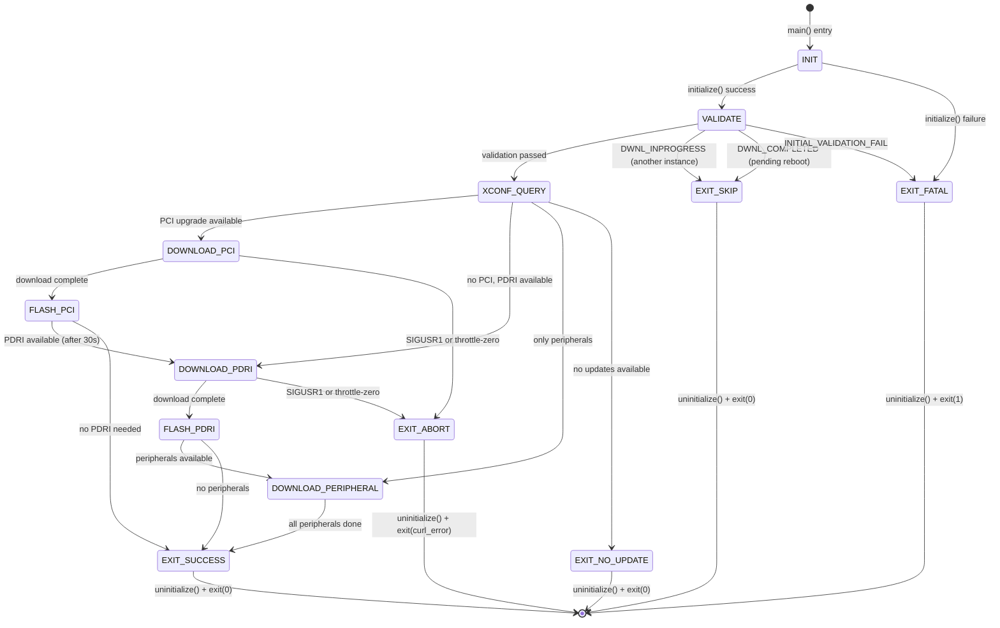
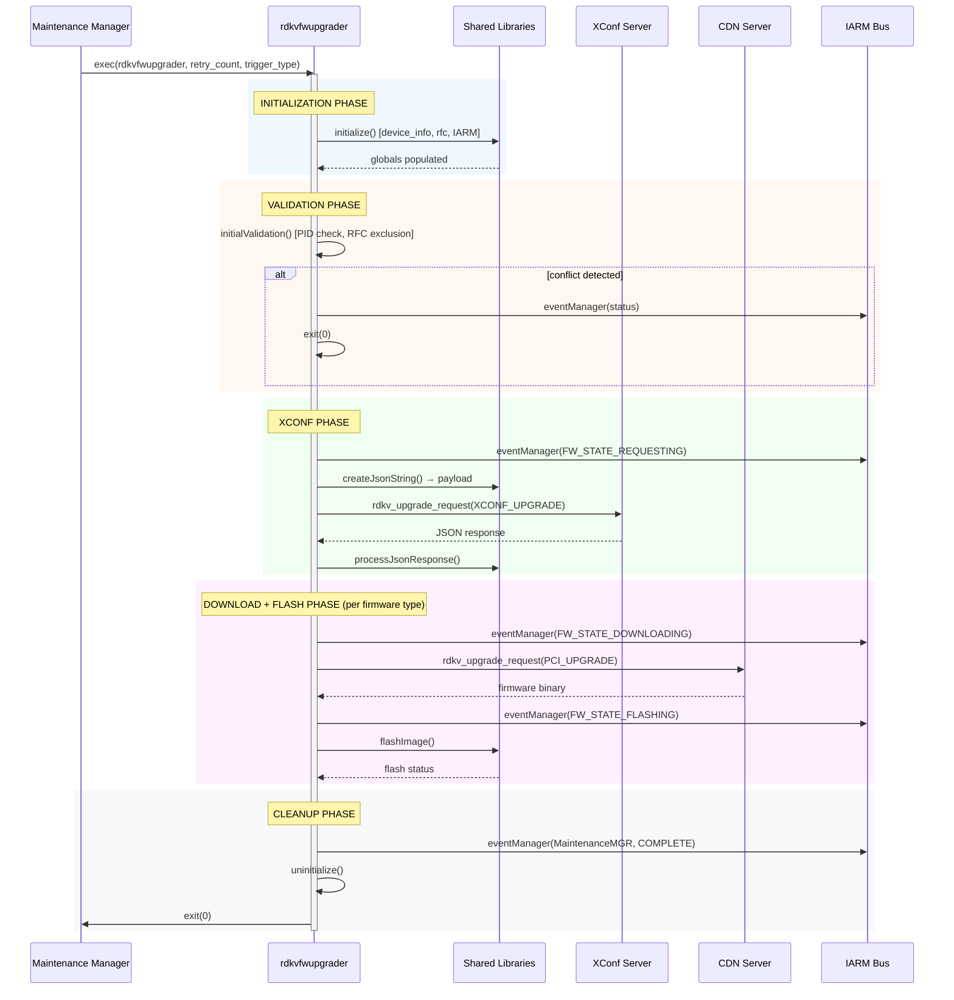

# Subsystem Specification: updater-execution

> **Subsystem:** One-Shot Firmware Update Execution Model (`rdkvfwupgrader`)  
> **Type:** Core Runtime — Execution Model Orchestrator  
> **Scope:** One-shot-specific (binary: `rdkvfwupgrader`)  
> **Evidence Level:** Verified from `src/rdkv_main.c`, `Makefile.am`  
> **Cross-references:** [runtime/rdkvfwupgrader-sequence.md](../../runtime/rdkvfwupgrader-sequence.md), [subsystems/subsystem-inventory.md §10](../../subsystems/subsystem-inventory.md)

---

## 1. Purpose

The `updater-execution` subsystem defines the behavioral contract for the one-shot firmware update execution model. It orchestrates the complete firmware update lifecycle as a single linear, start-to-exit pipeline: initialization → validation → XConf query → download → flash → cleanup → exit.

This subsystem is the authoritative entry point for the maintenance-manager-driven firmware update workflow. It owns process lifecycle, global state initialization, and the sequencing of shared subsystem calls.

---

## 2. What This Subsystem Owns

- Process lifecycle from `main()` entry to `exit()`
- Argument parsing and trigger-type classification
- Global state variable initialization (`device_info`, `rfc_list`, `curl`, `force_exit`)
- Multi-firmware sequencing (PCI → PDRI → Peripheral)
- Signal handling (`SIGUSR1` → graceful abort)
- Exit code semantics
- Maintenance Manager integration (mode query, status reporting)
- PID file lifecycle for single-instance enforcement

## 3. What This Subsystem Does NOT Own

- HTTP download mechanics (owned by `download-engine`)
- Flash I/O operations (owned by `firmware-validation` post-download)
- D-Bus service (daemon-only)
- Client API surface (daemon ecosystem)
- Concurrency control beyond PID-file single-instance guard
- Retry policy (caller decides whether to re-invoke the binary)

---

## 4. Responsibilities

| Responsibility | Behavioral Contract |
|----------------|-------------------|
| Process initialization | MUST initialize logging, signal handlers, device identity, RFC settings, and IARM before any firmware operations |
| Argument validation | MUST reject invocations with fewer than 3 arguments (exit code 1) |
| Trigger type classification | MUST support trigger types: 2 (scheduled), 3 (TR-69/SNMP), 4 (application) |
| Instance exclusion | MUST check PID file; if another instance is running, report DWNL_INPROGRESS and exit cleanly |
| XConf query | MUST construct device identity payload and execute blocking HTTP POST to XConf server |
| Multi-firmware sequencing | MUST process PCI first, then PDRI (with 30s delay after PCI), then all Peripheral images |
| Signal handling | MUST intercept SIGUSR1, set `force_exit=1`, and abort active curl transfer |
| Exit code propagation | MUST exit with curl error code on download failure, 0 on success, 1 on initialization failure |
| Cleanup guarantee | MUST call `uninitialize()` on all exit paths (normal and error) |
| IARM state events | MUST emit firmware state transitions (REQUESTING → DOWNLOADING → FLASHING → COMPLETE) |

---

## 5. Runtime Lifecycle



---

## 6. Interaction Contracts

### 6.1 Inbound Interactions

| Source | Mechanism | Contract |
|--------|-----------|----------|
| Maintenance Manager | `fork+exec` with arguments `<retry_count> <trigger_type>` | Binary MUST accept exactly these positional args |
| Maintenance Manager | IARM `DwnlStopEventHandler` callback | Callback MUST set download speed to 0 (abort) or throttle value |
| External signal | `SIGUSR1` | MUST gracefully abort current download and exit |

### 6.2 Outbound Interactions

| Target | Mechanism | Contract |
|--------|-----------|----------|
| XConf Server | HTTP POST via `download-engine` | Blocking; caller waits for response |
| CDN / HTTP | HTTP GET via `download-engine` | Blocking; may take minutes |
| Flash HAL | `flashImage()` via `librdksw_flash` | Blocking; returns status |
| IARM Bus | `eventManager()` via `librdksw_iarmIntf` | Fire-and-forget event broadcast |
| Thunder JSON-RPC | `getJsonRpc()` to `localhost:9998` | Blocking HTTP POST (50-200ms) |
| Filesystem | PID file, status file, upgrade flag | Direct file I/O |
| Telemetry (T2) | `t2CountNotify()` | Fire-and-forget metric increment |

---

## 7. Exposed Interfaces / APIs

This subsystem exposes no programmatic API. It is a standalone binary entry point.

### Exit Code Contract

| Exit Code | Meaning |
|-----------|---------|
| `0` | Success, or no update needed, or graceful skip |
| `1` | Initialization failure, invalid arguments |
| `curl_error_code` | Download failure (propagates curl error) |

### Argument Contract

```
rdkvfwupgrader <retry_count> <trigger_type>
```

| Arg | Type | Required | Semantics |
|-----|------|----------|-----------|
| `retry_count` | integer | Yes | Number of XConf query retries before failure |
| `trigger_type` | integer | Yes | 2=scheduled, 3=TR-69/SNMP, 4=application |

---

## 8. Shared-Library Dependencies

| Library | Usage |
|---------|-------|
| `librdksw_upgrade.so` | `rdkv_upgrade_request()` — HTTP download engine |
| `librdksw_jsonparse.so` | `createJsonString()`, `processJsonResponse()` — XConf payload |
| `librdksw_flash.so` | `flashImage()` — firmware flashing |
| `librdksw_rfcIntf.so` | `getRFCSettings()` — RFC configuration |
| `librdksw_iarmIntf.so` | `eventManager()`, `init_event_handler()` — IARM events |
| `librdksw_fwutils.so` | `getDeviceProperties()`, `getImageDetails()` — device identity |

---

## 9. Execution-Model-Specific Behavior

### 9.1 rdkvfwupgrader (This Subsystem)

| Behavior | Detail |
|----------|--------|
| Threading model | Single-threaded; all operations block main thread |
| XConf query | Direct `MakeXconfComms()` — no caching, no deduplication |
| Download → Flash | Chained when `download_only == 0` (default in one-shot) |
| Multiple firmware types | Sequential pipeline: PCI → sleep(30) → PDRI → Peripherals |
| Abort mechanism | `SIGUSR1` sets `force_exit`, `curl_easy_cleanup()` aborts transfer |
| Exit behavior | Always exits; never loops or waits for events |
| State Red recovery | Detects boot-time recovery state, emits RED_RECOVERY events |
| Throttle-to-zero | Treated as fatal abort (sets `force_exit`, exits) |

### 9.2 rdkFwupdateMgr Contrast

| Aspect | One-Shot | Daemon |
|--------|----------|--------|
| Lifecycle | Start → exit | Indefinite (systemd-managed) |
| Threading | Single thread | GLib main loop + GTask pool |
| Download mode | `download_only=0` (auto-flash) | `download_only=1` (decouple) |
| XConf | Direct, blocking, no cache | Cached, async worker, piggyback |
| Failure response | Exit with error code | Log error, continue serving |
| Multi-firmware | Built-in PCI→PDRI→Peripheral | Client initiates each individually |
| Throttle-to-zero | Exit | Abort download, signal error, stay alive |

---

## 10. Threading / Event-Loop Expectations

**[VERIFIED]** `rdkvfwupgrader` is strictly single-threaded:

- No GLib main loop
- No worker threads
- No async callbacks (except IARM `DwnlStopEventHandler` delivered on IARM's internal thread)
- Signal handler (`SIGUSR1`) is the only concurrency primitive
- All shared library calls are made synchronously from `main()`

### Thread Safety Implications

- Shared libraries MUST NOT assume multi-threaded context when called from one-shot
- Global state (`device_info`, `rfc_list`, `curl`) is written once during `initialize()` and read thereafter
- `force_exit` is written by signal handler (atomic write assumed) and read by curl progress callback
- `DwnlState` mutex exists but is effectively uncontested in single-threaded mode

---

## 11. Operational Invariants

| Invariant | Enforcement |
|-----------|-------------|
| At most one `rdkvfwupgrader` instance per device | PID file check (`CurrentRunningInst("/tmp/DIFD.pid")`) |
| Initialize before operate | `initialize()` MUST complete before any firmware operation |
| Cleanup on all paths | `uninitialize()` MUST be called before `exit()` — verified on all 8+ exit paths |
| Download before flash | `flashImage()` MUST NOT be called without a successful download |
| PCI before PDRI | PDRI download MUST NOT occur without PCI completion or PCI being unnecessary |
| Signal handler is reentrant-safe | Handler only sets a flag and calls `curl_easy_cleanup()` — no heap allocation |

---

## 12. Safety Guarantees

| Guarantee | Mechanism |
|-----------|-----------|
| No concurrent firmware modifications | PID file exclusion + `isUpgradeInProgress()` check |
| Graceful abort capability | `SIGUSR1` → `force_exit` → curl abort → cleanup → exit |
| Crash recovery indicators | `/tmp/fw_preparing_to_reboot` survives crashes; next invocation detects it |
| Download progress tracking | `STATUS_FILE` persists progress for external monitoring |
| No silent failure | All error paths emit IARM events and/or T2 metrics before exit |

---

## 13. Failure Semantics

| Failure Mode | Behavior | Exit Code |
|--------------|----------|-----------|
| `initialize()` failure | Log error, exit immediately | 1 |
| Invalid arguments | Log error, exit immediately | 1 |
| PID file conflict | Report `DWNL_INPROGRESS`, skip upgrade, exit | 0 |
| XConf HTTP error | Retry up to `retry_count` times, then exit | curl error |
| XConf: no update available | Report via IARM, exit | 0 |
| Download failure (network) | Exit with curl error code | curl error |
| Download failure (throttle-zero) | Exit with `RDKV_UPGRADE_ERROR_THROTTLE_ZERO` | 1 |
| Flash failure | Log error, report via IARM, exit | non-zero |
| `SIGUSR1` during download | Abort curl, cleanup, exit | curl error |

---

## 14. Retry / Recovery Behavior

**[VERIFIED]** The one-shot binary itself does NOT implement retry logic for downloads. Recovery semantics:

| Mechanism | Behavior |
|-----------|----------|
| XConf query retry | Built-in: retries up to `retry_count` (from argv[1]) with backoff |
| Download retry | NOT implemented internally — caller (Maintenance Manager) re-invokes binary |
| Chunk resume | Supported: partial downloads can be resumed on next invocation if file exists |
| Crash recovery | `/tmp/fw_preparing_to_reboot` detected on restart → reports DWNL_COMPLETED |
| State Red | Special boot-time recovery path activated by `isInStateRed()` |

---

## 15. Observability Expectations

| Observable | Mechanism | Consumer |
|------------|-----------|----------|
| Firmware state transitions | IARM events (`FW_STATE_*`) | System event bus listeners |
| Download progress | `STATUS_FILE` (`/opt/fwdnldstatus.txt`) | External monitoring tools |
| Maintenance status | IARM events (`MaintenanceMGR`, `MAINT_FWDOWNLOAD_*`) | Maintenance Manager |
| Error classification | T2 metrics (`SYST_ERR_*`, `SYST_INFO_*`) | Cloud telemetry |
| Process existence | PID file (`/tmp/DIFD.pid`) | Other binaries, operators |
| Exit code | Process exit status | Invoking process (systemd/cron/MM) |

---

## 16. External Dependencies

| Dependency | Nature | Failure Impact |
|------------|--------|----------------|
| XConf cloud server | Network (HTTPS POST) | Cannot determine if update exists |
| CDN / firmware server | Network (HTTP/HTTPS GET) | Cannot download firmware |
| IARM Bus daemon | IPC (local socket) | Cannot broadcast state events |
| Thunder framework | HTTP (localhost:9998) | Cannot query maintenance mode |
| `/etc/device.properties` | File (read-only) | Cannot identify device → exit |
| RFC settings (librfcapi) | File/IPC | Defaults used if unavailable |
| Curl library | Runtime linkage | Fatal: cannot perform any HTTP |

---

## 17. Assumptions and Unknowns

### Verified Assumptions

- [VERIFIED] Single-threaded execution model
- [VERIFIED] `initialize()` is shared code between one-shot and daemon
- [VERIFIED] All exit paths call `uninitialize()`
- [VERIFIED] PID file is authoritative for instance detection
- [VERIFIED] `download_only` is always 0 in one-shot mode

### Inferred Behavior

- [INFERRED] Maintenance Manager re-invokes binary on failure (external retry)
- [INFERRED] `retry_count` argument drives XConf-query-level retries, not download retries
- [INFERRED] 30-second delay between PCI and PDRI prevents flash bus contention

### Unresolved Unknowns

- [UNKNOWN] Exact conditions under which `isInStateRed()` returns true
- [UNKNOWN] Whether `getJsonRpc()` failure is fatal or degraded-mode
- [UNKNOWN] Maximum expected firmware image size and download duration
- [UNKNOWN] Whether peripheral firmware download failures are fatal to the overall pipeline

---

## 18. Sequence Diagram — Complete One-Shot Lifecycle



---

## ADDED Requirements (from direct-cdn-adoption)

### Requirement: checkTriggerUpgrade supports per-artifact mode
The `checkTriggerUpgrade()` function SHALL accept an `upgrade_type` parameter that specifies whether to process all artifact types (legacy) or a single specific artifact type (per-artifact mode).

#### Scenario: Legacy mode (upgrade_type = 0)
- **WHEN** `checkTriggerUpgrade(response, model, 0)` is called
- **THEN** the function SHALL process all available artifact types sequentially (PCI → PDRI → Peripheral) using existing behavior

#### Scenario: Per-artifact mode (upgrade_type = PCI_UPGRADE)
- **WHEN** `checkTriggerUpgrade(response, model, PCI_UPGRADE)` is called
- **THEN** the function SHALL process only the PCI firmware download using `response->firmwareUrl`

#### Scenario: Per-artifact mode (upgrade_type = PDRI_UPGRADE)
- **WHEN** `checkTriggerUpgrade(response, model, PDRI_UPGRADE)` is called
- **THEN** the function SHALL process only the PDRI firmware download using `response->pdriUrl`

#### Scenario: Per-artifact mode (upgrade_type = PERIPHERAL_UPGRADE)
- **WHEN** `checkTriggerUpgrade(response, model, PERIPHERAL_UPGRADE)` is called
- **THEN** the function SHALL process only the peripheral firmware download using `response->remCtrlUrl`

### Requirement: One-shot branching on Direct CDN
The one-shot binary `rdkvfwupgrader` SHALL branch its firmware update pipeline based on `isDirectCDNEnabled()` after initial validation.

#### Scenario: Direct CDN path replaces legacy orchestration
- **WHEN** initial validation passes and `isDirectCDNEnabled()` returns true
- **THEN** the one-shot binary SHALL call `DirectCDNDownload()` instead of the legacy `MakeXconfComms()` → `processJsonResponse()` → `checkTriggerUpgrade(..., 0)` sequence

#### Scenario: Legacy path preserved when disabled
- **WHEN** initial validation passes and `isDirectCDNEnabled()` returns false
- **THEN** the one-shot binary SHALL execute the existing legacy path unchanged: `MakeXconfComms()` → `processJsonResponse()` → `checkTriggerUpgrade(response, model, 0)`

### Requirement: DirectCDNDownload is a new source file
The `DirectCDNDownload()` orchestrator SHALL be implemented in a separate source file `src/directcdn.c` and linked into the `rdkvfwupgrader` binary via `Makefile.am`.

#### Scenario: Build system includes directcdn.c
- **WHEN** the project is compiled
- **THEN** `src/directcdn.c` SHALL be included in `rdkvfwupgrader_SOURCES` in `Makefile.am`

#### Scenario: Function callable from one-shot and daemon
- **WHEN** `DirectCDNDownload()` is declared in a header
- **THEN** both the one-shot binary and daemon binary SHALL be able to call it
