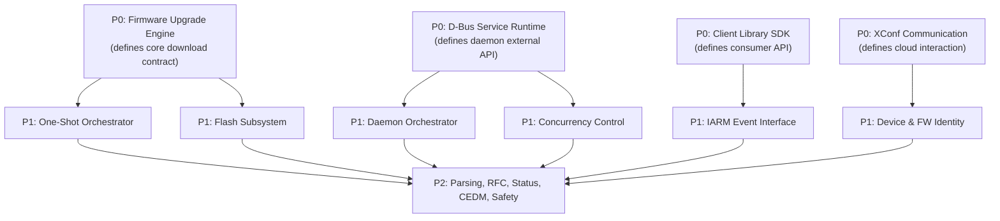

# OpenSpec Specification Recommendations

> **Purpose:** Prioritized recommendations for which subsystems deserve first-class OpenSpec specifications  
> **Criteria:** Runtime complexity, interface surface area, cross-model behavioral differences, testability needs

---

## 1. Priority Tiers

### Tier P0 — Specify First (Critical architectural subsystems)

These subsystems have the highest complexity, widest interface surface, and most cross-cutting behavioral impact. They define the platform's core contract.

| Subsystem | Rationale |
|-----------|-----------|
| **Firmware Upgrade Engine** | Central shared subsystem. `RdkUpgradeContext_t` is the primary API contract. Runtime behavior differs dramatically between execution models (blocking in main thread vs GTask worker). Download throttling, chunk resume, mTLS fallback, and `download_only` mode all need formal specification. |
| **D-Bus Service Runtime** | Defines the daemon's entire external contract. Method signatures, signal payloads, concurrency invariants, task lifecycle, piggyback semantics, and error response contracts are critical for client interoperability. |
| **Client Library SDK** | Defines the public API consumed by all third-party applications. Callback registration ordering, threading guarantees, connection lifecycle, and error propagation semantics must be formally specified. |
| **XConf Communication** | Two divergent implementations (one-shot direct vs daemon cached). Cache validity rules, fallback chains, response structure, and timing behavior need unified specification that covers both models. |

### Tier P1 — Specify Next (High-impact subsystems with clear boundaries)

| Subsystem | Rationale |
|-----------|-----------|
| **One-Shot Orchestrator** | Defines the legacy execution model's complete behavioral contract: argument parsing, validation gates, multi-firmware sequencing, signal handling, exit code semantics. Needed for behavioral parity verification against daemon model. |
| **Daemon Orchestrator** | Defines the startup state machine, D-Bus-before-init ordering, main loop lifecycle. Needed for integration testing and systemd interaction specification. |
| **Flash Subsystem** | Critical safety subsystem. Flash ordering, reboot decision logic, platform-specific flash invocation, and failure recovery need specification. |
| **IARM Event Interface** | Defines the event contract with the broader RDK ecosystem. Event names, payloads, callback semantics, and thread context of callbacks need specification. |
| **Concurrency Control** | Cross-cutting but safety-critical. Mutex ownership, main-loop serialization invariants, piggyback queue semantics, and race condition prevention rules need formal documentation. |
| **Device & Firmware Identity** | Foundation for XConf payloads and flash validation. Property file format, key semantics, and query reliability need specification. |

### Tier P2 — Specify When Needed (Well-bounded infrastructure)

| Subsystem | Rationale |
|-----------|-----------|
| **XConf Response Parsing** | Well-defined input/output: JSON → `XCONFRES`. Specify field semantics and validation rules. |
| **RFC Configuration** | Simple key-value interface. Specify key names, value semantics, default behavior. |
| **Download Status Tracking** | STATUS_FILE format and RFC notification semantics. Important for crash recovery. |
| **CEDM / Certificate Auth** | Codebig and mTLS configuration. Currently stub implementations suggest this is platform-specific. |
| **Process Safety Guards** | PID file semantics, upgrade flag files, cross-binary instance detection rules. |

### Tier P3 — Document, Don't Specify (Cross-cutting concerns)

| Subsystem | Rationale |
|-----------|-----------|
| **Telemetry (T2)** | Pervasive instrumentation, not a behavioral contract. Document marker names/values. |
| **rBus Integration** | Small surface area (T2 upload trigger). Document rather than specify. |

---

## 2. Specification Ordering Strategy

**Recommended order within P0:**
1. **Firmware Upgrade Engine** — foundational; both orchestrators depend on it
2. **D-Bus Service Runtime** — defines daemon's external contract
3. **Client Library SDK** — consumer-facing; depends on D-Bus contract
4. **XConf Communication** — can be specified in parallel with 2+3

---

## 3. Areas Where Subsystem Boundaries Are Unclear

| Area | Issue | Recommendation |
|------|-------|----------------|
| **XConf: shared vs daemon-specific** | One-shot uses `MakeXconfComms()` in `rdkv_main.c`; daemon uses `rdkFwupdateMgr_checkForUpdate()` in handlers. Different functions, same purpose. | Specify as single subsystem with two integration modes. |
| **Upgrade Engine vs Flash** | In one-shot mode, `rdkv_upgrade_request()` can chain directly into `flashImage()` when `download_only == 0`. This blurs ownership between download and flash. | Specify the `download_only` flag as the formal boundary. When 1: Upgrade Engine owns only download. When 0: Upgrade Engine delegates to Flash. |
| **`device_status_helper.c` ownership** | Contains both device-identity queries (`CurrentRunningInst`, connectivity checks) AND process-safety logic. Compiled into both binaries directly (not a library). | Split conceptually: device identity queries → Device Identity subsystem; process safety → Safety Guards. |
| **`chunk.c` dual compilation** | Compiled into BOTH `librdksw_upgrade.so` AND directly into both binaries. This creates duplicate symbols unless carefully managed. | Treat as part of Firmware Upgrade Engine. The binary-level compilation is a build quirk, not a subsystem boundary. |
| **Global state coupling** | `device_info`, `rfc_list`, `curl`, `force_exit` are globals defined in orchestrators but read/written by shared libraries. | Specify as "orchestrator-owned state injected into shared subsystems." The `RdkUpgradeContext_t` struct is the right pattern — extend it to replace remaining globals. |
| **Telemetry: subsystem or instrumentation?** | `t2CountNotify()` is defined independently in each binary (with `flashT2CountNotify` in flash to avoid symbol collision). It's not a library boundary. | Treat as cross-cutting instrumentation, not a subsystem. |

---

## 4. Subsystems Deserving First-Class OpenSpec Specifications

Based on the analysis above, these **8 subsystems** should receive full OpenSpec specifications:

1. **Firmware Upgrade Engine** (`librdksw_upgrade`)
2. **D-Bus Service Runtime** (`src/dbus/`)
3. **Client Library SDK** (`librdkFwupdateMgr`)
4. **XConf Communication** (shared + daemon cache)
5. **One-Shot Orchestrator** (`rdkv_main.c`)
6. **Daemon Orchestrator** (`rdkFwupdateMgr.c`)
7. **Flash Subsystem** (`librdksw_flash`)
8. **IARM Event Interface** (`librdksw_iarmIntf`)

Additionally, **Concurrency Control** should be specified as a cross-cutting concern within the D-Bus Service Runtime specification rather than as a standalone subsystem.

---

## 5. Specification Content Guidance

Each subsystem specification should include:

| Section | Content |
|---------|---------|
| **Purpose & Scope** | What this subsystem owns and does NOT own |
| **Runtime Context** | Thread context, event loop affinity, lifecycle bounds |
| **Interface Contract** | Functions, structs, D-Bus methods/signals, error codes |
| **State Ownership** | What mutable state this subsystem owns and how it's protected |
| **Behavioral Invariants** | Rules that must always hold (e.g., "at most one download at a time") |
| **Execution Model Variants** | How behavior differs between one-shot and daemon |
| **Failure Semantics** | What happens on error, who decides retry, what gets cleaned up |
| **Dependencies** | What this subsystem needs from others |
| **Concurrency Constraints** | Thread-safety guarantees, mutex requirements |
| **Testability Surface** | What can be tested in isolation, what requires integration |
